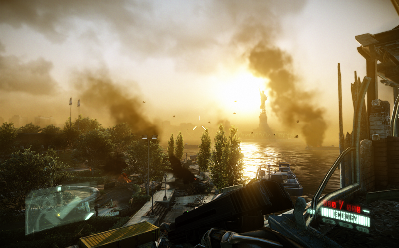

# CryENGINE Technical Notes

## CryENGINE History

 * [History of Crysis (2007 - 2020)][1]
 * [Never stop Achieving - CRYENGINE Showcase 2020: Games of the Decade][30]
 * 
 * 手游时代来领，CRYENGINE 5 开源，[https://github.com/CRYTEK/CRYENGINE][2]
 * 2013年11月，Ryse: Son of Rome
 * 2013年2月，Crysis 3
 * 2011年，CryENGINE 3 和 Crysis 2
 * 2007年，CryENGINE 2 和 Crysis
 * 2004年，CryENGINE 1 和 Far Cry。版权纠纷，FarCry 后来给了 Ubisoft

### Crysis 2 截图

## Presentations & Papers

### 2018

 * [CRYENGINE port to Android (Android Game Developer Summit 2018)][60]

### 2014

 * [SIGGRAPH - Rendering Techniques in Ryse][45]
 * [SIGGRAPH - Asset Production in Ryse][44]
 * [SIGGRAPH - Character Creation and Pipeline in Ryse][46]
 * [SIGGRAPH - Real-time Geometry Caches][49]

### 2013

 * [FMX - The Art and Technology behind Crysis 3][14]
 * [GDC - How CryENGINE 3 and AMD GCN Architecture Gave Birth to a Red Gem - Project Phoenix][48]
 * [GDC - Moving to the Next Generation - The Rendering Technology of Ryse][15]
 * [GDC - Advanced Visual Effects with DirectX 11: The Rendering Technologies of Crysis 3][16], [GDC Video][17]
 * [GDC Europe - Shining the Light on Crysis 3][18]
 * [GDC Europe - Crafting the World of Crysis][47]
 * [SIGGRAPH - CryENGINE 3 Graphic Gems][19]
 * [SIGGRAPH - Defining the Next Next-Gen][31]
 * [SIGGRAPH - Playing with Real-Time Shadows][20]

### 2012

 * SIGGRAPH - VFX for Games - Destruction Setpieces
 * SIGGRAPH - VFX for Games - Particle Effects

### 2011

 * [GAMEFEST - CryENGINE 3 Rendering Techniques][10]
 * [GDC Europe - Lighting in Crysis 2][11]
 * [SIGGRAPH - Anti-Aliasing Methods in CryENGINE 3][12]
 * [SIGGRAPH - Secrets of CryENGINE 3 Graphics Technology][13]
 * SIGGRAPH - Spherical Skinning with Dual-Quaternions and QTangents

### 2010

 * GDC China - The Future of Game Engines - Towards Real-time Photo-realistic Rendering and Natural Character Animation
 * GDC Europe - AAA Stereo-3D in CryENGINE 3
 * GDC Europe - Bringing Stereo to Consoles
 * [HPGC - Future Graphics in Games][34]
 * [I3D - Cascaded Light Propagation Volumes for Real Time Indirect Illumination][8]
 * [SIGGRAPH - Real-time Diffuse Global Illumination in CryENGINE 3][33]
 * [SIGGRAPH - CryENGINE 3: Reaching the Speed of Light][9]

### 2009

 * [GDC Europe - AAA Automated Testing for AAA Games][41]
 * [SIGGRAPH - Light Propagation Volumes in CryENGINE 3][5]
 * [TGC - A Bit More Deferred CryENGINE 3][6]
 * ShaderX7 - Screen-Space Ambient Occlusion

### 2008

 * [GDC - Crysis Next Gen Effects][36]
 * [GDC - Transition to Scrum Midway through a AAA Development Cycle][40]
 * [SIGGRAPH - Advanced Virtual Texture Topics][32]

### 2007

 * [GDC - Real-time Atmospheric Effects in Games Revisited][42]
 * [SIGGRAPH - Porting Game Engines to Direct3D 10: Crysis / CryEngine2][35]
 * [SIGGRAPH - Finding Next Gen - CryENGINE 2][3]
 * [GamingISV - Go Parallel - Multicore Programming and Game Development][39]

### 2006

 * [SIGGRAPH - Real-time Atmospheric Effects in Games][38]

### 2005

 * [GDC - Far Cry and DirectX9][37]

### Documentation

 * [https://docs.cryengine.com/][4]
 * [all Crytek free-talks on GDC][7]

## Core Developers

### Martin Mittring

 * [SIGGRAPH2007 - Finding Next Gen - CryENGINE 2][3]
 * [TGC2009 - A Bit More Deferred CryENGINE 3][6]
 * "Unreal Engine 4 Elemental demo" - SIGGRAPH 2012，说明已经去 Epic 了
 * [Unreal Engine 3 Blog][54]，可以看到很多 mittring 在 unreal 的成果

### Tiago Sousa

 * Mittring 离开之后，Sousa 接班。2014 年离开 Crytek，去 idsoftware 接班 John Carmack
 * [SIGGRAPH2011 - Secrets of CryENGINE 3 Graphics Technology][13]
 * [SIGGRAPH2013 - CryENGINE 3 Graphic Gems][19]

### Timur Davidenko

 * 代码中有很多 Timur 写的内容
 * 没有 paper，写了很多引擎代码
 * Technical Director

### Nicolas Schulz

 * 主要负责游戏的渲染，比如 Ryse
 * GDC2014 - Moving to the Next Generation - The Rendering Technology of Ryse

### Anton Kaplanyan

 * 研究员，an ex-R&D at Crytek，实现了 CryENGINE 3 LPV
 * [个人网页][22]
 * [SIGGRAPH2009 - Light Propagation Volumes in CryENGINE 3][5]
 * [SIGGRAPH2010 - Real-time Diffuse Global Illumination in CryENGINE 3][33]
 * [SIGGRAPH2010 - CryENGINE 3: Reaching the Speed of Light][9]
 * [LPV实现解读][21]

### Sergiy Migdalskiy

 * 待过 Crytek, Naughty Dog(Sony), Valve
 * 他设计的 ISizer, ZipDir
 * [https://github.com/migdalskiy][27]
 * [Valve's Physics for Game Programmers][28]
 * [Performance - Physics Optimization Strategies][29]

### Carsten Wenzel

 * 负责 Atmospheric 相关的内容
 * 目前在 [Cloud Imperium Games][50] 做 [Star Citizen][51]
 * [GDC2007 - Real-time Atmospheric Effects in Games Revisited][42]
 * [SIGGRAPH2007 - Porting Game Engines to Direct3D 10: Crysis / CryEngine2][35]
 * [GDC2005 - Far Cry and DirectX9][37]

### Vladimir Kajalin

 * SSAO 作者，Theodor Mader 前任 CRYENGINE V 的 Technical Director

### Theodor Mader

 * 从 Ryse 的 rendering engineer 开始进入 Crytek
 * [SIGGRAPH - Rendering Techniques in Ryse][45]
 * 2020年初成为 Technical Director，[Meet the Team: Theodor Mader, Technical Director][]

## Rendering Technique

### HDR - High Dynamic Range Rendering

 * [GDC2010 - Uncharted 2: HDR Lighting][52]
 * [GDC2005 - Far Cry and DirectX9][37]
 * GDC2003 - Frame Buffer Postprocessing Effects in DOUBLE-S.T.E.A.L（ppt、[voice][53]）

### GI - Global Illumination

#### SSAO - Screen Space Ambient Occlusion

 * 2011 - GEMS8 - Principles and Practice of Screen Space Ambient Occlusion (Starcraft II)
 * [2009 - SIGGRAPH - Multi-Layer Dual-Resolution Screen-Space Ambient Occlusion][57]
 * 2009 - ShaderX7 - Variance Methods for Screen-Space Ambient Occlusion
 * 2009 - ShaderX7 - Screen-Space Ambient Occlusion (Crysis)
 * [2008 - SIGGRAPH - Image-Space Horizon-Based Ambient Occlusion][58]
 * [2008 - NVidia - Screen Space Ambient Occlusion][56]
 * [LearnOpenGL - SSAO][55]
 * [NVIDIA ShadowWorks][59]，有 HBAO+ 的实现

#### SSDO - Screen Space Directional Occlusion

 * 2009 - Approximating Dynamic Global Illumination in Image Space

#### LPV & SVOGI & VXGI

 * [About LPV, SVOGI and VXGI][25]
 * 
 * LPV - 作者 Anton Kaplanyan
 * [2009 - SIGGRAPH - Light Propagation Volumes in CryENGINE 3][5]
 * 
 * SVOGI - 作者 Andrew Scheidecker，[https://www.scheidecker.net/][26]
 * 在 UE4 Elemental Tech Demo 中实现了 SVOGI
 * 但因为 XBOXONE & PS4 的性能不足，最终从引擎中删除了这部分的实现
 * 目前 CRYENGINE 5 中也实现了 SVOGI
 * 
 * VXGI - Nvidia 设计的，和 SVOGI 同类的技术
 * [Voxel Cone Tracing and Sparse Voxel Octree for Real-time Global Illumination][23]
 * [https://developer.nvidia.com/vxgi][24]

## Tools

### QuickBMS

 * http://aluigi.altervista.org/quickbms.htm
 * QuickBMS + Crysis 2 script
 * quickbms.exe crysis2.bms Textures.pak OutputFolder

[1]:https://www.youtube.com/watch?v=43V16tXFE8g
[2]:https://github.com/CRYTEK/CRYENGINE
[3]:https://developer.amd.com/wordpress/media/2013/02/Chapter8-Mittring-Finding_NextGen_CryEngine2.pdf
[4]:https://docs.cryengine.com/
[5]:http://advances.realtimerendering.com/s2009/
[6]:https://www.slideserve.com/yama/a-bit-more-deferred-cryengine-3
[7]:https://www.gdcvault.com/search.php#&conference_id=&category=free&firstfocus=&keyword=Crytek
[8]:https://www.realtimerendering.com/blog/cascaded-light-propagation-volumes-for-indirect-illumination/
[9]:http://advances.realtimerendering.com/s2010/
[10]:https://www.slideshare.net/TiagoAlexSousa/cryengine-3-rendering-techniques
[11]:https://www.gdcvault.com/play/1014915/Lighting-in-Crysis
[12]:https://www.slideshare.net/TiagoAlexSousa/antialiasing-methods-in-cryengine-3
[13]:http://advances.realtimerendering.com/s2011/
[14]:https://www.slideshare.net/TiagoAlexSousa/the-art-and-technology-behind-crysis-3-fmx-2013
[15]:https://gdcvault.com/play/1020432/Moving-to-the-Next-Generation
[16]:https://www.slideshare.net/TiagoAlexSousa/rendering-technologies-from-crysis-3-gdc-2013
[17]:https://gdcvault.com/play/1017626/Advanced-Visual-Effects-with-DirectX
[18]:https://www.gdcvault.com/play/1019235/Shining-the-Light-on-Crysis
[19]:http://advances.realtimerendering.com/s2013/
[20]:https://www.realtimeshadows.com/sites/default/files/Playing%20with%20Real-Time%20Shadows_0.pdf
[21]:https://ericpolman.com/2016/06/28/light-propagation-volumes/
[22]:http://kaplanyan.com/
[23]:https://on-demand.gputechconf.com/gtc/2012/presentations/SB134-Voxel-Cone-Tracing-Octree-Real-Time-Illumination.pdf
[24]:https://developer.nvidia.com/vxgi
[25]:https://www.zhihu.com/question/28295455
[26]:https://www.scheidecker.net/
[27]:https://github.com/migdalskiy
[28]:https://www.youtube.com/watch?v=1RphLzpQiJY
[29]:http://media.steampowered.com/apps/valve/2015/Migdalskiy_Sergiy_Physics_Optimization_Strategies.pdf
[30]:https://www.youtube.com/watch?v=wGQWGAuNx6M
[31]:https://ia800902.us.archive.org/25/items/crytek_presentations/Ryse_ChrisEvans_Sigg.pdf
[32]:https://ia600902.us.archive.org/25/items/crytek_presentations/AdvVirtualTexTopics.ppt
[33]:https://ia800902.us.archive.org/25/items/crytek_presentations/GI_crytek.ppt
[34]:https://ia800902.us.archive.org/25/items/crytek_presentations/Notes.ppt
[35]:https://ia800902.us.archive.org/25/items/crytek_presentations/SIGGRAPH2007_CrysisDX10.ppt
[36]:https://ia800902.us.archive.org/25/items/crytek_presentations/GDC08_SousaT_CrysisEffects.ppt
[37]:https://ia800902.us.archive.org/25/items/crytek_presentations/GDC2005_FarCryAndDX9.ppt
[38]:https://ia800902.us.archive.org/25/items/crytek_presentations/SIGGRAPH2006_RealtimeAtmoFxInGames.ppt
[39]:https://ia800902.us.archive.org/25/items/crytek_presentations/MunichIntel_eng.ppt
[40]:https://ia600902.us.archive.org/25/items/crytek_presentations/ASoendergaardGDC08.ppt
[41]:https://ia800902.us.archive.org/25/items/crytek_presentations/AAA_Automated_testing.ppt
[42]:https://ia600902.us.archive.org/25/items/crytek_presentations/GDC2007_RealtimeAtmoFxInGamesRev.ppt
[43]:https://ia800902.us.archive.org/25/items/crytek_presentations/Ryse_SIGGRAPH_2014_Christopher%20Evans_Asset%20Production.pdf
[44]:https://ia800902.us.archive.org/25/items/crytek_presentations/Ryse_SIGGRAPH_2014_Christopher%20Evans_Asset%20Production.pdf
[45]:http://advances.realtimerendering.com/s2014/crytek/Sigg14_Schulz_Mader_Ryse_Rendering_Techniques.pptx
[46]:https://archive.org/download/crytek_presentations/Ryse_SIGGRAPH_2014_Lars%20Martinsson_Character%20Creation%20and%20Pipeline.pdf
[47]:https://archive.org/download/crytek_presentations/Crafting%20the%20World%20of%20Crysis.pptx
[48]:https://archive.org/download/crytek_presentations/Project%20Phoenix.pptx
[49]:https://slideplayer.com/slide/3432122/
[50]:https://cloudimperiumgames.com/
[51]:https://en.wikipedia.org/wiki/Star_Citizen
[52]:https://www.gdcvault.com/play/1012351/Uncharted-2-HDR
[53]:https://www.gdcvault.com/play/1022664/Frame-Buffer-Postprocessing-Effects-in
[54]:https://docs.unrealengine.com/udk/Three/ContentBlog.html
[55]:https://learnopengl.com/Advanced-Lighting/SSAO
[56]:https://developer.download.nvidia.cn/SDK/10.5/direct3d/Source/ScreenSpaceAO/doc/ScreenSpaceAO.pdf
[57]:https://developer.download.nvidia.cn/presentations/2009/SIGGRAPH/Bavoil_MultiLayerDualResolutionSSAO.pdf
[58]:https://developer.download.nvidia.com/presentations/2008/SIGGRAPH/HBAO_SIG08b.pdf
[59]:https://developer.nvidia.com/shadowworks
[60]:https://www.youtube.com/watch?v=ahd_N3r7P7k
[61]:https://www.cryengine.com/news/view/meet-the-team-theodor-mader-technical-director
