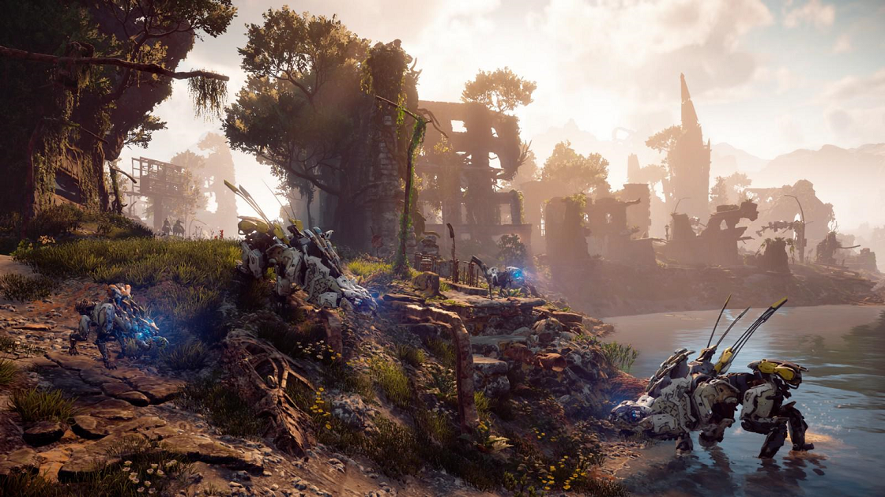

# Decima

* [Wikipedia][1]
* [Publications][18]

## Games

* [2013 - Killzone: Shadow Fall][2]
* [2017 - Horizon Zero Dawn][3]
* [2019 - Death Stranding][4]
* [Horizon Zero Dawn 性能评测][24]

## Presentations

### Design

* [2018 - GDC - 'Horizon Zero Dawn': A Game Design Postmortem][5] ([ppt][20])
* [2018 - GDC - Level Design Workshop: Balancing Action and RPG in 'Horizon Zero Dawn' Quests][13] ([ppt][21])
* [2017 - GDC - Building Non-linear Narratives in 'Horizon: Zero Dawn'][14]

### Programming

* 2017 - GCAP - Decima Engine: Visibility in Horizon Zero Dawn ([ppt][22])
* [2017 - GDC - Creating a Tools Pipeline for 'Horizon: Zero Dawn'][15] ([ppt][27])
* [2017 - GDC - Player Traversal Mechanics in the Vast World of 'Horizon: Zero Dawn'][17] ([ppt][26])
* 2017 - SIGGRAPH - Decima Engine: Advances in Lighting and AA ([ppt][25])
* 2017 - SIGGRAPH - Nubis: Authoring Real-Time Volumetric Cloudscapes with the Decima Engine ([ppt][23])

### Visual Arts

* [2018 - GDC - Animation Bootcamp: Bringing Life to the Machines of 'Horizon Zero Dawn'][7]
* [2018 - GDC - Art Direction Bootcamp: A No Nonsense Approach to Designing Robot Dinosaurs][8]
* [2018 - GDC - Between Tech and Art: The Vegetation of 'Horizon Zero Dawn'][9]
* [2018 - GDC - Repopulating the Earth: Character Production on 'Horizon Zero Dawn'][12]
* [2017 - GDC - GPU-Based Run-Time Procedural Placement in 'Horizon: Zero Dawn'][16]

### AI

* [2018 - GDC - Beyond 'Killzone': Creating New AI Systems for 'Horizon Zero Dawn'][10]
* [2018 - GDC - Giving a Voice to the Machines of 'Horizon Zero Dawn'][11]

### Production & Team Management

* [2018 - GDC - 'Horizon Zero Dawn': A QA Open World Case Study][6] ([ppt][19])

[1]:https://en.wikipedia.org/wiki/Decima_(game_engine)
[2]:https://en.wikipedia.org/wiki/Killzone_Shadow_Fall
[3]:https://en.wikipedia.org/wiki/Horizon_Zero_Dawn
[4]:https://en.wikipedia.org/wiki/Death_Stranding
[5]:https://www.gdcvault.com/play/1024963/-Horizon-Zero-Dawn-A
[6]:https://www.gdcvault.com/play/1025153/-Horizon-Zero-Dawn-A
[7]:https://www.gdcvault.com/play/1025040/Animation-Bootcamp-Bringing-Life-to
[8]:https://www.gdcvault.com/play/1025049/Art-Direction-Bootcamp-A-No
[9]:https://www.gdcvault.com/play/1025066/Between-Tech-and-Art-The
[10]:https://www.gdcvault.com/play/1024912/Beyond-Killzone-Creating-New-AI
[11]:https://www.gdcvault.com/play/1025143/Giving-a-Voice-to-the
[12]:https://www.gdcvault.com/play/1024992/Repopulating-the-Earth-Character-Production
[13]:https://www.gdcvault.com/play/1025177/Level-Design-Workshop-Balancing-Action
[14]:https://www.gdcvault.com/play/1024158/Building-Non-linear-Narratives-in
[15]:https://www.gdcvault.com/play/1024124/Creating-a-Tools-Pipeline-for
[16]:https://www.gdcvault.com/play/1024120/GPU-Based-Run-Time-Procedural
[17]:https://www.gdcvault.com/play/1024117/Player-Traversal-Mechanics-in-the
[18]:https://www.guerrilla-games.com/read/publications
[19]:https://d3ihk4j6ie4n1g.cloudfront.net/downloads/large/GDC_2018_Ana_Barbuta_Testing_Horizon_Zero_Dawn_V5.pptx
[20]:https://d3ihk4j6ie4n1g.cloudfront.net/downloads/large/GDC_Horizon_GameDesignPostMortemL_withfonts.pptx
[21]:https://d3ihk4j6ie4n1g.cloudfront.net/downloads/large/Finding%20Balance%20Presentation.pptx
[22]:https://d3ihk4j6ie4n1g.cloudfront.net/downloads/assets/GCAP2017_DecimaVisibilityEmbedded.pptx?mtime=20200402092945&focal=none
[23]:http://advances.realtimerendering.com/s2017/Nubis%20-%20Authoring%20Realtime%20Volumetric%20Cloudscapes%20with%20the%20Decima%20Engine%20-%20Final.pptx
[24]:https://new.qq.com/rain/a/20200905A0KHLF00
[25]:https://d3ihk4j6ie4n1g.cloudfront.net/downloads/large/DecimaSiggraph2017-final.pptx
[26]:http://d3ihk4j6ie4n1g.cloudfront.net/downloads/large/GDC2017_VanGrinsven_PlayerTraversalMechanics.pptx
[27]:https://d3ihk4j6ie4n1g.cloudfront.net/downloads/large/GDC2017_Sumaili_VanDerSteen_CreatingAToolsPipelineForHorizonZeroDawn.pptx
