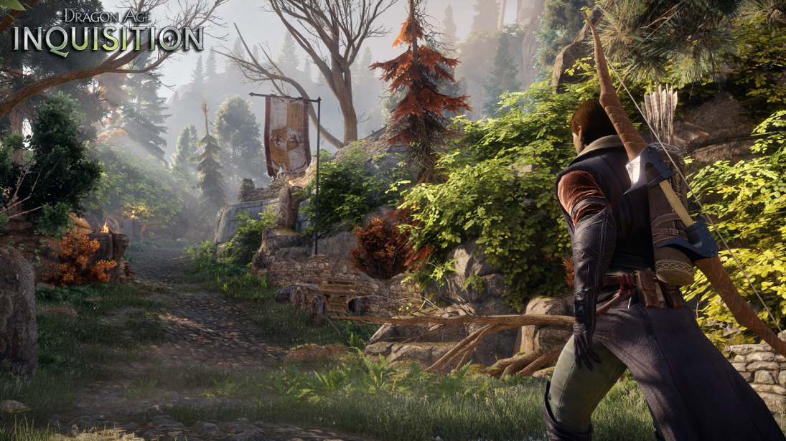

# Frostbite Engine - Technical Notes

 * [Frostbite on wikipedia][1]
 * These resources are available on [dice.se][2], [ea.com/frostbite][3] and [slideshare.net][4]

## "Move to One Engine"

EA is moving its games, including Mass Effect and FIFA, [onto a single graphics engine][5]. Frostbite has evolved to become the cornerstone of these titles:

 * `FIFA` (FIFA 17/18)
 * `Mass Effect` (Mass Effect: Andromeda)
 * `Battlefield` (Battlefield 1 - 2016)  
 * `Need for Speed` (NEED FOR SPEED 2017: PAYING IT BACK)
 * `Mirror's Edge` (Mirror's Edge Catalyst - 2016)
 * `Star Wars` (Star Wars Battlefront) 
 * `Dragon Age` (Dragon Age: Origins)

## Resources

### Engine & Pipeline 

Year | Conf       | Title                                                                                           | Note
---- | ---------- | ----------------------------------------------------------------------------------------------- | ----
2017 | gdc2017    | [FrameGraph: Extensible Rendering Architecture in Frostbite][16]                                |
2016 | gdc2016    | [Optimize the graphics pipeline with compute][15]                                               |
2015 | siggraph15 | [The Rendering Pipeline - Challenges & Next Steps][14]                                          |
2013 | stockholm  | [Scaling the Pipeline][13]                                                                      | Asset Pipeline
2011 | nv-lan-6   | [Shiny PC Graphics in Battlefield 3][11] ([on SlideShare][12])                                  |
2010 | stockholm  | [Parallel Futures of a Game Engine v2.0][10]                                                    |
2009 | intel2009  | [Parallel Futures of a Game Engine][9]                                                          |
2009 | siggraph09 | [Parallel Graphics in Frostbite – Current & Future][8]                                          |
2008 | gh2008     | [The Intersection of Game Engines and GPUs: Current & Future][7]                                |
2007 | gdc2007    | [frostbite - Rendering Architecture and Real-time Procedural Shading & Texturing Techniques][6] |

### GDC 2011 & 2012 - Frostbite 2 & Battlefield 3/4

Year | Title                                                                                        | Note
---- | -------------------------------------------------------------------------------------------- | ----
2014 | [Rendering Battlefield 4 with Mantle][17]                                                    | Mantle
2013 | [Battlefield 4 + Frostbite + Mantle][18]                                                     | Mantle
2013 | [Mantle for Developers][19]                                                                  | Mantle
2012 | [Stable SSAO in Battlefield 3 with Selective Temporal Filtering][20]                         | SSAO
2012 | [Terrain in Battlefield 3: A Modern, Complete and Scalable System][21]                       | Terrain
2012 | [Modular Rigging in Battlefield 3][22]                                                       | Animation
2011 | [Approximating Translucency for a Fast, Cheap and Convincing Subsurface Scattering Look][23] | SSS
2011 | [SPU Based Deferred Shading in Battlefield 3 for Playstation 3][24]                          | Deferred-Shading
2011 | [Culling the Battlefield Data Oriented Design in Practice][25]                               |
2011 | [Lighting you up in Battlefield 3][26]                                                       | Lighting
2011 | [DirectX 11 Rendering in Battlefield 3][27]                                                  |

### Rendering & Visual Effects

Year | Conf       | Title                                                                                           | Comment
---- | ---------- | ----------------------------------------------------------------------------------------------- | ----
2017 | GDC        | [HDR Color Grading and Display in Frostbite][30]                                                |
2017 | GDC        | [4K Checkerboard in Battlefield 1 and Mass Effect Andromeda][31]                                |
2016 | SIGGRAPH   | [Physically Based Sky, Atmosphere & Cloud Rendering][39]                                        | Environment
2010 | SIGGRAPH   | [A Real-time Radiosity Architecture][38]                                                        | Lighting
2009 | GDC        | [Shadows & Decals: D3D10 Techniques in Frostbite][37]                                           | ShadowMap & Decal
2009 | GDC        | [The Unique Lighting in Mirror’s Edge][36]                                                      | Lighting
2009 | ?          | Lighting and Materials for Real-time Game Engines                                               |
2009 | ?          | [Advanced Real-time Post-Processing using GPGPU techniques][35]                                 | Rendering
2009 | Paper      | Interactive Real Time Cloth Simulation with Adaptive Level of Detail                            | 
2008 | Paper      | [Procedural Deformation and Destruction in Real-time][34]                                       | Physics
2007 | Paper      | [Real-Time Hair Simulation and Visualisation for Games][33]                                     | Physics
2007 | SIGGRAPH   | [Terrain Rendering in Frostbite using Procedural Shader Splatting][32]                          | Terrain

- [(2010) #siggraph2010 Bending the Graphics Pipeline](http://www.dice.se/news/bending-graphics-pipeline/)
- [(2010) #siggraph2010 5 Major Challenges in Interactive Rendering](http://www.dice.se/news/5-major-challenges-interactive-rendering/)
- [(2011) #siggraph2011 More Performance - Five Rendering Ideas from Battlefield 3 and Need For Speed The Run](http://www.dice.se/news/performance-five-rendering-ideas-battlefield-3-need-speed-run/)
- [(2012) #thesis Real-time Interactive Water Waves](http://www.dice.se/news/realtime-interactive-water-waves/)
- [(2012) 5 major challenges in real-time rendering](http://www.dice.se/news/5-major-challenges-real-time-rendering/)
- [(2012) Data Oriented Interactive Water - An Interactive Water Simulation For PlayStation 3](http://www.dice.se/news/data-oriented-interactive-water/)
- [(2012) Adaptive Hardware-accelerated Terrain Tessellation](http://www.dice.se/news/adaptive-hardware-accelerated-terrain-tessellation/)
- [(2014) #siggraph2014 Moving Frostbite to PBR](https://www.ea.com/frostbite/news/moving-frostbite-to-pb)
- [(2015) #siggraph2015 Frostbite on mobile](https://www.ea.com/frostbite/news/frostbite-on-mobile)
- [(2015) #siggraph2015 Stochastic Screen-Space Reflections](https://www.ea.com/frostbite/news/stochastic-screen-space-reflections)
- [(2015) #siggraph2015 Physically Based and Unified Volumetric Rendering in Frostbite](https://www.ea.com/frostbite/news/physically-based-unified-volumetric-rendering-in-frostbite)
- [(2016) #gdc2016 Lighting the city of glass - Rendering ‘Mirror’s Edge Catalyst’](https://www.ea.com/frostbite/news/lighting-the-city-of-glass)
- [(2016) #gdc2016 Photogrammetry and Star Wars Battlefront - Frostbite](https://www.ea.com/frostbite/news/photogrammetry-and-star-wars-battlefront)

### General Programming

- [(2010) DICE Coders Day 2010 - Scope Stack Allocation](http://www.dice.se/news/scope-stack-allocation/)
- [(2010) DICE Coders Day 2010 - Introduction to Data Oriented Design](http://www.dice.se/news/introduction-data-oriented-design/)
- [(2010) DICE Coders Day 2010 - A Step Towards Data Orientation](http://www.dice.se/news/step-towards-data-orientation/)
- [(2011) Executable Bloat – How it happens and how we can fight it](http://www.dice.se/news/executable-bloat-happens-can-fight/)
- [(2011) Battlelog – Building scalable web sites with tight game integration](http://www.dice.se/news/battlelog-building-scalable-web-sites-tight-game-integration/)

### Gameplay & Input

- [(2009) #gdc2009 Creating First Person Movement for Mirror’s Edge](http://www.dice.se/news/creating-first-person-movement-mirrors-edge/)
- [(2010) #gdc2010 Mirrors Edge Level Design Challenges & Solutions](http://www.dice.se/news/mirrors-edge-level-design-challenges-solutions/)
- [(2012) #thesis Motion Controllers for Game Consoles (PlayStation Move and Microsoft’s Kinect)](http://www.dice.se/news/motion-controllers-game-consoles/)

### Papers & Detailed Reports

- [(2014) Per-face parameterization for Texture Mapping of Geometry in Real-Time](https://www.ea.com/frostbite/news/per-face-parameterization-for-texture-mapping-of-geometry-in-real-time)
- [(2015) Surface Data On Dynamic Topologies](http://www.dice.se/news/master-thesis-surface-data-dynamic-topologies/)
- [(2017) #i3d2017 Tiled light trees](https://www.ea.com/frostbite/news/tiled-light-trees) ([Paper](http://yuriyodonnell.com/publications/TiledLightTrees-preprint.pdf))
- [(2017) Matching of geometrically and topologically changing meshes](https://www.ea.com/frostbite/news/matching-of-geometrically-and-topologically-changing-meshes)

## TODO ^^^^^

## Misc

 * [Frostbite3 Editor (unofficial)][28]
 * [Frostbite3 Editor (unofficial) - github][29]

[1]:https://en.wikipedia.org/wiki/Frostbite_(game_engine)
[2]:http://www.dice.se/
[3]:https://www.ea.com/frostbite
[4]:https://www.slideshare.net/
[5]:http://www.techradar.com/news/gaming/from-battlefield-to-fifa-here-s-what-ea-s-frostbite-revolution-means-for-you-1323291
[6]:https://www.ea.com/frostbite/news/frostbite-rendering-architecture-and-real-time-procedural-shading-texturing-techniques
[7]:https://www.ea.com/frostbite/news/the-intersection-of-game-engines-and-gpus-current-future
[8]:https://www.ea.com/frostbite/news/parallel-graphics-in-frostbite-current-future
[9]:https://www.slideshare.net/repii/parallel-futures-of-a-game-engine-2478448
[10]:https://www.ea.com/frostbite/news/parallel-futures-of-a-game-engine-v2-0
[11]:https://www.ea.com/frostbite/news/shiny-pc-graphics-in-battlefield-3
[12]:https://www.slideshare.net/DICEStudio/shiny-pc-graphics-in-battlefield-3
[13]:https://www.google.com/url?sa=t&rct=j&q=&esrc=s&source=web&cd=&cad=rja&uact=8&ved=2ahUKEwie7cKFxObsAhXOfXAKHYj3C08QFjAAegQIAxAC&url=https%3A%2F%2Fmedia.contentapi.ea.com%2Fcontent%2Fdam%2Feacom%2Ffrostbite%2Ffiles%2Fscaling-the-pipeline.pptx&usg=AOvVaw2hzoiuZdLIKH3XWD1TyDSe
[14]:https://www.ea.com/frostbite/news/the-rendering-pipeline-challenges-next-steps
[15]:https://www.gdcvault.com/play/1023109/Optimizing-the-Graphics-Pipeline-With
[16]:https://www.gdcvault.com/play/1024612/FrameGraph-Extensible-Rendering-Architecture-in
[17]:https://www.ea.com/frostbite/news/rendering-battlefield-4-with-mantle
[18]:https://www.ea.com/frostbite/news/battlefield-4-frostbite-mantle
[19]:https://www.ea.com/frostbite/news/mantle-for-developers
[20]:https://www.ea.com/frostbite/news/stable-ssao-in-battlefield-3-with-selective-temporal-filtering
[21]:https://www.ea.com/frostbite/news/terrain-in-battlefield-3-a-modern-complete-and-scalable-system
[22]:https://www.gdcvault.com/play/1015573/Modular-Rigging-in-Battlefield
[23]:https://www.ea.com/frostbite/news/approximating-translucency-for-a-fast-cheap-and-convincing-subsurface-scattering-look
[24]:https://www.ea.com/frostbite/news/spu-based-deferred-shading-in-battlefield-3-for-playstation-3
[25]:https://www.ea.com/frostbite/news/culling-the-battlefield-data-oriented-design-in-practice
[26]:https://www.ea.com/frostbite/news/lighting-you-up-in-battlefield-3
[27]:https://www.ea.com/frostbite/news/directx-11-rendering-in-battlefield-3
[28]:https://greydynamics.github.io/Frostbite3_Editor/
[29]:https://github.com/GreyDynamics/FrostBite3_Editor
[30]:https://www.ea.com/frostbite/news/high-dynamic-range-color-grading-and-display-in-frostbite
[31]:https://www.ea.com/frostbite/news/4k-checkerboard-in-battlefield-1-and-mass-effect-andromeda
[32]:https://www.ea.com/frostbite/news/terrain-rendering-in-frostbite-using-procedural-shader-splatting
[33]:https://pdfs.semanticscholar.org/1fb1/8e39d793a09804f4a6cad92d004dd55248d2.pdf
[34]:https://www.researchgate.net/profile/Kenneth_Bodin2/publication/265749430_Procedural_deformation_and_destruction_in_real-time/links/555f1ea808ae86c06b60d2a2/Procedural-deformation-and-destruction-in-real-time.pdf
[35]:https://www.ea.com/frostbite/news/advanced-real-time-post-processing-using-gpgpu-techniques
[36]:https://www.slideshare.net/DICEStudio/henrikgdc09-compat
[37]:https://www.ea.com/frostbite/news/shadows-decals-d3d10-techniques-from-frostbite
[38]:https://www.ea.com/frostbite/news/a-real-time-radiosity-architecture
