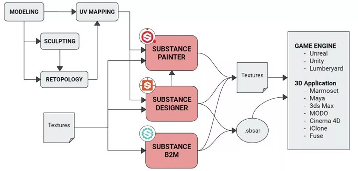
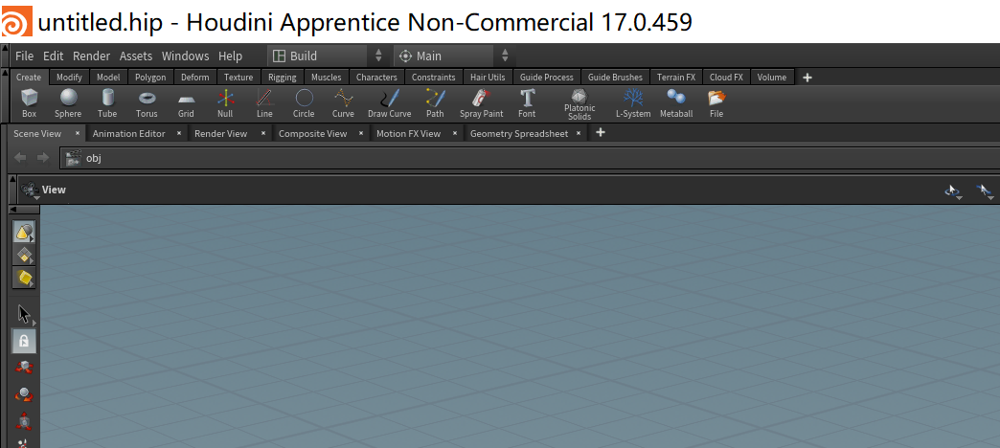

# Hello, Houdini~

## 简介

今天看了《[游戏流程大变革？！游戏中的技术生产艺术][1]》，满震撼的。

Model 系列工具

 * 3DMax
 * Maya
 * ZBrush

Substance 系列工具

 * SP(Substance Painter)，将材质球刷到模型上
 * SD(Substance Designer)，制作材质球
 * SB(Substance B2M)，贴图自动生成发现（老郭说不好用）

Houdini

 * 可编程的数字资产(asset)生成工具
 * 万物皆可参数化

电影级的数字资产制作流程

 * SD 出材质球
 * 丢到 SP 中组合，刷到模型上
 * SP 输出 pbr texture，丢到引擎上去 render

[SideFX][2] 公司出品的 Houdini，在电影界估计家喻户晓。最近开始进入国内游戏开发的视野。硬件越来越快了，很多电影界才能用的技术，慢慢都会游戏化。

 * 技术从 离线渲染(offline rendering) => 实时渲染(real-time rendering)
 * 大势所趋

## 安装

[下载 Houdini][3]，一路安装，选择 apprentice license(免费版)。

[1]:https://mp.weixin.qq.com/s?__biz=MzAxNzAxMDgyNw==&mid=2649769601&idx=1&sn=974c5aebb3f7c62a129d5494a6959769&chksm=83e8ff65b49f7673468e462a7ccfc2c575aeb5d6b0709116aa6c65d63a529447bc52c437e214&mpshare=1&scene=1&srcid=0202EJClClR5mAULCjroDphp#rd
[2]:https://www.sidefx.com/
[3]:https://www.sidefx.com/download/
