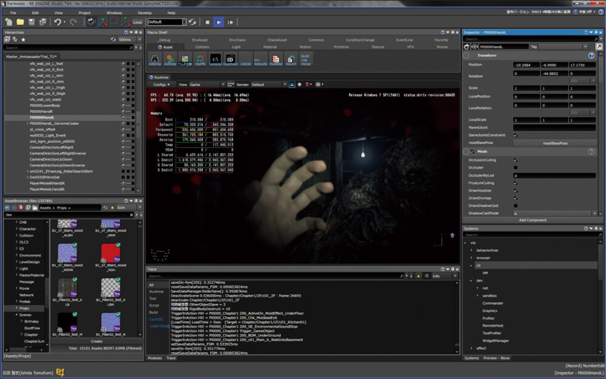

# RE ENGINE (CAPCOM)

* [Wiki][1]

## Games

Resident Evil (生化危机)、Devil May Cry(鬼泣)、Monster Hunter(怪物猎人)

* [Resident Evil 7: Biohazard][2]
* [Devil May Cry 5][3]
* [Resident Evil 2][4]
* [Resident Evil 3][5]
* [Resident Evil Resistance][6]
* [Monster Hunter Rise][7]
* [Resident Evil Village][8]
* [Resident Evil Re:Verse][9]

## People

* 石田智史 - Architecture
* 是松匡亮 - Architecture
* 三嶋仁 - Rendering
* 松宮雅俊 - Physics

## Presentations

* CEDEC - Computer Entertainment Developers Conference
* GCC - Game Creators Conference
* RE:2019 - CAPCOM Open Conference RE:2019

### Architecture

* [2019 - RE:2019 - Architecture of RE ENGINE: Creating an All-Purpose Engine][46] ([youtube][10])
* [2017 - CEDEC - I can't say that SDR is more attractive! HDR support for the latest titles][40]
* [2017 - GCC - Achieve Rapid Iteration: RE ENGINE Design][21]
* [2016 - CEDEC - Game Engine Design for Rapid Iteration][31]
  * 和 2017 GCC 内容是一样的
* [2016 - CEDEC - About the asset conversion mechanism and cache sharing adopted by the RE ENGINE][42]
* [2010 - CEDEC - LostPlanet2 DirectX11 Features][33]
* [2006 - CEDEC - Game Engine Design for Next-Generation Consoles][32]

### Rendering

* [2018 - CEDEC - Latest title graphics optimization case][29]
* [2016 - GCC - GPU-Driven Rendering][22]
* [2016 - CEDEC - Rendering technology that realizes "Resident Evil 7"][27]
* [2014 - CEDEC - Technical explanation of "deep down" graphics expression][45] ([ppt][28])
  * "deep down" is a title developed by Panta Rhei, the predecessor of RE ENGINE
* [2011 - CEDEC - Technical explanation of graphic expression of "Dragon's Dogma"][30]

### Physics

* [2011 - CEDEC - Super simple physics!][43]
  * Clothing in "Dragon's Dogma" / Secret of hair simulation + Rigid body / Expansion to ragdoll

### Art Pipeline

* [2018 - CEDEC - Introducing "just right 3D modeling function" to in-house game engine that lowers the threshold of stage prototype][34]
* [2018 - CEDEC - RE ENGINE and DCC tool animation synchronous playback system for improving animation workflow][35]
* [2016 - CEDEC - Animation technology in "Resident Evil 7 Biohazard"][41]
* [2015 - CEDEC - Challenge and process of incorporating next-generation VFX expression into real time][44]

### Misc

* [2018 - CEDEC - File I/O optimization in "Monster Hunter: World"][36]
* [2018 - CEDEC - Optimization example of "Monster Hunter: World" Efforts to utilize the specifications of modern machines][37]
* [2017 - CEDEC - Technical direction to maximize product quality and management to bring out the abilities of engineers in "MONSTER HUNTER: WORLD"][38]
* [2017 - CEDEC - Supporting Game Development: Introduction to Macro][39]

## TODO

* 有待分类

### CAPCOM Open Conference RE:2019

* [2019 - RE:2019 - UI Overhaul: Usability centered rework of RE ENGINE interface][11]
* [2019 - RE:2019 - RE ENGINE: Integration of Houdini in Level Design][12]
* [2019 - RE:2019 - RE ENGINE: Procedural Modelling in Environment Creation using Houdini][13]
* [2019 - RE:2019 - Modular Rigging: For Simplicity and Efficiency][14]
* [2019 - RE:2019 - Resident Evil 2: Motion Retargeting & Character Synchronization][15]
* [2019 - RE:2019 - RE ENGINE: Procedural Animation & Motion Matching][16]
* [2019 - RE:2019 - Devil May Cry 5: Physics Simulations & Secondary Animations][17]
* [2019 - RE:2019 - Devil May Cry 5: Techniques Employed for Efficient Creation of PhotoRealistic VFX][18]
* [2019 - RE:2019 - RE ENGINE: Advancements in Rendering][19]

### CEDEC

TODO

* [2019 - Accumulate accurate performance information every day!][24]
* [2018 - Introduction of rendering technology and GPU optimization of "MONSTER HUNTER: WORLD"][25]
* [2017 - A large set of assets and an approach to a comfortable user work environment][26]
* [2015 - Introducing the latest development environment, workflow][23]

### Game Creators Conference

[这里][20]还有一些ppt，TODO。

[1]:https://residentevil.fandom.com/wiki/RE_Engine
[2]:https://residentevil.fandom.com/wiki/Resident_Evil_7:_Biohazard
[3]:https://devilmaycry.fandom.com/wiki/Devil_May_Cry_5
[4]:https://residentevil.fandom.com/wiki/Resident_Evil_2
[5]:https://residentevil.fandom.com/wiki/Resident_Evil_3
[6]:https://residentevil.fandom.com/wiki/Resident_Evil:_Resistance
[7]:https://monsterhunter.fandom.com/wiki/Monster_Hunter_Rise
[8]:https://residentevil.fandom.com/wiki/Resident_Evil_Village
[9]:https://residentevil.fandom.com/wiki/Resident_Evil_Re:Verse
[10]:https://www.youtube.com/watch?v=fc3avwM-oTE
[11]:https://www.youtube.com/watch?v=YhnIW2XY_wU
[12]:https://www.youtube.com/watch?v=ABpjD-9FRe0
[13]:https://www.youtube.com/watch?v=Q67T8K8SxHg
[14]:https://www.youtube.com/watch?v=nivB9gIoBx4
[15]:https://www.youtube.com/watch?v=x58JnJJSDYM
[16]:https://www.youtube.com/watch?v=t3KCgZDZ93E
[17]:https://www.youtube.com/watch?v=DQOzMoNaB_U
[18]:https://www.youtube.com/watch?v=7UPc79EMwgk
[19]:https://www.youtube.com/watch?v=Gz0k91MVjys
[20]:https://www.slideshare.net/capcom_rd/
[21]:2021_03_10_achieve_rapid_iteration_re_engine_design.md
[22]:2021_05_27_gpu_driven_rendering.md
[23]:https://cedil.cesa.or.jp/cedil_sessions/view/1376
[24]:https://cedil.cesa.or.jp/cedil_sessions/view/1841
[25]:https://cedil.cesa.or.jp/cedil_sessions/view/1766
[26]:https://cedil.cesa.or.jp/cedil_sessions/view/1686
[27]:https://cedil.cesa.or.jp/cedil_sessions/view/1488
[28]:https://cedil.cesa.or.jp/cedil_sessions/view/1246
[29]:https://cedil.cesa.or.jp/cedil_sessions/view/1897
[30]:https://cedil.cesa.or.jp/cedil_sessions/view/604
[31]:https://cedil.cesa.or.jp/cedil_sessions/view/1484
[32]:https://cedil.cesa.or.jp/cedil_sessions/view/21
[33]:https://cedil.cesa.or.jp/cedil_sessions/view/316
[34]:https://cedil.cesa.or.jp/cedil_sessions/view/1828
[35]:https://cedil.cesa.or.jp/cedil_sessions/view/1810
[36]:https://cedil.cesa.or.jp/cedil_sessions/view/1786
[37]:https://cedil.cesa.or.jp/cedil_sessions/view/1775
[38]:https://cedil.cesa.or.jp/cedil_sessions/view/1684
[39]:2021_03_31_introduction_to_macro_plugin_in.md
[40]:https://cedil.cesa.or.jp/cedil_sessions/view/1658
[41]:https://cedil.cesa.or.jp/cedil_sessions/view/1493
[42]:https://cedil.cesa.or.jp/cedil_sessions/view/1461
[43]:https://cedil.cesa.or.jp/cedil_sessions/view/603
[44]:https://cedil.cesa.or.jp/cedil_sessions/view/1421
[45]:2021_06_22_technical_explanation_of_deep_down.md
[46]:2021_02_07_architecture_of_re_engine.md
