# Achieve Rapid Iteration: RE ENGINE Design

* [Game Creators Conference 2017 的 ppt][1]


## RE ENGINE 简介

* CAPCOM's in-house next-generation game engine
  * New architecture from MT Framework
* Multi-platform support
  * PS4, Xbox One, PC (Steam / UWP)
* Adopted in Resident Evil 7 (生化危机7)
 * Will be used in various titles in the future


### Features

* High performance
  * High resolution and high frame rate
* High development efficiency (本ppt重点讨论)
  * Achieve high-speed iteration


### 传统的开发流程

需要很多步骤，才能看到整体效果。

1. 编程 → Build → 确认 → ...
2. DCC工具编辑 → 资源转换／导出 → 确认 → ...
3. 游戏启动 → 测试／试玩 → 参数调整 → ...
4. QA → Bug修正 → 打包 → ...


### 基于 RE ENGINE 的开发流程

* 所见即所得 (类似unity)
* Remote editing of the actual machine
* Reload support for all resources
* Real-time coding
* Package creation (一键打包)


### Achieve rapid iteration

* Reduced waiting time
* Increased number of trials and errors
* Increase the frequency of running on the actual machine
* Reduced bugs in QA
* "You can spend your spare time improving the quality of the game"


### Development results of Resident Evil 7

* Final project scale
  * Approximately 280,000 lines of C# game code, approximately 150,000 total assets
* Maintain fast iterations
  * Full build ~10 seconds, level adjustment was repeated many times until the end of development
  * 从后文可知，10s指C#脚本编译时间
* Achieves stable performance on the actual machine
  * VR below 60fps = Cannot be released
* Peaceful QA
  * Is it the first large-scale title in our history?


## 大纲

* Tool Architecture
* Resource Architecture
* Script Architecture


## Tool Architecture

### Old Tool Architecture

* Tools run on runtime
  * Unique UI system
  * Real-time editing and adjustment on the actual machine

* Problem
  * There are restrictions on resolution and preformance on the actual machine
  * You need to create your own UI
  * It takes time to operate the actual machine
  * Edit data lost due to runtime crash


### New Tool Architecture

* Completely separate tool process
  * TCP/IP synchronization between runtime and tools
  * The tool runs on a PC and is implemented in WPF/C#

* Advantage
  * Works on high-speed, high-resoltion PCs
  * Rich WPF UI features
  * Instantly edit on a different real machine
  * Insensitive to runtime crashes


### New Tool Architecture Challenges

* Incompatible between languages
  * C++ for runtime and C# for tools
* Run-time operations need to be done asynchronously
  * Code is cumbersome and verbose
* Communication costs are likely to be an issue
  * Limited data transfer rate


### RE ENGINE solution

* Unification of communication protocols
* Remote object system


### Unification of communication protocols

* Unified communication method between runtime and tools
  * All communication is done with a common protocol
* Efficient protocol implementation
  * Common definitions between C# and C++ languages
  * Binary format communication
  * Concise description of asynchronous code


### Communication protocol (1/2)

* Remote entity
  * Binary serializable and deserializable classes between C++/C#
  * Defined in C# and automatically generated the corresponding C++ header


### Communication protocol (2/2)

* Query/Response protocol
  * Query/Response inherits remote entities
  * Query has an Execute method and returns Response as a return value
  * When Response is returned, the corresponding handler is executed


### Query/Response protocol (1/3)

* Protocol example
  * Get the world coordinates corresponding to the tool's mouse cursor position from runtim
* Define Query/Response on the tool side (C#)


### Query/Response protocol (2/3)

* Automatically generate C ++ header files
* Implement Query execution code on the runtime side (C++)
  * Calculate world coordinates and return as Response


### Query/Response protocol (3/3)

* Send a query from the tool to the runtime
  * Callback is executed when Response is returned
    * Describe arbitrary processing based on Response
* Similar flow for query from runtime to tool


### Remote object system

* How to handle runtime objects transparently on the tool
  * Can absorb process and language differences
* Remote object
  * Virtual runtime instance on the tool
  * Arbitrarily materialized on runtime
  * Synchronize state between tools/runtime


### Remote object (1/3)

* Get all type information from runtime
  * Consists of type name and property information


### Remote object (2/3)

* Creating a remote object
  * Build a virtual instance from a runtime type
  * Have a value corresponding to each property


### Remote object (3/3)

* Wrap remote objects
  * Inherit RuntimeObject and implement accessor
    * Frequently used basic types, etc.
  * Can be written to handle runtime types directly


### Remote object synchronization (1/2)

* Assign an instance ID during the first sync
  * Instances synced from the tool have a positive ID
  * Instances synchronized from runtime have a negative ID
* Map instances in tables
  * Both tools and runtime have two tables


### Remote object synchronization (2/2)

* Basic state synchronization
  * Call Sync manually in a timely manner
* Automatic state synchronization
  * Add to monitor list
  * Every frame, the state of the runtime instanceMonitor
    * Automatically send only changed properties to the tool side
  * High load
    * Limited use such as when displaying the inspector


### Widget system

* Tool features that run on runtime
  * Operate from the tool side via a remote object
  * Improve communication costs and response


### Remote object behavior


### Summary

* Tool process separation is very effective
  * Freely switch runtimes
  * In many cases, it can only be adjusted on the actual machine.
    * VR, mobile devices, etc.
  * Runtime is prone to crash
* Establish communication protocols and synchronization mechanisms
  * The complexity of process separation can be reduced


## Resource Architecture

### Old resource architecture

* File-based resource management
  * Resource loading is done with game code
* Problem
  * Synchronous load spikes
  * Resource updates that require a reboot
  * Long waiting time due to conversion
  * Manual packaging
    * Mixing of unnecessary resources, lack of required resources


### New resource architecture

* Asset-based resource management
  * Resource loading is done automatically on the engine side
* Advantage
  * Full control of resource loading
    * Supports asynchronous loading of all resources
    * Supports dynamic reloading of all resources
    * Reduce conversion time with cache
  * Automatic packaging
    * Automatically pack only the resources you need in the optimal order


### New resource architecture challenges

* When playing a scene
  * Resources used need to be preloaded
* When creating a package
  * You need to know the resources used and the loading order
* Asynchronous load and reload support is required on the engine side
  * Difficult to enforce with all resources


### RE ENGINE solution

* Build static inter-asset dependency information
* Resource access constraints


### Building static inter-asset dependency information

* Introducing the concept of assets
  * Add metadata to the file
    * Include dependency information on other assets in metadata
* Abolished resource loading by game code
  * I don't know the resources used from the game code
* Build your game with one huge scene asset
  * Master scene assets


### Introducing the concept of assets

* Assets
  * Consists of intermediate data and metadata files
  * Save dependencies in metadata
  * Converted assets become resources
* Load metadata for all assets when the tool starts
  * You can statically build dependencies between all assets


### Dependency information between assets

* There are two types of dependencies, Reference and Include.
  * A resource references another resource = Reference
  * Resources depend on the contents of other assets = Include


### Utilization of Reference information

* When loading resources / creating packages
  * Extract only Reference resources


### Utilization of Include information

* Conversion process when updating assets
  * Convert all Include original assets
* Sharing converted resources
  * Calculate resource ID from hash of all Include assets
  * Upload / download to server based on resource ID


### Master scene assets

* Includes all the scene assets that make up the game
  * Become the root of dependencies between assets
* Activate the scene as it progresses
  * Easy seamless loading


### Dependencies between assets


### Resource access constraints

* Do not implement synchronous loading
  * A major factor in spikes
    * Block code until resource loading is complete
    * Intuitive and easy to use, so it tends to be used a lot
  * Supports asynchronous loads only
* Reload support is compulsory
  * Old resource access warns
* **No impact on game code**
  * There is no way to access resources directly


###  Resource access during asynchronous loading

* Cannot access immediately after resource creation
  * ASSERT fails if accessed before loading is complete

```C++
m_handle = Resource::load<Texture>("test");
m_handle->getWidth(); // ASSERT, can't do it
```

* Wait for the resource to finish loading before accessing

```C++
if (m_handle.isValid()) // returns true if valid
{
  m_handle->getWidth(); // only accessible if valid
}
```


### All resources support asynchronous loading

* Road spikes do not occur in principle
* The load order can be rearranged
  * The conversion time is hidden


### Resource access when reloading

* Load update resources first
  * Both old and new resources are in memory
  * Add a reference to the new resource to the old resource
* Query the resource handle for updates
  * If there is an update, replace the old and new resources
  * The old resource is released when the update of all resource handles is completed.
* Reload only enabled during development


### All resources are reloadable

* Determine if there is an update before accessing the resource
  * If there is an update, update the resource

```C++
// Determine if there is an update (always false at release)
if (m_handle.isUpdate()) {
  // Exchange old and new resources
  m_handle.update();
}
```

* When accessing an old resource without supporting updates
  * Large amount of warning logs (does not crash)


### Asynchronous load & convert behavior

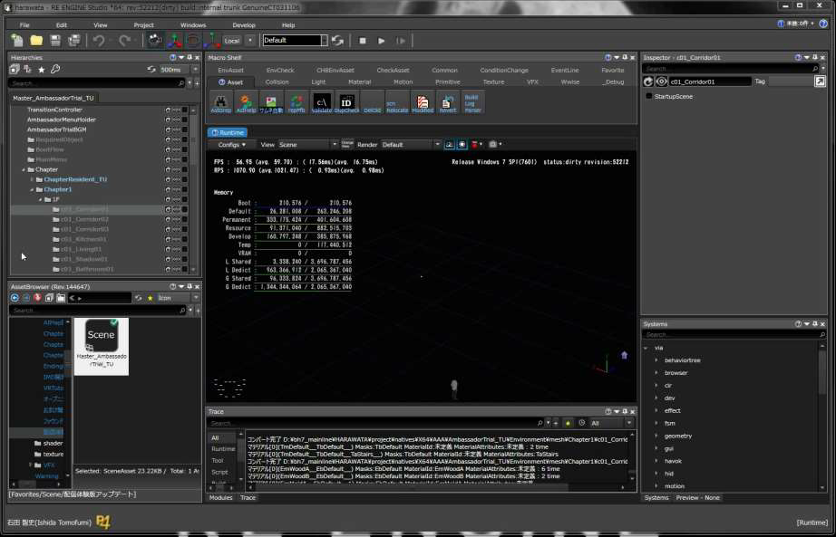


### Summary

* Abolished resource loading by game code
  * Dependencies between resources can be determined statically
    * Various efficiencies and automations are possible based on dependencies
  * Full control over resource load on the engine side
    * Supports asynchronous loading and reloading of all resources. Seek time optimization
* Restrict resource access on the engine side
  * Do not prepare synchronous load from the beginning
  * Reload first and force a response


## Script Architecture

### Old script architecture

* Coding all game logic in C++
  * Programmers do not use scripting languages
* Problem
  * Long build time ~15 minutes
    * Even with distributed builds!
  * Frequent crashes
  * Memory leak, memory corruption
  * Vast and chaotic C++ language specification


### New script architecture

* Coding all game logic in C#
  * There is no application-specific C++ code
* Advantage
  * Build is overwhelmingly fast ~10 seconds
  * Does not crash
  * Automatic memory management
  * No memory leak or memory corruption
  * Sophisticated C# language specifications

Resident Evil 7 Code Metrics


### New script architecture challenges

* Execution speed is slower than C ++
  * Marshall cost with native code
  * Strict handling of exceptions, etc.
* Garbage collection downtime
  * All threads stop irregularly for a long time (Stop The World)
  * Low compatibility with console game consoles
  * JIT compilation prohibited, risk of dealing with launch hardware


### RE ENGINE solution

* Develop your own virtual machine (REVM)
* Implement your own garbage collection


### Develop your own virtual machine REVM

* AOT compilation premise design
  * JIT compilation is not supported
* High affinity with C++ language
  * Significant reduction in martial costs
* Compact standard library
  * Import the minimum required functionality from Core FX
    * MIT license


### AOT compilation premise design

* Convert C# code to IL and AOT compilation
  * Pre-expand generics etc. and statically link
* During development
  * Output type information and microcode
* At release
  * Output type information and C++ code

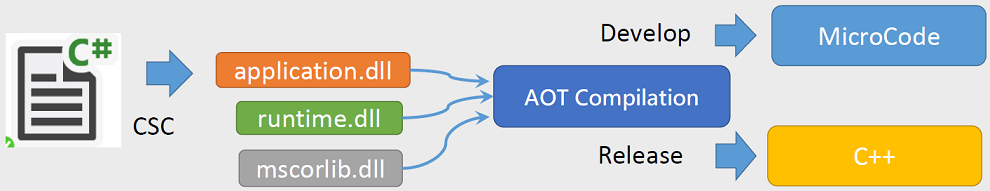


### During development

* Prioritize iteration speed
  * Convert IL to your own microcode
    * IL is not suitable for interpreter execution
  * Run microcode in the interpreter
* Supports hot patches
  * Reflect code changes in real time without rebooting


### At the time of release

* Prioritize execution performance
  * Convert IL to C++ code (IL2CPP)
  * C++ runtime code and static linking
    * All Marshall code is inlined
* Requires runtime build
  * Distributed build ~15 minutes

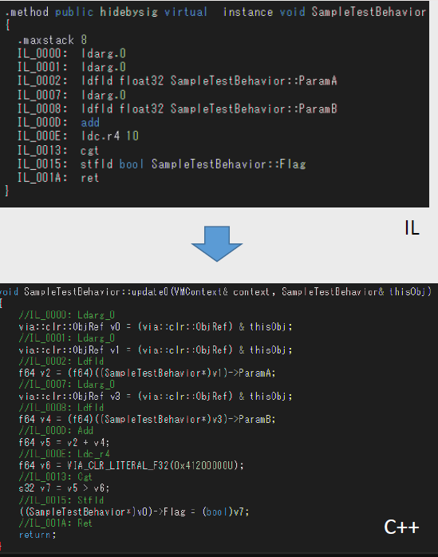


### High affinity with C++ language (1/4)

* Managed objects
  * Integrate instance model in C++/C#
  * All C# objects are managed objects
  * Classes defined in C++ can be inherited in C#
  * Reference counter (RC) manages instance life
* **Can interact in both directions at no martial cost**


### High affinity with C++ language (2/4)

* Automatically publish C++ classes to C#
  * Analyze C++ source code with Clang
  * Publish managed object inheritance class to C#
  * Publish singleton class to C# as Static class

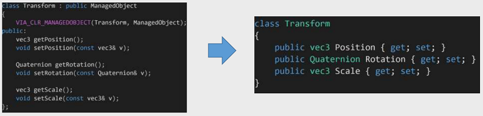


### High affinity with C++ language (3/4)

* Call C# methods from C++
  * Statically resolved using C++ Template
* Cost equivalent to calling a function pointer
  * All conversion codes are inlined

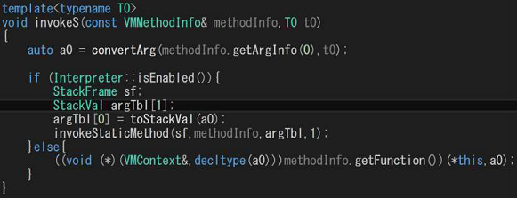


### High affinity with C++ language (4/4)

* Call C++ methods from C#
  * Two-stage marshall code for IL2CPP and interpreter
* Equivalent cost of calling C++ method directly
  * Marshall code for IL2CPP is inlined

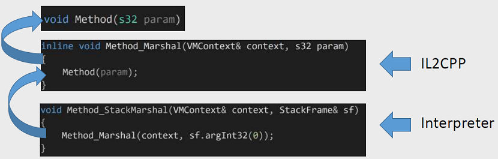


### REVM performance (1/2)

* Speed comparison between C++ code and C# code

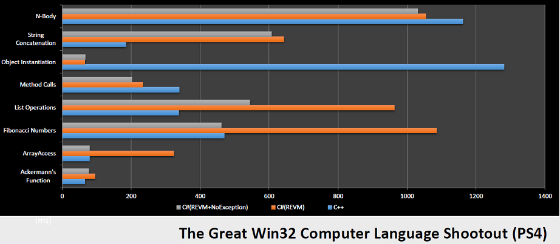


### REVM performance (2/2)

* Comparison between development (interpreter) and release (IL2CPP)

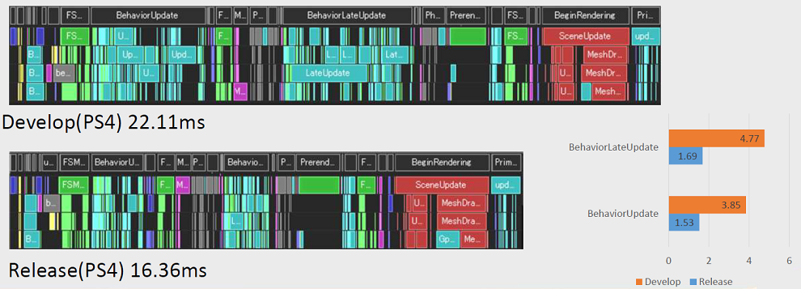


### Implement your own garbage collection

* Existing garbage collectors are not suitable for games
  * Generational GC method
    * Irregular and long outages due to major GC
  * Concurrent GC method
    * Slow down during GC execution, need enough free memory
  * Automatic reference counting method
    * Circular reference leaks, high overhead of counter operation
* Implement real-time GC suitable for game applications
  * FrameGC method


### FrameGC method

* Algorithms limited to gaming applications
  * Requires regular sync points with main loop
  * C# code is supposed to be used as a script
* Features
  * Predictable and controllable downtime
  * Immediate release
    * Memory available near limit
  * High performance on multi-core
  * High affinity with C++ language
* Algorithm details
  * See appendix description and pseudocode


### Frame GC flow

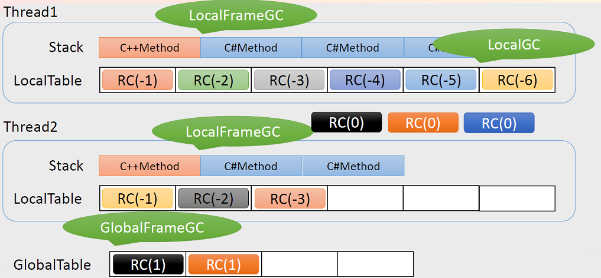


### The main points of FrameGC

* Take advantage of reference counters
  * The load does not depend on the number of objects
  * Unnecessary objects can be released immediately
  * High affinity with C++ language
* Eliminate the drawbacks of reference counters
  * Reduce the number of objects managed by the reference counter
    * Local that can refer to the object only from the thread to which it belongs, and refer to it from all threadsDivide into possible globals and refer only to global objects Counter management
  * Reduce reference counter operations
    * Operate the counter only when writing to a global object
  * Efficient collection of circular reference waste
    * Incrementally process only types and fields that may be circularly referenced


### FrameGC optimization

* Speeding up local frame GC is important
  * Occurs most frequently with every C# method call from C++
* Introducing a local heap
  * Holds 4KB of heap area for each thread
  * Allocate small local objects from the local heap
    * Increment pointer when secured
    * Reset pointer when released
  * Speed ​​close to stack allocation

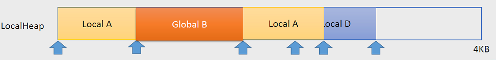


### FrameGC operation

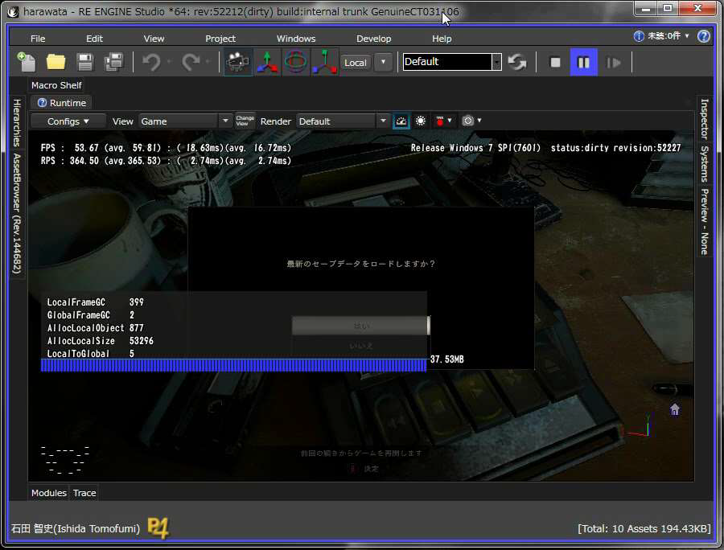


### FrameGC performance

* 1-frame profile of exploration/battle scenes (PS4)

|                          | Exploration scene | Battle scene |
| ------------------------ | ----------------- | ------------ |
| C++ => C# method call    | 2063              | 2093         |
| Local object generation  | 2457              | 5085         |
| Global object generation | 5                 | 14           |
| Local => Global conversion | 55              | 330          |
| Global table registration  | 49              | 300          |
| Cycle table registration   | 4               | 18           |
| Local frame GC             | 1018            | 1143         |
| Local GC                   | 0               | 0            |
| Global frame GC            | 4               | 8            |
| Local field store          | 5039            | 6714         |
| Global field store         | 1059            | 2385         |
| Local frame GC time (ms)*  | 0.116           | 0.174        |
| Global frame GC time (ms)  | 0.042           | 0.166        |
| Cycle GC time (ms)         | 0.013           | 0.037        |

* Local frame GC time is actually several times faster because it is executed in parallel with multiple cores.


### Summary

* C# is great!
  * Greatly improve programmer productivity
  * Application stop bugs do not occur
* No performance issues
  * REVM runs faster than bad C++ code
  * Frame GC changes the common sense that GC is not suitable for games


## 后记

翻译技巧

* 用[Google翻译][2]将整个pdf翻译成英文
* 然后对照原始pdf中的图片，综合理解


[1]:https://www.slideshare.net/capcom_rd/re-engine-72302524
[2]:https://translate.google.cn/
