# Achieve Rapid Iteration: RE ENGINE Design

* [Game Creators Conference 2017 的 ppt][1]


## RE ENGINE 简介

* CAPCOM's in-house next-generation game engine
  * New architecture from MT Framework
* Multi-platform support
  * PS4, Xbox One, PC (Steam / UWP)
* Adopted in Resident Evil 7 (生化危机7)
 * Will be used in various titles in the future


### Features

* High performance
  * High resolution and high frame rate
* High development efficiency (本ppt重点讨论)
  * Achieve high-speed iteration


### 传统的开发流程

需要很多步骤，才能看到整体效果。

1. 编程 → Build → 确认 → ...
2. DCC工具编辑 → 资源转换／导出 → 确认 → ...
3. 游戏启动 → 测试／试玩 → 参数调整 → ...
4. QA → Bug修正 → 打包 → ...


### 基于 RE ENGINE 的开发流程

* 所见即所得 (类似unity)
* Remote editing of the actual machine
* Reload support for all resources
* Real-time coding
* Package creation (一键打包)


### Achieve rapid iteration

* Reduced waiting time
* Increased number of trials and errors
* Increase the frequency of running on the actual machine
* Reduced bugs in QA
* "You can spend your spare time improving the quality of the game"


### Development results of Resident Evil 7

* Final project scale
  * Approximately 280,000 lines of C # game code, approximately 150,000 total assets
* Maintain fast iterations
  * Full build ~ 10 seconds, level adjustment was repeated many times until the end of development
  * （不知道这里指的是C#编译时间，还是包括资源；包括资源就太强了 Orz）
* Achieves stable performance on the actual machine
  * VR below 60fps = Cannot be released
* Peaceful QA
  * Is it the first large-scale title in our history?


## 大纲

* Tool Architecture
* Resource Architecture
* Script Architecture


## Tool Architecture

### Old Tool Architecture

* Tools run on runtime
  * Unique UI system
  * Real-time editing and adjustment on the actual machine

* Problem
  * There are restrictions on resolution and preformance on the actual machine
  * You need to create your own UI
  * It takes time to operate the actual machine
  * Edit data lost due to runtime crash


### New Tool Architecture

* Completely separate tool process
  * TCP/IP synchronization between runtime and tools
  * The tool runs on a PC and is implemented in WPF/C#

* Advantage
  * Works on high-speed, high-resoltion PCs
  * Rich WPF UI features
  * Instantly edit on a different real machine
  * Insensitive to runtime crashes

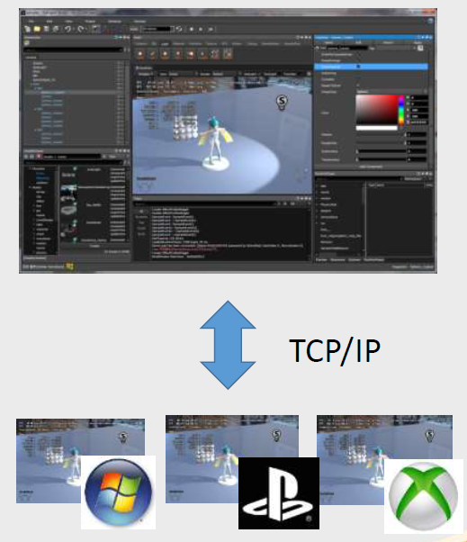


### New Tool Architecture Challenges

* Incompatible between languages
  * C++ for runtime and C# for tools
* Run-time operations need to be done asynchronously
  * Code is cumbersome and verbose
* Communication costs are likely to be an issue
  * Limited data transfer rate


### RE ENGINE solution

* Unification of communication protocols
* Remote object system


### Unification of communication protocols

* Unified communication method between runtime and tools
  * All communication is done with a common protocol
* Efficient protocol implementation
  * Common definitions between C# and C++ languages
  * Binary format communication
  * Concise description of asynchronous code


### Communication protocol (1/2)

* Remote entity
  * Binary serializable and deserializable classes between C++/C#
  * Defined in C# and automatically generated the corresponding C++ header

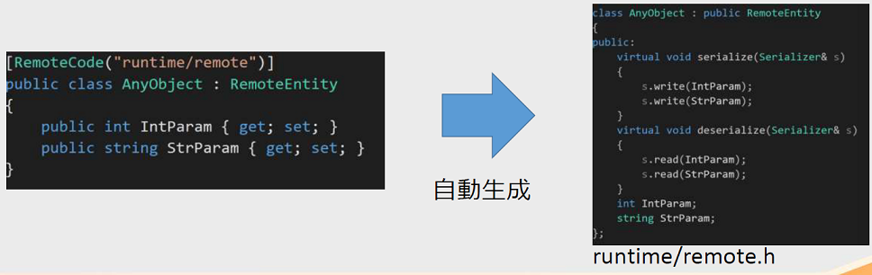


### Communication protocol (2/2)

* Query/Response protocol
  * Query/Response inherits remote entities
  * Query has an Execute method and returns Response as a return value
  * When Response is returned, the corresponding handler is executed

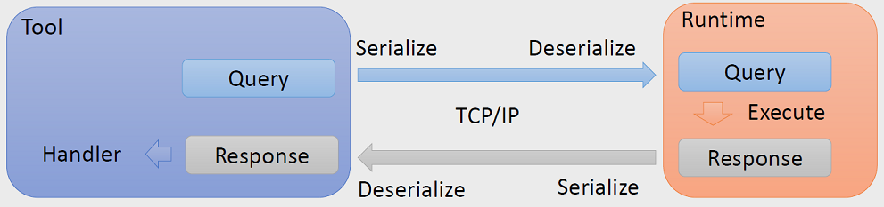


### Query/Response protocol (1/3)

* Protocol example
  * Get the world coordinates corresponding to the tool's mouse cursor position from runtim
* Define Query/Response on the tool side (C#)

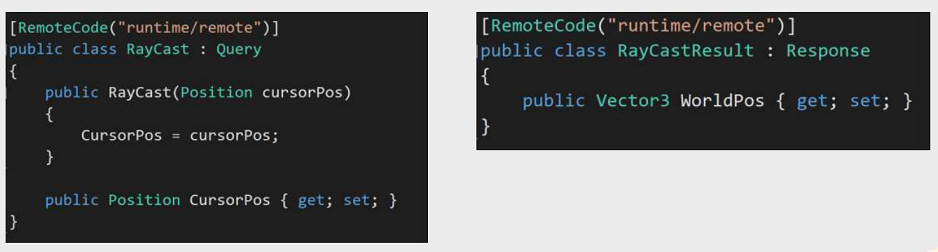


### Query/Response protocol (2/3)

* Automatically generate C ++ header files
* Implement Query execution code on the runtime side (C++)
  * Calculate world coordinates and return as Response

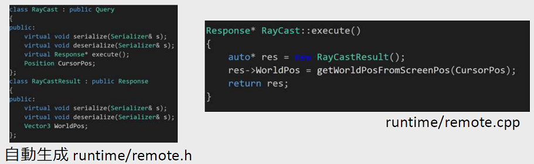


### Query/Response protocol (3/3)

* Send a query from the tool to the runtime
  * Callback is executed when Response is returned
    * Describe arbitrary processing based on Response
* Similar flow for query from runtime to tool

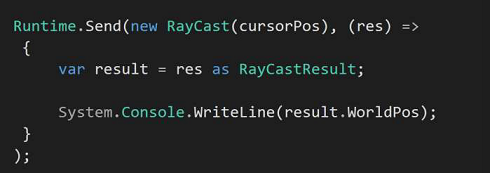


### Remote object system

* How to handle runtime objects transparently on the tool
  * Can absorb process and language differences
* Remote object
  * Virtual runtime instance on the tool
  * Arbitrarily materialized on runtime
  * Synchronize state between tools/runtime


### Remote object (1/3)

* Get all type information from runtime
  * Consists of type name and property information

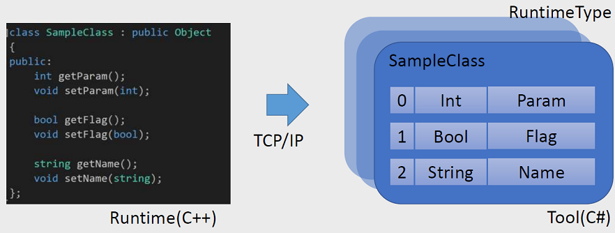


### Remote object (2/3)

* Creating a remote object
  * Build a virtual instance from a runtime type
  * Have a value corresponding to each property

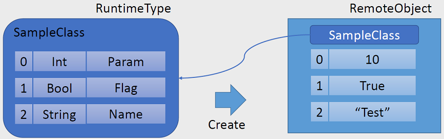


### Remote object (3/3)

* Wrap remote objects
  * Inherit RuntimeObject and implement accessor
    * Frequently used basic types, etc.
  * Can be written to handle runtime types directly

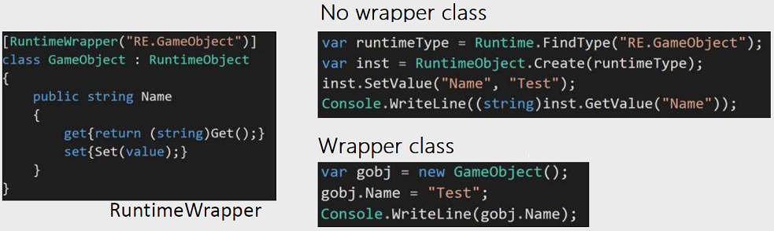


### Remote object synchronization (1/2)

* Assign an instance ID during the first sync
  * Instances synced from the tool have a positive ID
  * Instances synchronized from runtime have a negative ID
* Map instances in tables
  * Both tools and runtime have two tables

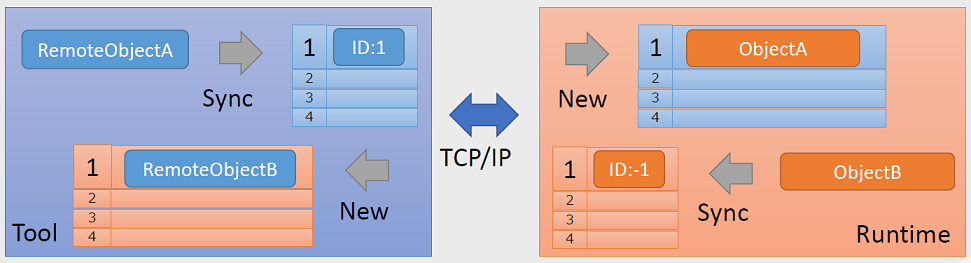


### Remote object synchronization (2/2)

* Basic state synchronization
  * Call Sync manually in a timely manner
* Automatic state synchronization
  * Add to monitor list
  * Every frame, the state of the runtime instanceMonitor
    * Automatically send only changed properties to the tool side
  * High load
    * Limited use such as when displaying the inspector

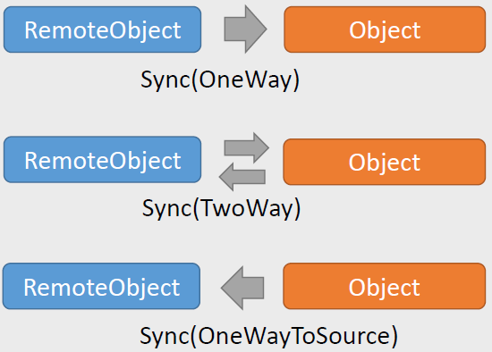


### Widget system

* Tool features that run on runtime
  * Operate from the tool side via a remote object
  * Improve communication costs and response

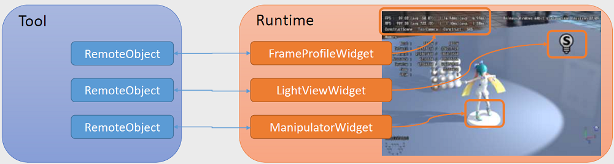


### Remote object behavior

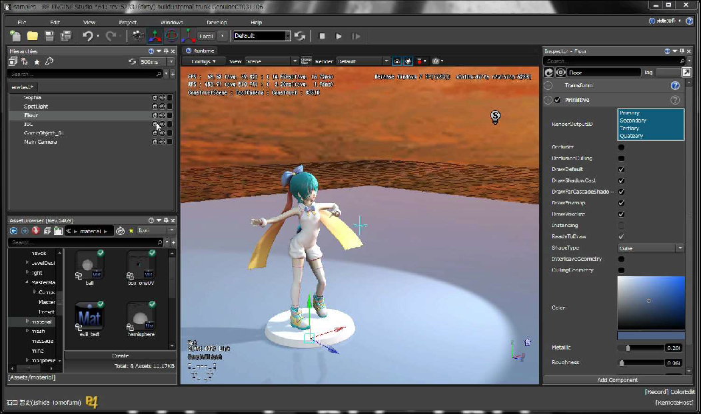


### Summary

* Tool process separation is very effective
  * Freely switch runtimes
  * In many cases, it can only be adjusted on the actual machine.
    * VR, mobile devices, etc.
  * Runtime is prone to crash
* Establish communication protocols and synchronization mechanisms
  * The complexity of process separation can be reduced


## Resource Architecture

### Old resource architecture

* File-based resource management
  * Resource loading is done with game code
* Problem
  * Synchronous load spikes
  * Resource updates that require a reboot
  * Long waiting time due to conversion
  * Manual packaging
    * Mixing of unnecessary resources, lack of required resources


### New resource architecture

* Asset-based resource management
  * Resource loading is done automatically on the engine side
* Advantage
  * Full control of resource loading
    * Supports asynchronous loading of all resources
    * Supports dynamic reloading of all resources
    * Reduce conversion time with cache
  * Automatic packaging
    * Automatically pack only the resources you need in the optimal order

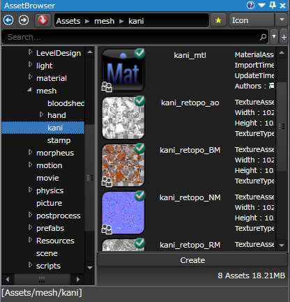


### New resource architecture challenges

* When playing a scene
  * Resources used need to be preloaded
* When creating a package
  * You need to know the resources used and the loading order
* Asynchronous load and reload support is required on the engine side
  * Difficult to enforce with all resources


### RE ENGINE solution

* Build static inter-asset dependency information
* Resource access constraints


### Building static inter-asset dependency information

* Introducing the concept of assets
  * Add metadata to the file
    * Include dependency information on other assets in metadata
* Abolished resource loading by game code
  * I don't know the resources used from the game code
* Build your game with one huge scene asset
  * Master scene assets


### Introducing the concept of assets

* Assets
  * Consists of intermediate data and metadata files
  * Save dependencies in metadata
  * Converted assets become resources
* Load metadata for all assets when the tool starts
  * You can statically build dependencies between all assets

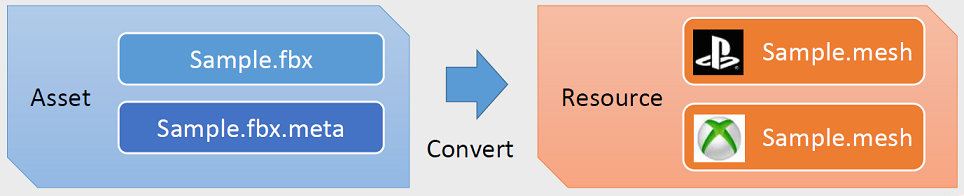


### Dependency information between assets

* There are two types of dependencies, Reference and Include.
  * A resource references another resource = Reference
  * Resources depend on the contents of other assets = Include

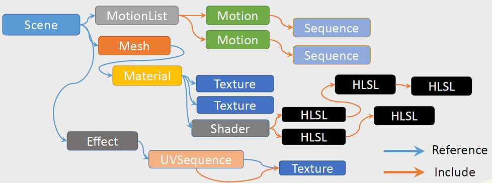


### Utilization of Reference information

* When loading resources / creating packages
  * Extract only Reference resources


### Utilization of Include information

* Conversion process when updating assets
  * Convert all Include original assets
* Sharing converted resources
  * Calculate resource ID from hash of all Include assets
  * Upload / download to server based on resource ID

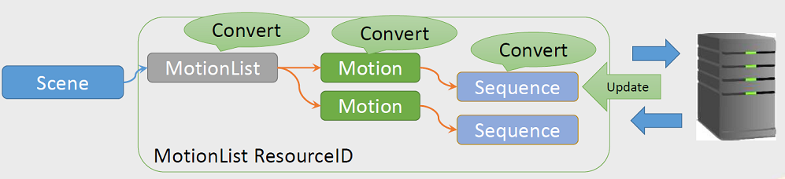


### Master scene assets

* Includes all the scene assets that make up the game
  * Become the root of dependencies between assets
* Activate the scene as it progresses
  * Easy seamless loading

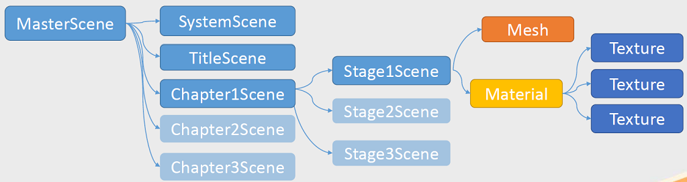


### Dependencies between assets

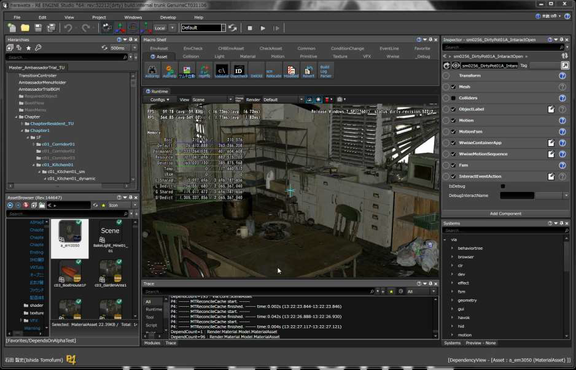


### Resource access constraints

* Do not implement synchronous loading
  * A major factor in spikes
    * Block code until resource loading is complete
    * Intuitive and easy to use, so it tends to be used a lot
  * Supports asynchronous loads only
* Reload support is compulsory
  * Old resource access warns
* **No impact on game code**
  * There is no way to access resources directly


###  Resource access during asynchronous loading

* Cannot access immediately after resource creation
  * ASSERT fails if accessed before loading is complete

```C++
m_handle = Resource::load<Texture>("test");
m_handle->getWidth(); // ASSERT, can't do it
```

* Wait for the resource to finish loading before accessing

```C++
if (m_handle.isValid()) // returns true if valid
{
  m_handle->getWidth(); // only accessible if valid
}
```


### All resources support asynchronous loading

* Road spikes do not occur in principle
* The load order can be rearranged
  * The conversion time is hidden

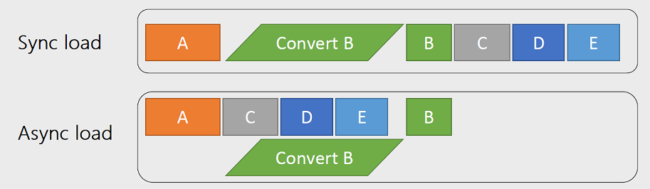


### Resource access when reloading

* Load update resources first
  * Both old and new resources are in memory
  * Add a reference to the new resource to the old resource
* Query the resource handle for updates
  * If there is an update, replace the old and new resources
  * The old resource is released when the update of all resource handles is completed.
* Reload only enabled during development

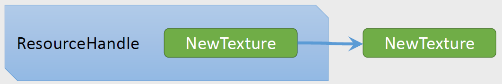


## Script Architecture


## 后记

翻译技巧

* 用[Google翻译][2]将整个pdf翻译成英文
* 然后对照原始pdf中的图片，综合理解


[1]:https://www.slideshare.net/capcom_rd/re-engine-72302524
[2]:https://translate.google.cn/
