# Introduction to Macro (Plug-in) - RE ENGINE's Supporting Game Development

* https://cedil.cesa.or.jp/cedil_sessions/view/1683

## 个人介绍

関野優樹

* 2009年加入公司，隶属技术开发部
* DCC Plug-in support
  * Softimage XSI, Autodesk MAYA
* In-house game engine support
  * MT FRAMEWORK
  * RE ENGINE

## 内容简介

* RE ENGINE
  * CAPCOM in-house development environment
    * Daily function updates
* Simultaneous development with BIOHAZARD 7(生化危机7)
  * Will continue to be used in various game titles
* Introduction of some Macro functions
  * 人生苦短，我用Python

## RE ENGINE 简介

* Asset-based Development
  * Resolve dependencies between Assets based on Meta information
* Component design
  * Add component to GameObject and build a game
* Tool(C#) and Runtime(C++ separated
  * Run game code(C#) on asynchronous communication virtual machine (REVM) with TCP/IP
* For details
  * See "[Achieve Rapid Iteration: RE ENGINE Design][3]"

## 大纲

* What is Macro?
* Background of implementing Macro
* Where Macro is effective
* Internal implementation

## What is Macro?

### Relationship between RE ENGINE and Macro

**Macro** is a Python environment running on RE ENGINE

* Direct access to various values ​​in RE ENGINE
  * GameObject, Component, Prefab Asset etc ...
* Can call RE ENGINE internal functions
  * Call via Command
* Working with RE ENGINE Editor
  * Python code can be written and executed

### Features similar to Macro

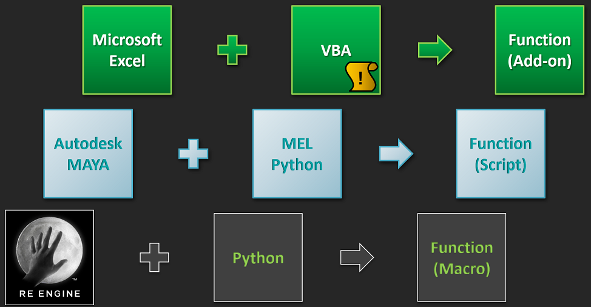

### Macro Commands

* The number of commands is 400+ (as of September 2017)

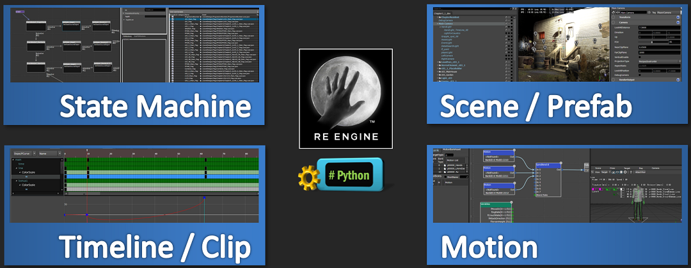

### Macro execution environment Demo

* Introducing Macro Editor, Macro Shelf
  * RE ENGINE is Python executable
* Python can
  * Call RE ENGINE functions
  * Edit the value in RE ENGINE

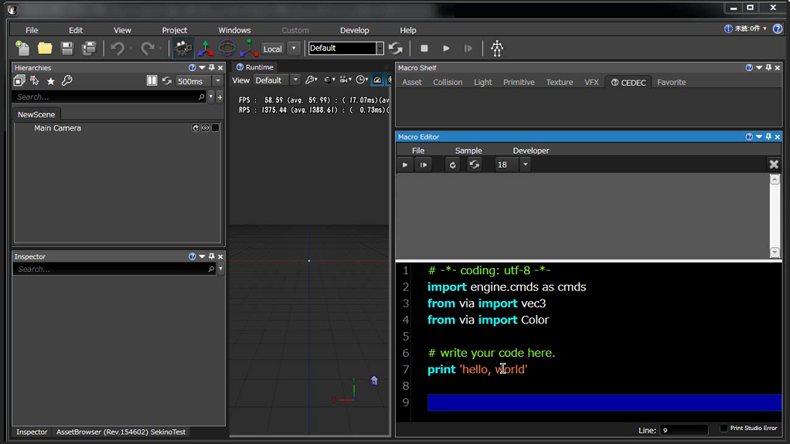

### Demo1 - Features seen from (TODO: name it DEMO?)

• Run RE ENGINE functions from Python
  * An alternative to cumbersome manual work
* No need to build RE ENGINE when adding features
  * Feel free to implement functions and try them out
* Easy buttoning and intuitive execution
  * Artists and planners are also friendly

### Macro Editor @ RE ENGINE

* Ready to implement and try
  * supports Command completion
* Syntax Highlighting
  * Syntax errors can also be displayed
* ~~Maya Script Editor style~~

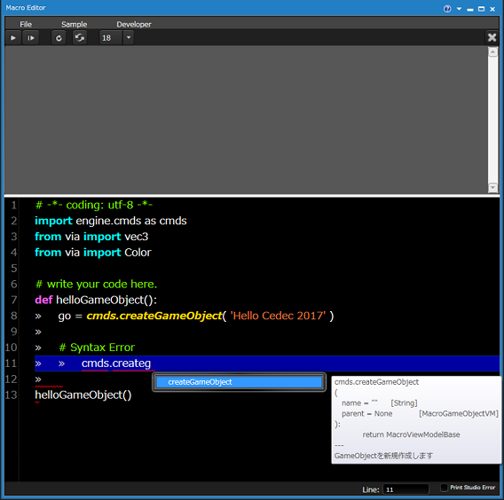

### Macro Shelf @ RE ENGINE

* Button the created Python code
  * Icon, label, ToolTip can be changed
* Button information is shared within the team
  * Save as external file, version control, distribution
* ~~Maya Shelf style~~

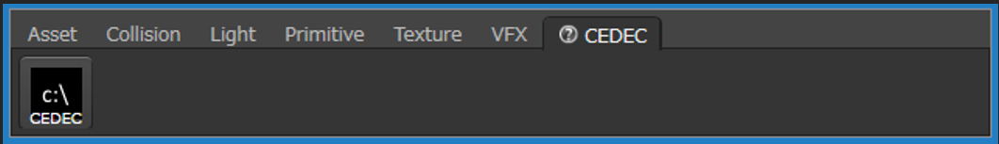

### Command Reference (automatically generated)

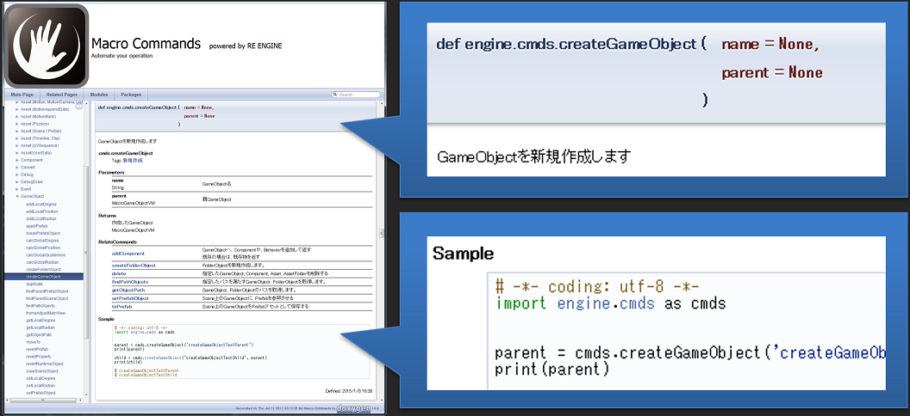

## Background of implementing Macro

### RE ENGINE provision policy

* RE ENGINE distributes "execution environment"
  * Do not allow game developers to change core functionality
    * Only browse the source code and solve it by communicating your request
    * Reduces the burden on game and game engine developers
  * The fate of game engine developers
  * Guarantee execution performance and production flow

### But there is no "perfect from the beginning"

* RE ENGINE (early development)
  * Lack of tools and features
    * Gradually add / change functions
  * BIOHAZARD 7 Development Team
    * A few more steps to make up for missing features
    * Add unique functions to match the game you are developing
  * Specification changes and additions
    * I want to reduce the manual work that occurs

### To deal with problems in the early stages of development

* Introduced the interpreted language Python
  * Powerful standard library
  * Employees creating MAYA Plug-in have already learned
    * Low learning cost
  * Access to in-game Property values
    * Asset, GameObject, Component etc
  * Provides useful functionality as a Command

### Started implementation of Macro

* Development started a few months behind RE ENGINE
* Given task
  * Complement the functions of RE ENGINE for each game you develop
  * I want to simplify the work as much as possible
  * Aiming for a safe and easy-to-expand environment

## Where Macro is effective

### Well, everyone

* While making a game
* Have you ever thought about this?

### Recent large-scale development is becoming more complicated

BIOHAZARD 7 统计数据

* Number of Props(accessories): 2700+
* Number of Stage(room): 600+
* Number of workers: 30+
* Lots of work, increased staff, development period does not change much
  * 人少、事多、时间紧

### 挑战1 - 美术人员多

* It's a nice scream!
* Communicate the detailed work flow!
* Let's make materials that people will not make mistakes!
* (Maybe I make a mistake, but I'll point it out at any time)

### 挑战2 - Asset optimization

* Weird size texture!
* Collision is too subdivided!
* I want to see the latest Asset information in Excel!
* (If you can't, I'll do my best to make Excel by hand)

### More or Less

* Similar experience
* Maybe many people have it?

### Game development sites have challenges

* Define the optimal configuration for each game under development
  * Asset structure, folder structure, naming convention
* Making games according to new rules
  * Game developers who join in the middle are confused by the composition of the first look

### Problems that occur in the above situations

* It takes time to make materials
  * If you have a lot of trouble, it will be difficult
* People make mistakes
  * Misunderstanding, tired eyes, mistaken operation, high difficulty
  * In some cases, it is requested many times
* Gradually, the original work becomes difficult

### Challenges in managing people and work

* It is clear that it also occurs in BIOHAZARD 7
* In Macro, prepare buttons for each purpose and deal with them
  * 标准化、流程化

### Prefab Setup

* Manual (之前)
  1. Create Shader settings for drawing mesh
  2. Prefab creation
  3. Set up GameObject configuration 
  4. Add required Component
  5. Reflects various parameters
  6. 1 Process Prefab in minutes (x2700)
* Macro (改进后)
  1. Select Drawing Mesh in Asset Browser
  2. Press the button (Shader setting / Prefab creation, reflection / error correction)
  3. 1 Process Prefab in seconds

### Prefab Setup (续)

* Setup work also occurs when changing specifications
  * Change the collision detection attribute
    * Increased / decreased / changed etc ...
  * Edit Component in Prefab
    * Value setting
  * Change Shader settings
    * It is necessary to judge according to the specifications

### Demo2 - Macro Prefab Setup

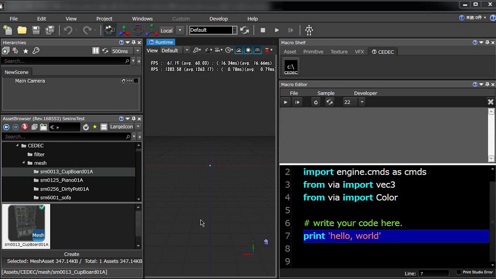

### 美术资源信息表

* Manual (之前)
  1. Open Prefab with RE ENGINE
  2. Copy & Paste the number of drawn Mesh Polygons
  3. Copy & Paste Texture resolution
  4. Copy & Paste the number of Collision Polygon
  5. Repeat the above for the number of Prefabs
  6. Excel file creation over several hours 
* Macro (改进后)
  1. Select a folder in the Asset Browser 
  2. Access information in all Prefabs in a folder
  3. Create an Excel file in tens of seconds 

### Prefab Setup (续)

* Originally "non" creative work
  * Sober work (Copy & Paste of values)
* Must be run by a knowledgeable person on a regular basis
  * Analysis of the obtained situation, understanding of specifications
* Reduce the work of knowledgeable personnel
  * Specified and routine work = `Macro` comes into play

## Internal implementation

### Content for programmers

* The difficulty of the material increases
  * About Macro internal implementation
  * Ingenuity until Macro spreads within the company

### Contents of Macro

* IronPython
  * Python 2.7.* Executive function
  * http://ironpython.net
* Avalon Edit
  * Text Editor
  * http://avalonedit.net

### IronPython

* .NET Framework
* Passing a string interprets it as Python 2.7.*
  * Also provides a standard Python library
* Method defined in C# can be executed
  * Mandatory
  * Function Module / namespace resolution

### Avalon Edit

* WPF Text control
* Provides the following functions
  * Syntax Highlighting
  * line number
  * Code completion UI

### I will talk about this item

**IronPython**

### Ultimate story

* Incorporate IronPython into your development environment
  * From strings (Python code)
    * Can call all C# functions
    * You can also get/set C# Property values
  * However, the namespace needs to be resolved

### Command execution

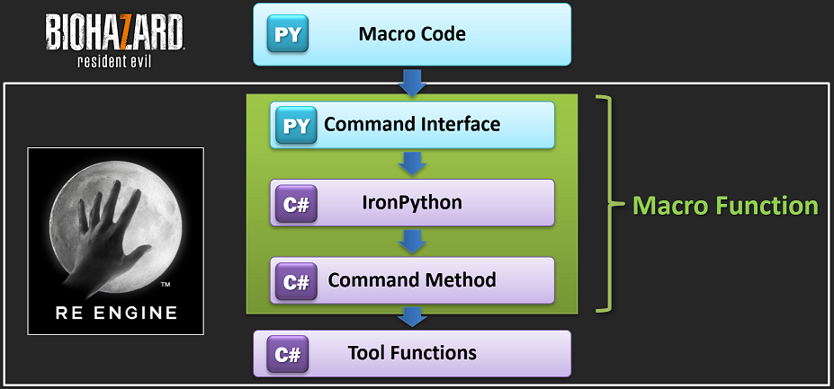

### Why interface

* All Commands to a single Python Module
  * Emphasis on clarity
    * e.g.: `import engine.cmds as cmds`, and all Macro Commands are available
* Prevent Python run-time errors
  * Changed the specifications of the Tool function in RE ENGINE
  * Build error in Macro Method

### Command Interface 机制

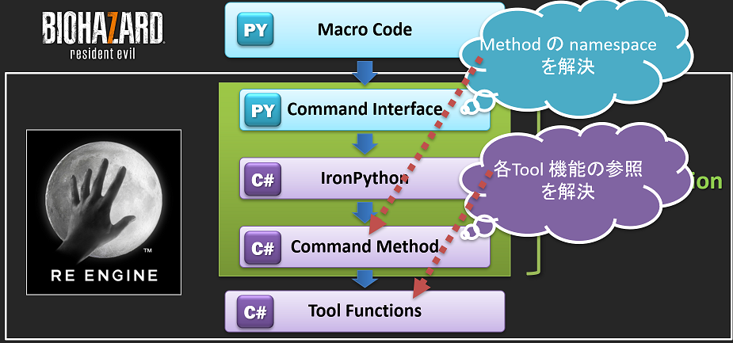

### Interface & Method 范例

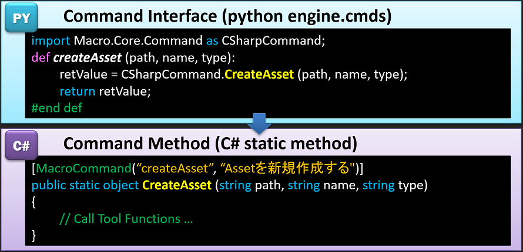

### Command Interface

* Python file that describes the function
* Generated from C# Command Method
  * Based on Attribute information
  * Output `__init__.py` as a Text file
    * Write the Reference generation code in the comment
    * HTMLization via Doxygen

### Why it takes time

* All to make Macro easy
  * Design a function that you can try immediately with peace of mind
    * e.g. GameObject creation command
      * To Scene? To Prefab?
      * Which GameObject child?
  * Due to the in-house development environment, case search on the Web is not possible
    * How to lower the hurdle

### To make it more convenient

* Activities like an in-house evangelist
  * Talk directly to the game development site
    * How can I achieve the desired function?
  * Implement and provide simple functions on the spot
    * PR of Reference / Editor function
  * Specification consultation and idea sharing
    * Occasionally hold a presentation of new features by gathering stakeholders
  * There are many surprising features created by this activity

### Demo3 - Maya & RE ENGINE cooperation

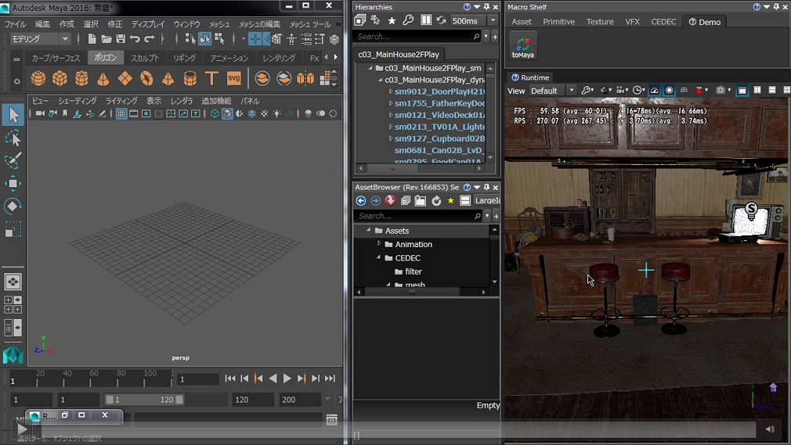

### Changes in the exchange

* More people are creating prototype tools
  * technical artist is more of
    * I'm planning to make such a function, but do you have a sample?
  * young programmer is more of
    * Implement unexpected features
  * mid-veteran programmer is more of
    * "It's fun to make"

### Technical summary

* IronPython and AvalonEdit are great
* Browse C# functions from Python over Interface
  * Avoid run-time errors
* Attempt to get to know the function
  * Automatic reference generation and hearing
* Cooperation with other applications

### Session Summary

* Python (interpreter language) is very convenient !!
  * Increased productivity by introducing it into the in-house production environment
    * Easily provide the functions you need at any given time
* Possibility in environments other than RE ENGINE
* Design and act according to the environment
  * Command design, documentation, hearing

## Do you have any questions?

* What is Macro?
  * Plug-in mechanism on RE ENGINE
  * Easy to call and distribute Tool functions at once
* Background of implementing Macro
  * Add functionality without building RE ENGINE
  * Retrofitting functions tailored to the environment of each game
* Where Macro is effective
  * Consolidate the work of many existing personnel
  * Work with fixed specifications and handle physical quantity
* Internal implementation
  * Use IronPython, Avalon Edit
  * Command Interface to keep using with confidence

## Q&A

### #1 - Interface explanation

* 没有 Command Interface 层级
* 引擎功能修改，需要对应修改项目的 Macro Code

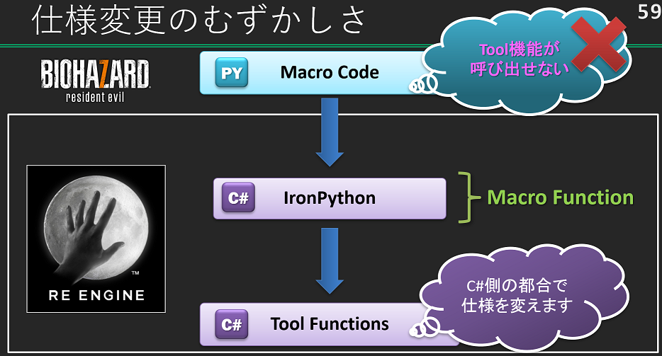

* 建立 Command Interface 层级
* 引擎功能变更，由 Command Method 隔离起来
  * 引擎组保证 Command Method 能 works~

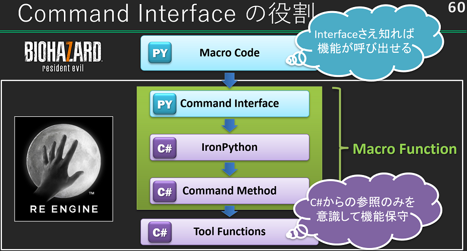

### #2 - Property composition

* 属性反射到界面上

#### About data structure

* RE ENGINE Tool is created in WPF
  * The design pattern is MVVM (Model-ViewModel-View)
  * Macro edits the Model via a dedicated ViewModel
* For more information on RE ENGINE's MVVM
  * see: [CEDEC 2015] Modern game production environment:Explanation of specific methods
    of communication between editors, their backends, and development staff
  * http: / /cedec.cesa.or.jp/2015/session/ENG/3250.html

#### Macro MVVM

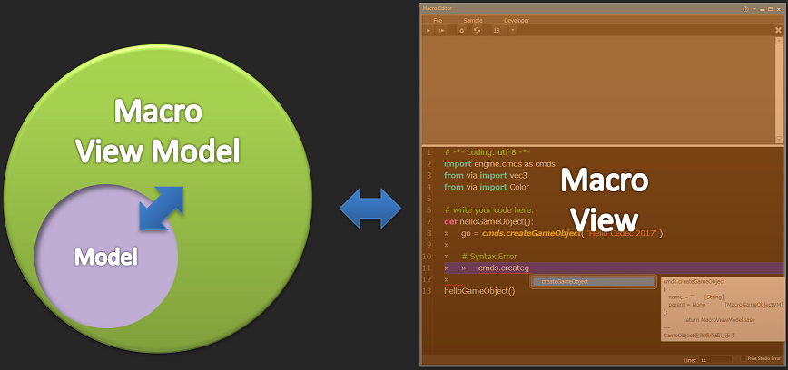

#### Macro ViewModel - Model

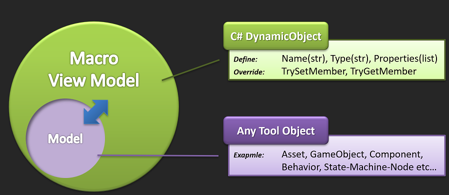

#### Macro ViewModel

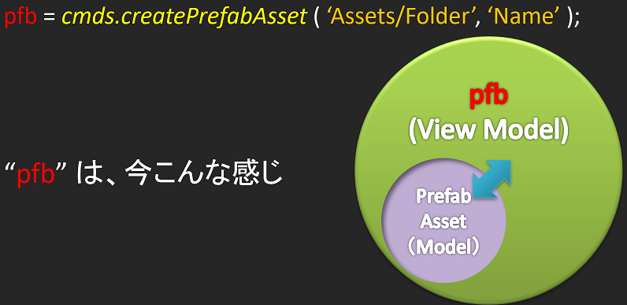

#### Invoke TryGetMember

#### Macro Properties

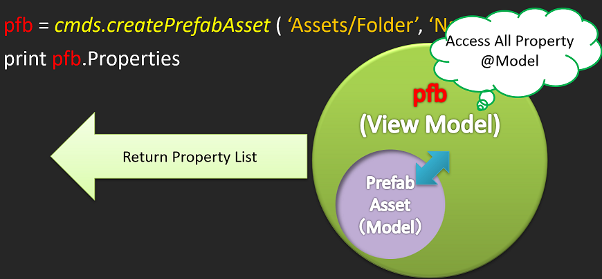

#### Macro Property @ RE ENGINE

* Property 列表
  * Name
  * Value
  * Type
* ~~XSI SDK Explorer style~~

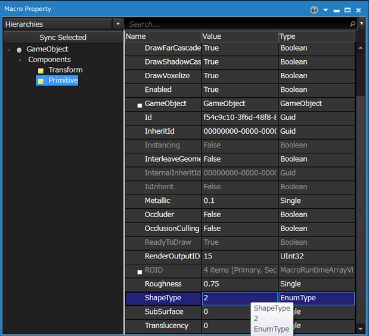

## 后记

* CDEDC 可免费注册会员，下载 ppsx
* 下载的 ppsx 文件，转换为 pdf（[ppsx-to-pdf][1]）
* 用 [Google Translate][2] 翻译 pdf

[1]:https://www.zamzar.com/convert/ppsx-to-pdf/
[2]:https://translate.google.cn/
[3]:https://github.com/kasicass/blog/blob/master/3d-reengine/2021_03_10_achieve_rapid_iteration_re_engine_design.md
