# RE ENGINE - GPU-Driven Rendering

* https://www.slideshare.net/capcom_rd/gpu-59175056


## 大纲

* Rendering pipeline
* Mesh renderer
* Light culling


## Rendering Pipeline

* For multi-platform
  * Intermediate drawing command
  * Native drawing instructions
  * Resource management


### Rendering Pipeline

* 接下来讲解：Intermediate drawing command

```
Intermediate drawing command => Sort drawing instructions => Native drawing command
```


### Intermediate drawing command

* Used by programmers
  * In-house drawing command
    * Multithread
    * Build-in drawing context
  * Instruction reuse


### Intermediate drawing command

* Basic instructions are DirectX 11 style
  * DX12 generation features
    * Multi Draw and Async Compute
    * Low cost use of 32-bit constants
  * General instructions
    * Copy, Update Buffer
    * Draw, Dispatch, etc.
  * Specify priority

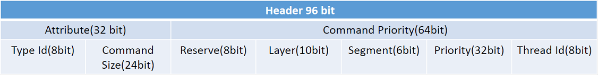


### Drawing context

* Interface for creating drawing instructions
  * Exists for each thread
    * Holds a unique thread ID
  * Priority setting
  * Settings for various drawing resources
  * Shader and resource integrity check
  * Create intermediate drawing instructions


### Types of drawing instruction resources

* Elements required for graphics
  * Texture,
  * Shader Binary,
  * ShaderResourceView,
  * UnordredAccessView,
  * VertexBuffer,
  * Index Buffer...

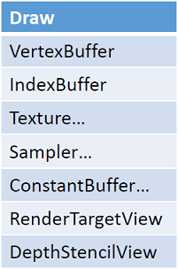


### Resource management of drawing instructions

* Object reference status is managed by reference counting
* Resource lifetime management
  * Must be guaranteed to survive until drawing is complete
  * Needs separate lifetime management than the reference counter
    * Lifetime management uses security frames
      * Guarantee frame substitutes current frame + n at reference
    * The guaranteed frame exceeds the current frame and the reference count with 0 is released from the memory
  * Lifetime management is at the time of issuing the drawing command 


### Resource configuration of drawing instructions

* Consists of multiple resources
  * High setup cost
    * Collecting resources
    * Update guarantee frame to collected resources
  * A large number of drawing commands during in-game
  * Setup costs cannot be ignored


### Reuse of drawing instruction resources

* Empirically, the drawing command is not much different from the previous drawing.
  * Draw mesh
    * Send almost the same combination of resources each time
    * It is the content of the resource that is updated, the handle is fixed
  * Drawing particles
    * Resources to use are predetermined
* Reuse as same as last time
  * Improve CPU performance


### Resource expansion

* Aggregate resources into meaningful units
  * Created at initialization
  * Reuse in multiple frames
  * Manage internal resources
    * At creation time
      * Only the reference counter of the resource you have updated at creation
    * At release
      * Reflected in the resources that have the guarantee
    * Update check drops to play
* Created at runtime
  * PipelineResourceTable
    * Because what you need at run time is determined
  * Reuse to reduce drawing costs

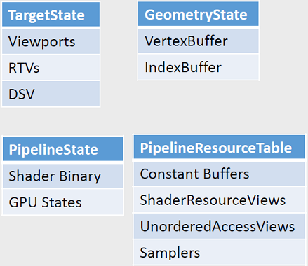


### Drawing resources to send

* Four resources for the Draw instruction

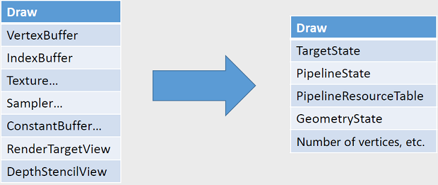


### Multithreading of intermediate drawing instructions

* Native drawing instructions are executed in the order of priority of intermediate drawing instructions
  * Issuance of intermediate drawing instructions can be separated from actual drawing
* Execution of translucent and opaque instructions

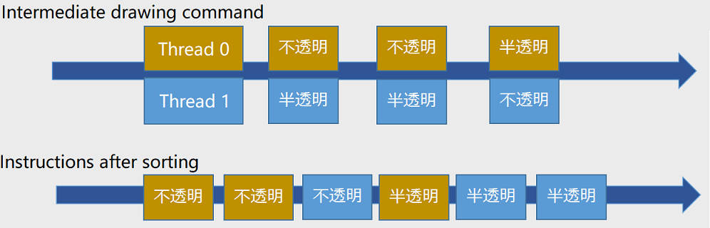


### Multithreading of intermediate drawing instructions

* Priority application example
  * Optimize drawing order
    * Drawing in front order to make EarlyZ work
    * Back-order drawing for translucent consistency
  * Controlling data copy timing
  * Adjusting compute shader dependent resources
  * Delayed check process


### Adjusting Compute Shader Dependent Resources

* Stall where UAV and SRV ping pong in CS
  * Problems with GPU sorting, simulation, etc.
  * Adjust priorities so that dependent resources are not processed continuously
  * Mix with other CS to avoid

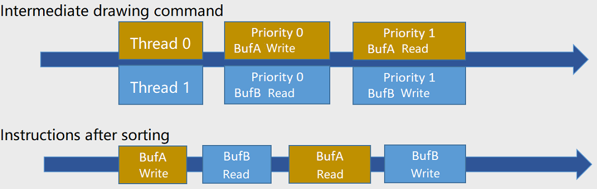


### Multithread

* Actual engine operation (3-stage)

```
Update information
on lights and        ==>  Build drawing path  =>  Drawing process
meshes 
```


### Update information on lights and meshes

* Pre-processing before actual drawing with multithreading
* Light
  * Judge whether to cast a shadow and register / cancel the drawing path
  * Whether to update the shadow cache
* mesh
  * For details, see the second half!


### Build drawing path

* Collect drawing paths used in the current frame
  * GBuffer
  * Deferred Lighting
  * ShadowCast
  * PostProcess
  * Etc
* Drawing path construction works single
  * Create the highest priority value (LayerId)
  * Subsequent drawing processing can create accurate drawing timing by using the priority of the path.
* The drawing instructions issued by the drawing path are multithreaded.
  * Clearing or copying the screen at the beginning of the drawing path


### Drawing process

* Multi-threaded
  * Individual drawing processes are independent
    * Drawing depends on drawing resources and drawing path (priority)
  * Create an intermediate drawing command from the drawing path collected by each drawing process


### Command capture and play

* Reuse drawing commands once created
  * Fastest because you can omit memory settings etc.
* Example
  * Shadowcast mesh, post process
* Capture and play constraints
  * Resources that depend on the drawing path cannot be used in another drawing path
    * Change the local constant buffer to the globalized constant buffer of the engine, etc.
    * Example: There is only one CameraConstantBuffer in the scene...


### Rendering Pipeline

* 接下来讲解：Sort drawing instructions

```
Intermediate drawing command => Sort drawing instructions => Native drawing command
```


### Sort

* Sort in the correct instruction order
  * Use stable sorting
    * Drawing instructions with the same priority and the same thread maintain the issuing order.
* Sorting is multithreaded


### Rendering Pipeline

* 接下来讲解：Native drawing command

```
Intermediate drawing command => Sort drawing instructions => Native drawing command
```


### Native drawing command

* Pass intermediate drawing instructions to the graphics API
  * DirectX11, DirectX12, Mantle, etc...
* Created in multithread

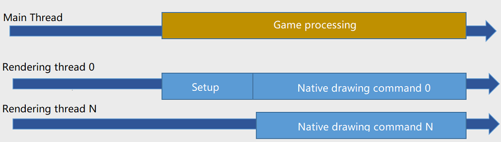


### Support native drawing instructions from resources

* Pre-optimized reusable processing
  * Gather the information needed to create the intermediate drawing instructions
    * Implementation differs depending on the platform
      * DX11 is a simple array of resources
      * Build a descriptor table for DX12
  * Designed on the assumption that resources will be reused


### Support native drawing instructions from resources

* Separation of resource processing by update frequency
  * Resources that may be updated
    * ConstantBuffer
      * It is used to update small units such as location information and camera information, and the handle is variable.
      * Implementation differs depending on the platform
    * Texture
      * Because the handle is variable, such as with streaming textures.
  * Resources that are not updated
    * RWTexture, Buffer, RWBuffer, Sampler
* Collect only CB and Texture when creating native drawing instructions


### Summary

* Creating multithreaded drawing instructions
* Resource aggregation and reuse
* How to improve performance?


## Mesh renderer

* Mesh renderer goals
  * Process more geometry faster than ever before
  * Reduce the number of drawing calls
  * Effective culling
  * Take over CPU load from GPU
  * Utilization of CPU SIMD
  * CPU, GPU cache friendly


### Challenges as a new engine

* High performance even in general-purpose design
* Do not close extensibility
* Multi-platform
  * Capacity to support the latest APIs
    * Mantle, DirectX12, etc...
  * Below considers up to DirectX 11th generation
* Challenge to [zero driver overhead][1]


### Mesh renderer initiatives

* Indirect drawing API
  * All meshes are drawn by the Indirect instruction
* Reduce drawing calls
  * Multi-Draw, Instancing
  * Merge mesh
* GPU culling


### Indirect drawing API

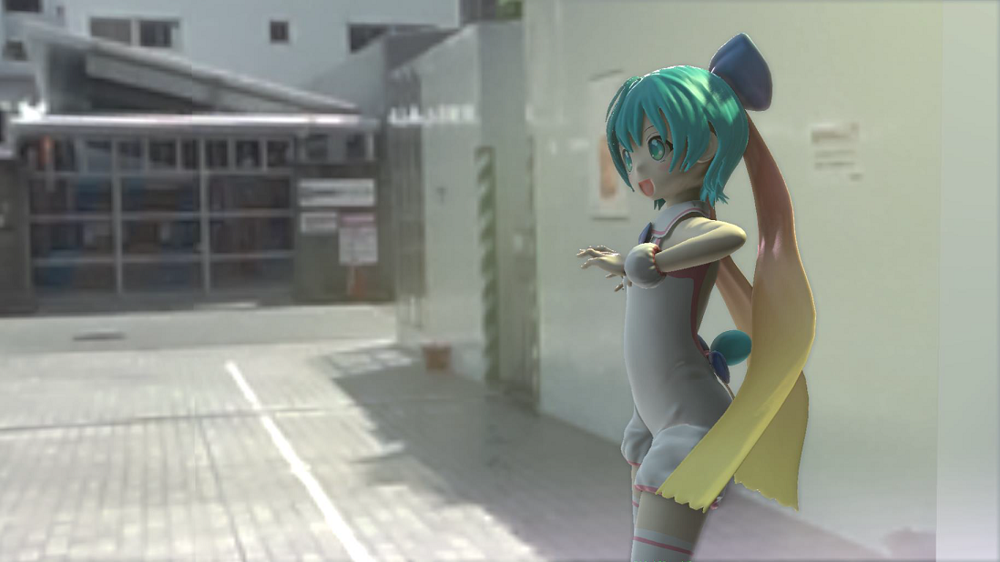


### What is an Indirect instruction?

* Specify drawing API arguments in the GPU buffer
  * Argument control is possible from GPU
  * If the argument data is on the CPU side, it needs to be transferred to the GPU.
  * Buffer offset is specified by the CPU

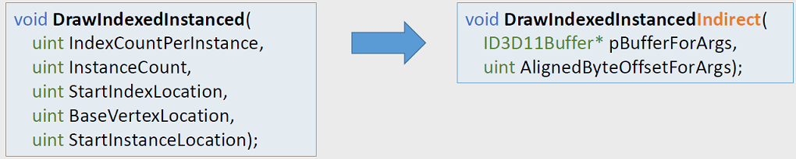


### Arguments for the Indirect instruction

* Data for drawing geometry (20 bytes)
* Focus on managing this data

```C++
struct DrawIndexedInstancedArgs {
    uint IndexCountPerInstance;
    uint InstanceCount;
    uint StartIndexLocation;
    uint BaseVertexLocation;
    uint StartInstanceLocation;
};
```


### Management of Indirect arguments

* Allocate some area of ​​VRAM
  * Manage allocated space with an allocator
  * Easy CS access by using a single resource
* Buffer usage strategy
  * Transfer information including LOD and shadow model in mesh units
  * Change the buffer offset when switching LOD
  * Re-transfer when switching mesh status (parts, etc.)


### Memory usage diagram of the Indirect argument

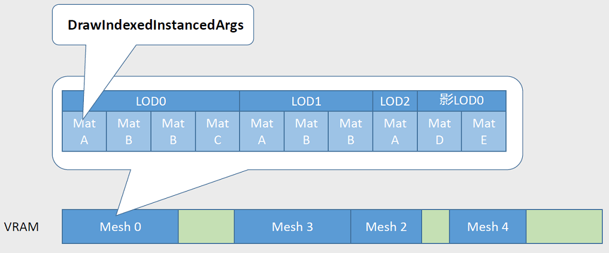


### Can I use the Indirect instruction?

* Is there a big change in CPU load?
  * In the case of PC, it depends on the driver implementation (may it be slower?)
  * Buffer management overhead
* Potential
  * Using Multi-Draw
  * [GPU-Driven Rendering Pipeline][2]


### Reduction of draw calls

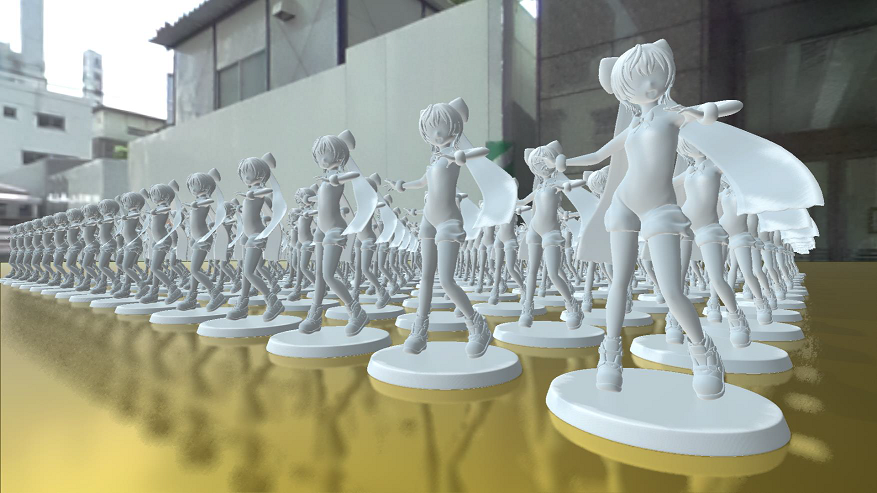


### What is Multi-Draw API?

* Perform multiple Indirect draws in a single draw call
* DirectX12, OpenGL4.4, [Extended DirectX11][4]
  * Similar functionality available


### A naive implementation of mesh drawing

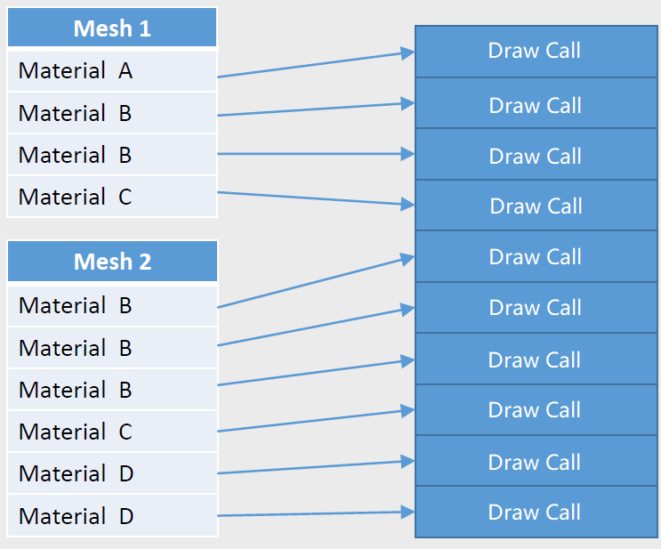


### Implementation using Multi-Draw

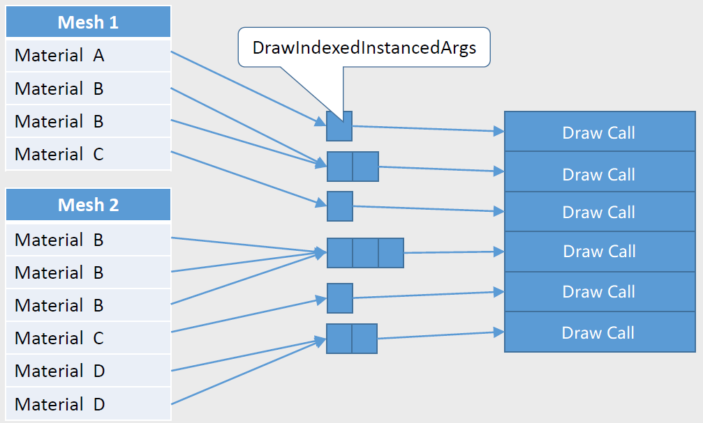


### Can Multi-Draw be used?

* Supported platform issues
  * Replaced with multiple Indirect instructions in DirectX 11
* Be sure to think if you use the Indirect instruction
  * Simple reduction of drawing calls


### Regarding Instancing

* Hashmap management of identical drawable instances
  * Automatic Instancing
  * Transfer the number of instances after CPU culling to GPU
  * CS controls InstanceCount in Indirect buffer
* Buffering instance information
  * Change from CB to Structured Buffer
* Instance information
  * World Matrix
  * Previous World Matrix
  * Joint Offset
  * Previous Joint Offset
  * Shader Parameters


### Management of instance information

* Renderer manages all instance information
  * Subtract by mesh-specific offset and SV_InstanceID

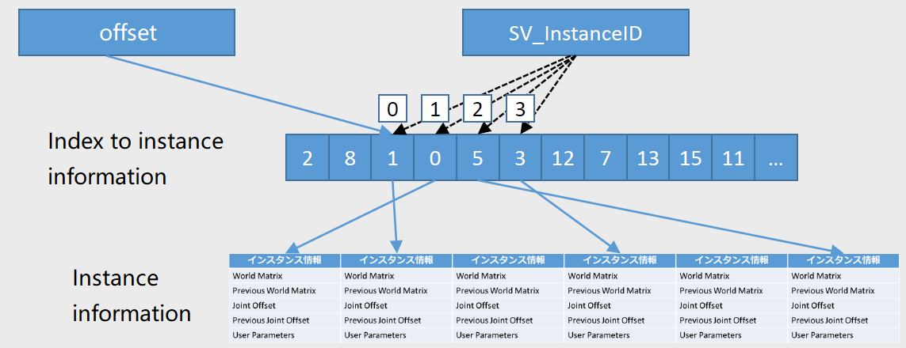


### Merge mesh validation

* Multi-Draw gives you flexibility in drawing geometry
  * Is it possible to merge drawing calls across meshes?
* Concatenate 20-byte Indirect arguments
  * Combine required resources
  * Recalculation of StartIndexLocation, BaseVertexLocation
  * Specify the number of buffer with StartInstanceLocation

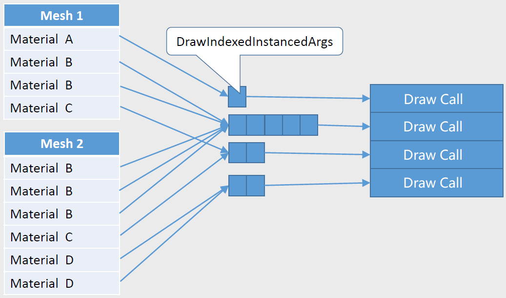


### Instancing, merge mesh challenges

* Drawing calls are reduced, but overdraw load is noticeable
  * High pixel load is fatal
  * CPU and GPU load trade-offs
  * You need to choose whether it is effective depending on the scene
* Is the result worth the implementation cost?
  * Especially merge mesh requires resource merging
    * VB, IB, CB, Texture, etc...
    * Using Bindless Texture


### Can merge mesh be used?

* Material is hard with user-made engine
* A mesh that meets requirements such as resource constraints...
  * **Shadow map drawing!**
* Is it difficult to debug when drawing problems?


## GPU Culling

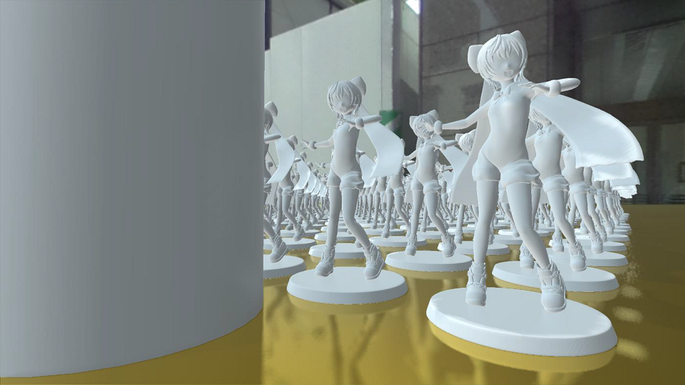


### New engine early culling flow

* All culling is CPU processing

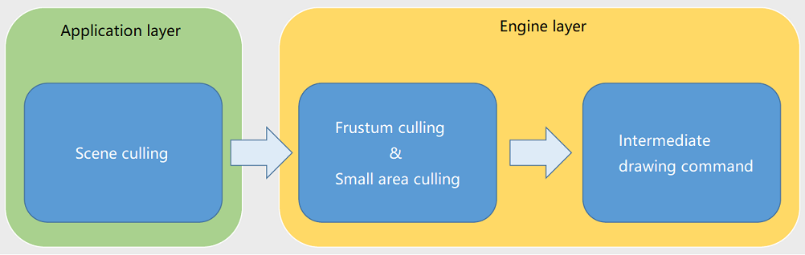


### Rethinking culling process

* Frustum culling
  * Reasonable CPU load
  * GPU seems to be better at processing that?
* Occlusion culling
  * High-speed CPU processing is difficult to implement
  * GPU seems to be better at processing that?


### To GPU-driven culling

* ideal
  * Offload CPU cost to GPU
  * All meshes are passed through the GPU and culled by the GPU
* reality
  * Enlarged intermediate drawing instructions, large number of drawing calls
  * Increased cost of copying data to GPU


### Introduction of occlusion culling

* The algorithm uses HiZ
  * [Practical, Dynamic Visibility for Games][3]
* Only the mesh to be drawn to GBuffer
  * No preZ processing for lights
* Run in CS before the Gbuffer path
* No delay because it is processed by GPU of the same frame


### GPU occlusion culling flow

* Create HiZ with PreZ
  * This is also used for light culling etc.
* Reduce the pixel load at the vertices of the GBuffer path
* 图中 shield 表示 occlusion

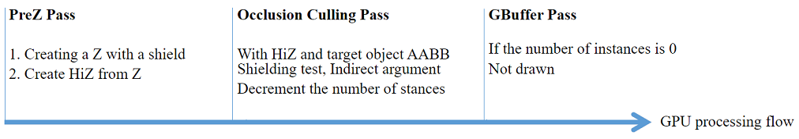


### Can GPU occlusion culling be used?

* Increased GPU load due to culling process
  * Mainly trade-off with vertex load of geometry
  * Minimize data transfer load to GPU
* The number of drawing calls does not decrease
  * CPU needs to read occlusion information


### Verification of GPU frustum culling

* Increased intermediate drawing instructions because CPU does not culling
  * Apply to shadow map drawing using merge mesh

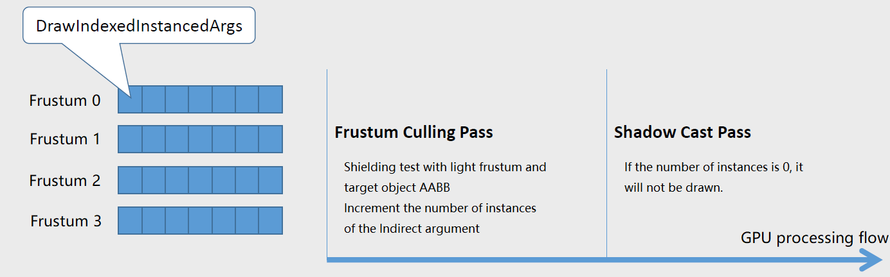


### Can GPU culling be used?

* CPU and GPU culling processing overhead
  * It doesn't make sense when it gets bigger
* Increased GPU load due to CS culling
  * Can asynchronous compute hide the load?


### GPU culling outlook

* CPU occlusion query with no frame delay
  * Asynchronous compute rasterizer
  * Possibility of reducing both CPU and GPU load


### Summary of mesh renderer

* What is installed in the engine
  * Multi-Draw, Instancing
  * GPU occlusion culling
* Those whose engine installation is being verified
  * Merge mesh (shadow map drawing)
  * GPU frustum culling (shadow map drawing)


## Light culling

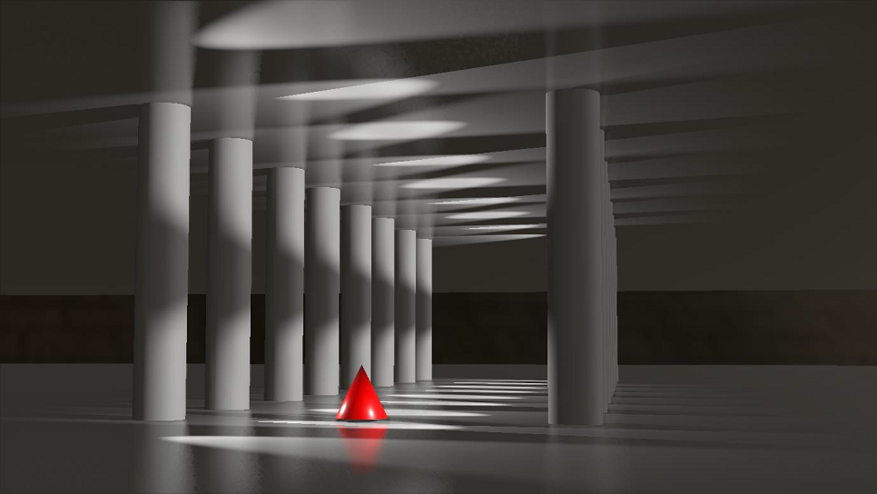


### Two-step approach

* Occlusion culling on GPU
  * Utilize the depth created by PreZ
  * Frame delay
* Light culling when drawing
  * Create HiZ from the depth created by GBuffer
  * Run in CS


### Better spotlight culling

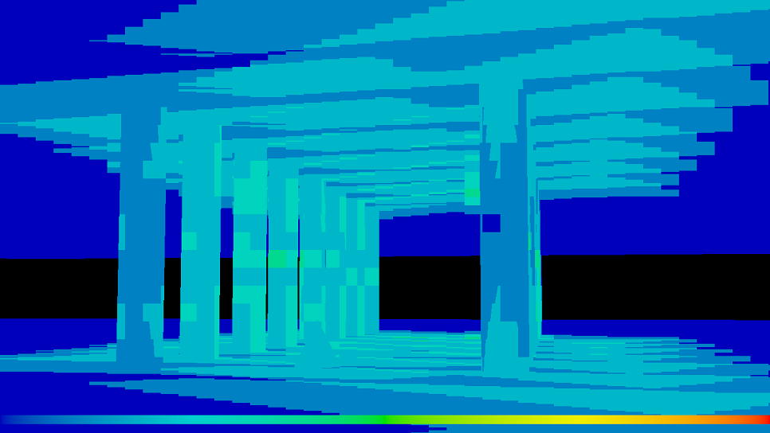


### Implementation

* From Frustum to AABB in View space
* Cone from AABB to Frustum in View space
  * Appropriate culling is possible by reversing the objec
  
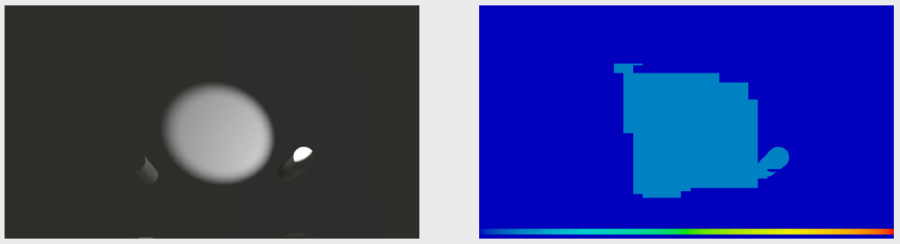


### Summary and challenges

* Pros
  * The illumination range of the light can be expressed by any convex hull.
* Cons
  * Wrong judgment occurs when the viewing platform is set to AABB

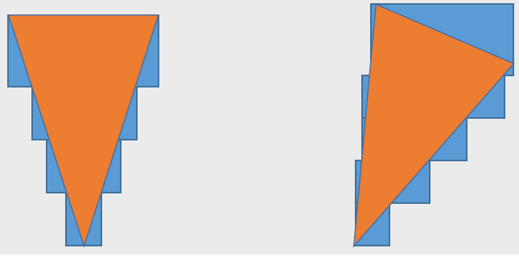


## References

* [Approaching Zero Driver Overhead in OpenGL][1]
* [GPU-Driven Rendering Pipelines][2]
* [Practical, Dynamic Visibility for Games][3]
* [AMD GPU Services (AGS) Library][4]
* [Practical Clustered Shading][5]


[1]:http://gdcvault.com/play/1020791/
[2]:http://advances.realtimerendering.com/s2015/aaltonenhaar_siggraph2015_combined_final_footer_220dpi.pdf
[3]:http://blog.selfshadow.com/publications/practical-visibility/
[4]:http://gpuopen.com/gaming-product/amd-gpu-services-ags-library/
[5]:http://www.humus.name/Articles/PracticalClusteredShading.pdf
