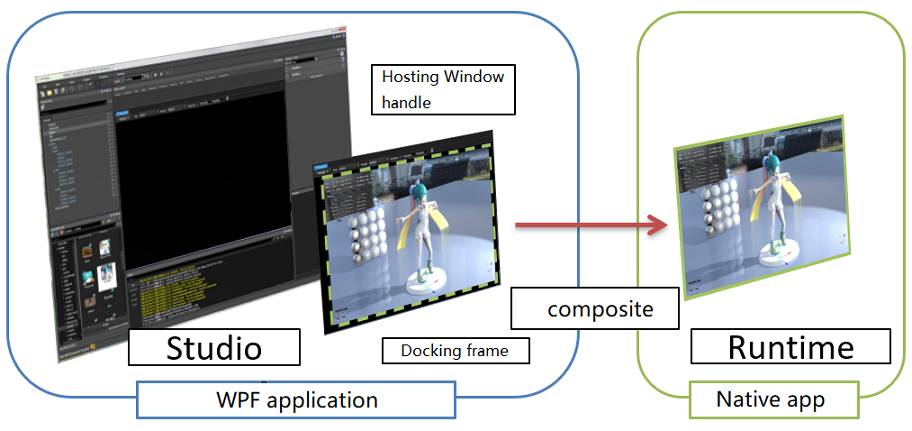
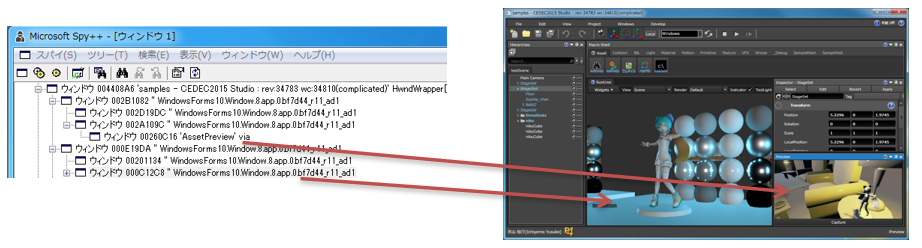
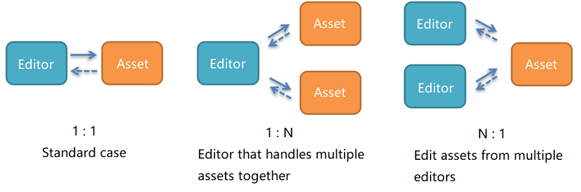
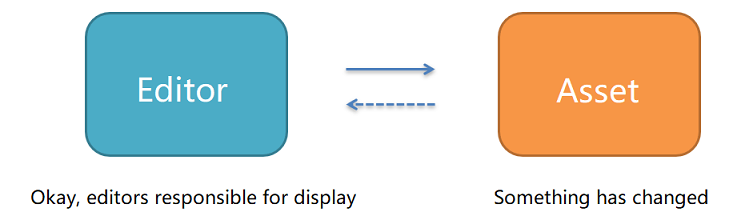
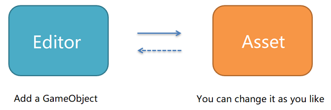
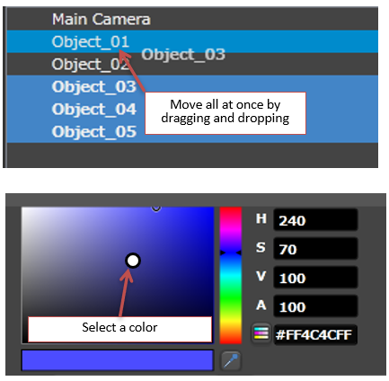
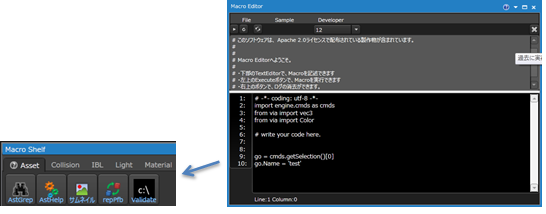

# RE ENGINE - Modern Game Production Environment

* by Yusuke Ichiyama and Masaaki Korematsu


## Preface

### Why a new production environment?

* Further scale-up of development
  * Transition to 8th generation
  * Increased memory and computing resources
  * In the production environment of MT FRAMEWORK, there is a limit to efficiency.
* I had to make a big review of the production environment


### Agenda

* Yusuke Ichiyama
  * Editor introduction and internal design
  * Asset design premised on co-editing
* Masaaki Korematsu
  * Telemetry
  * Stable environment distribution
  * C# script and C++ reflection


## Part I - Yusuke Ichiyama

* Editor introduction and internal design
  * Simple demonstration
  * Relationship between editor and runtime
  * Cooperation between editors
  * Undo support
* Asset design premised on co-editing
  * Common things in scene asset editing
  * Can assets be merged?
  * What's important for merging assets
  * What I learned from operation


### Introduction to Editor

#### Engine Editors

* Studio
  * Generic term for editors
    * Integrated game development environment consisting of about 40 types of editors
      * I can't make it by myself
      * Requires simple rules and frameworks
* Runtime
  * Game runtime
    * Write the engine code in C++ and the game code in C#

#### Studio language and external libraries

* WPF (.NET4.5) + C#
  * Rich user interface
  * Separation of display and function by Binding
* Livet
  * Leverage MVVM infrastructure, update notifications, event listeners
  * https://visualstudiogallery.msdn.microsoft.com/ee198b62-fa45-496c-9c1c-e8f63b43f677
  * https://github.com/runceel/Livet
* Avalon Dock
  * WPF docking window library
  * https://avalondock.codeplex.com/
  * https://github.com/Dirkster99/AvalonDock

#### Demo - Easy stage creation

[](https://www.youtube.com/watch?v=_v4uhulozwg "RE ENGINE - Easy Stage Creation")

#### Demo - Prefab and multi-scene

[](https://youtu.be/Kh2W33I1uiY "RE ENGINE - Pretab")

#### Demo - Check commit history and differences

[](https://youtu.be/vbOfPkKumMA "RE ENGINE - Check commit history and differences")

#### Scene editor

* Create a hierarchy with GameObject and Component
* Variations with prefabs
  * Inheritance, use of prefabs in prefabs
* Multi-scene
  * Compose one scene with multiple scenes
  * Loading and unloading by scene

#### Asset browser

* Asset manipulation front end
  * Asset management
    * File update detection (monitoring with FileSystemWatcher)
* Version control
  * Updates, commits, history, etc.
  * Use of Perforce function
* Understanding dependencies
  * Asset reference, non-reference
    * Relationships stored in metadata


### Relationship with game runtime

#### Relationship between Studio and Runtime

* Works in a separate process
  * Studio is unaffected by Runtime crashes
  * Studio and Runtime are one-to-one
    * Runtime can create multiple views
    * Resources can be shared
  * Studio receives type information from Runtime

```
+--------+            +---------+
|        | - - - - -> |         |
| Studio |   TCP/IP   | Runtime |
|        | <- - - - - |         |
+--------+            +---------+
```

#### Host the runtime display

* Fit the program of another process into the docking frame of [AvalonDock][1]



* Use WindowsFormsHost(HwndHost)
  * Create WindowHandle for parent and child
    * Studio can handle multiple Runtime drawing results
  * Click events etc. are processed on the runtime side
    * Feedback to the editor via TCP/IP
* In AvalonDock, the docking window is created by UserControl.
* In WPF, user controls don't have window handles, so you can explicitly create window handles.
You need this method.
* Since the runtime display is a separate process, the windows are parented and childed.
  * If you look at it with the Spy tool, you can see that the window handles are parent-child. 



#### Studio editor is always master

* Clarify master-slave relationship
  * Runtime is a slave of the editor
    * Existence that displays drawing results
  * Editor has all data and editing rights
    * Do not create a structure where data is determined on the runtime side

#### Demo - Crash recovery

[](https://www.youtube.com/watch?v=B64_4QKgLu0 "RE ENGINE - Crash Recovery")

#### Crash recovery

* Data is protected in the event of a crash
  * In MT FRAMEWORK, the editor and data were blown away together
  * Separate process of runtime
  * Editor has all data and editing rights


### Cooperation between editors

#### Editors coexist in Studio

* About 40 types
  * Need a well-controlled creation policy and means
    * Greatly affects expandability and maintainability
* Editors work together
  * A screen that displays only the edit target and a screen that displays the entire scene
  * While watching the game screen

#### Cooperate around assets

* Editor edits assets
  * The editor display changes as the asset changes
  * Event driven with a focus on assets



#### Functions required for assets

* As a file
  * data file
    * Data such as **JSON, FBX, DDS,** etc.
  * Metadata file
    * Dependencies (reference, referenced)
    * Public information for search
    * Data version information
  * Version control target

* As an instance
  * Publishing data manipulation methods
  * Issuance of change notification
  * Reference counting type Open, Close
  * Conversion to native data

#### Two types of editor cooperation

* Cooperation on memory
  * Display update when asset changes are made
    * Normal editing operation
    * The file has not been saved yet
* Cooperation via files
  * Reload when the file is overwritten
    * File overwrite from external tool

#### Demo - Cooperation on memory

* N:1
  * Edit assets from multiple editors
* Scene editor
  * Take the renaming of a game object as an example.
    * Simple cooperation without anything
    * Cooperation between **Inspector** and **Hierarchy** display
      * Rename on **Inspector**
      * Renamed on **Hierarchy**
      * Rename in **Python script**
  * Undo works in all cases

[](https://www.youtube.com/watch?v=GqOR39L9DuA "RE ENGINE - Cooperation on memory")

#### Demo - Cooperation via files

* Scene and material editor
  * Example of changing texture
  * Link when the asset is saved
  * Shader asset updates are also linked with files
* At the stage of saving the asset
  * FileSystemWatcher detects the change of the asset file as a trigger and cooperates.
* The material editor itself can also be linked in memory
  * However, there is an opinion of the artist that it is easier to use if it is not linked to the scene in real time.
  * When it was saved in a file, it was reflected in the scene.

[](https://www.youtube.com/watch?v=o75WT5t48j8 "RE ENGINE - Cooperation via files")

#### Editor responsible for display

* Editor detects asset changes
  * Don't expect detailed notifications



#### The editor doesn't do anything

* Tweak the data inside the asset



#### Don't interfere inside the asset

* Editor
  * Use data manipulation methods exposed by assets
* Asset
  * Providing data manipulation methods to the outside
    * Undo support on the data side


### Undo

* Undo on the data side

#### Undo is required

* User perspective
  * It should be a function that can be used everywhere
* Programmer's point of view
  * Implementation is troublesome
    * I want to reduce the mounting load
    * I want to have a unified implementation method
  * I want to prioritize function implementation
    * Schedule makes it so
    * But later Undo implementation is a remake level

#### Undo 's basic policy

* Implement Undo on the asset side
  * Record the methods and values ​​that manipulated the data
* Display and update with change notification from assets
  * Undo modifies data with old values
    * Same event driven as normal flow

#### Undo (basic operation) on the asset side

* Allows you to redo 5 types of basic operations
  * Assets provide methods for manipulating data
  * Make sure to implement forward and reverse operations at the time of basic operation
  * Use in combination

Forward operation              | Reverse operation 
------------------------------ | -------------------------------
Create object                  | Delete object
Delete object                  | Create object
Change value                   | Change value
Add element to the collection  | Remove element from collection
Remove element from collection | Add element to the collection

#### Undo (basic operation) on the asset side

* Notation for programmers

Forward operation                                         | Reverse operation 
--------------------------------------------------------- | ---------------------------------------------------------
CreateObject(#id)                                         | DeleteObject(#id)
DeleteObject(#id)                                         | CreateObject(#id)
SetValue(#obj, newValue)                                  | SetValue(#obj, oldValue)
Add(#collectoin, item) / Insert(#collection, index, item) | Remove(#collection, item) / RemoveAt(#collection, index)
Remove(#collection, item) / RemoveAt(#collection, index)  | Add(#collectoin, item) / Insert(#collection, index, item)

#### Record the method

* The important thing is that all the parameters required for Undo and Redo are determined in the first Do operation part.
* Do not get Parent or Index during Undo. 

```C#
public static void RemoveGameObjectCommand(this SceneAsset thisObject, GameObject obj)
{
    if (!obj.CanDelete())
        return;
    
    var parent = obj._parent;
    int index  = obj.Index;
    EditHistory.Record(thisObject,
        () =>
        {
            thisObject.RemoveGameObject(obj);                // redo
        },
        () =>
        {
            thisObject.InsertGameObject(index, obj, parent); // undo
        },
        string.Format("RemoveGameObjectCommand {0}, Remove {1} from {2}",
        thisObject.Name, parent == null ? "Root" : parent.Name, obj.Name));
}
```

#### Undo (advanced operation) on the asset side

* Create a transaction for basic operations
  * Group consecutive basic operations and return with one undo
* Tree operation
  * Select multiple, move, delete, etc.
* Color picker
  * Requires edit start value and end value
    * Record everything and shrink later



#### Undo(优点) on the asset side

* Undo easy to make a possible editor
  * Clarify the layer that manipulates assets
  * Undo implementation does not differ for each editor
    * Degree of consideration regarding transaction start and end
* Easy to make operations from Python
  * Same conditions as other C# editors
  * Can be easily undone



#### Undo support summary

* Support on the asset side
  * Undo enable methods for manipulating data
  * The editor only uses undo-enabled methods
  * When the data returns, the display will also return
* All the information required for Undo is decided at the first time
  * You never see the state during Undo
* It's still troublesome, but once implemented, it can be applied.


## Part II - Masaaki Korematsu


## Postscript

* upload to youtube and use `video-to-markdown`
  * https://github.com/marcomontalbano/video-to-markdown
  * https://video-to-markdown.netlify.app/


[1]:https://github.com/Dirkster99/AvalonDock
