# Technical Explanation of "Deep Down" Graphics

* [Deep Down - TGS 2013 Trailer (PS4)][2]
* [Deep Down - TGS 2014 Trailer (PS4)][3]
* [Deep Down - 25 Minutes of Gameplay][4]


## Agenda

* Material
* Light
* Hair


## Material


### Panta Rhei's objective

* High quality texture
  * Make it look richer than ever
* Unified quality
  * Have similar quality no matter who makes it
  * Use it anywhere = separate lighting
* "Physically Based Rendering" to achieve


### Material

* Normal shading
  * OrenNayer + GGX
    * At the time of TGS exhibition, it was Oren Nayer + Blinn Phong, but it will be changed later
* Skin shading
  * Pre-integrated Skin Shading + GGX


### GGX

* Beautiful highlights of details
  * Leather, metal and plastic textures are more flexible than Blinn-Phong


### Skin sample


### Texture adjustment value

Value to adjust   | Meaning 
----------------- | -----------------------------------------------------------------
Albedo            | Diffuse reflectance Non-metals have color, metals are black
Reflectance       | Gloss reflectance Non-metals are almost black, metals have colors
Glossiness        | Surface smoothness
Normal            | Normal
Emissive          | Optional self-luminous component

Panta Rhei uses [3D-Coat][1] and MAYA shaders to make adjustments using these values


### Shader editor

* Create shaders with graphical editing
  * Graph method for editing by linking nodes


* Instant preview available


### Detail layer


### Water monster


### Screen space effect 


### Shader editor pros/cons

* Pros
  * Artists can create while checking the appearance for themselves
* Cons
  * The number of nodes increases and tends to be complicated
  * Performance is not considered


### Comparison with the conventional

* Conventional (MT FRAMEWORK)
  * Material (setting based on empirical rules)
  * A combination of shader nodes
* Currently (Panta Rhei)
  * Material (Physically based. Created with a small number of parameters)
  * Artist-based shaders


## Light

### Panta Rhei's objective

* Dynamic light source processing as much as possible
  * Automatically generated dungeons
    * No lightmap in the dungeon
  * handle indirect lighting dynamically
* Improved rendering quality


### Lighting

* HDR lighting & linear space
  * Rendered in FP16
* In-game lighting
  * Direct lighting
    * Tile-based deferred + forward
  * Indirect lighting
    * Irradiance volume + parallax correction environment map


### Rendering Pipeline


### GBuffer

* Albedo and Reflectance compressed with YCbCr
  * Cb and Cr are stored alternately in pixel units in RT3
* Options: Save decal information, BRDF type


### Problems with YCbC

* Albedo and reflectance with YCbCr
  * Due to the nature of encoding, color difference information
  * Colors close to black cannot be reproduced accurately
    * Purple etc. occur when exposed to high brightness
    * 8-bit accuracy
* It is better to put RGB normally
  * Consider introducing Metallic's idea for the same capacity


### Rendering Pipeline

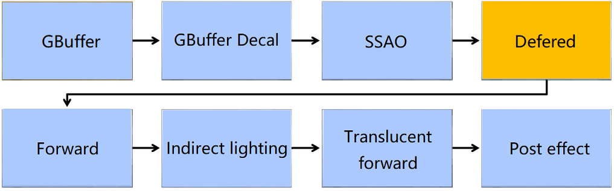


### Tile Based Deferred Shading

* Two-stage configuration
  * Create light list
    * Creating light information that is also used for translucency, etc.
* Direct lighting processing


### Light list

* Create a light list by dividing the image into 16x16 units
  * Create a frustum from tile depth information
    * Divide the frastam into 32 pieces in the line-of-sight direction
      * The 32nd is a frustum in the range of maximum and minimum depth values
      * The rest is a frustum divided evenly from the minimum value
      * Judgment of intersection with the light source for each frustum

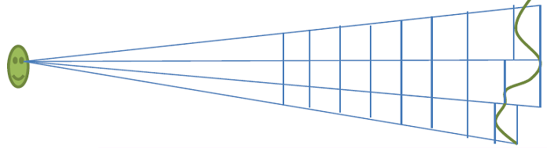


### Creating a light list

* Calculate and save the number of lights after culling
  * Get memory blocks from the writelist pool
    * Keep head offset and number of tiles
* The pool is uint2's Structured Buffer
  * 32-bit write index
  * 32-bit culling mask


### Light culling

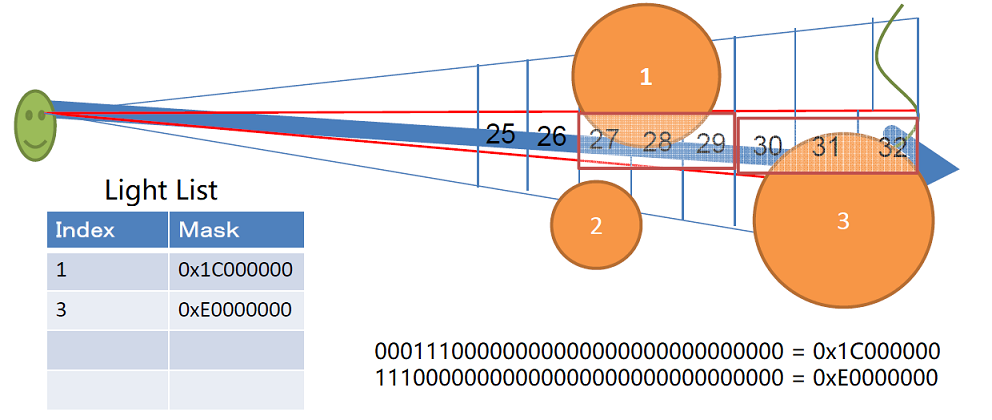


### Direct lighting

* Processed as a light source with size
  * Spherical light source only
    * Light intensity, magnitude, distance squared attenuation
  * Points, spots, directional
  * Supports shadow and projected textures


### Example of direct lighting

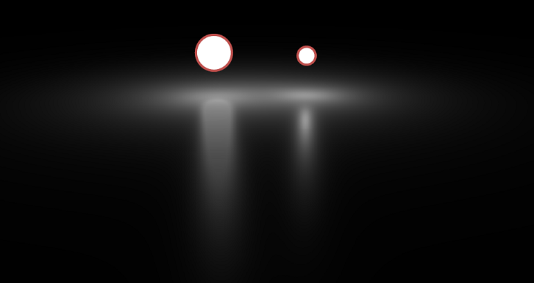


### Direct lighting shader

* Process images in 16x16 units with CS
  * Get from light list
    * Get only lights with the 32nd bit enabled
    * Stored in Shared Memory for each light type
  * Expand loops by light type
    * Use the best calculation within each loop
    * VGPR bloated when shadow filter is involved


### Rendering Pipeline

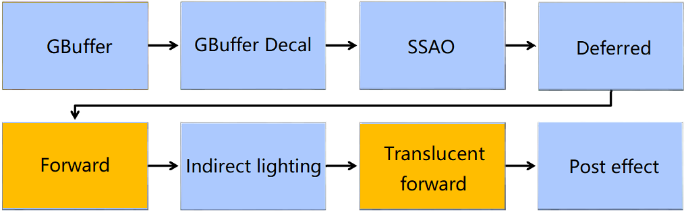


### Forward

* Used for skin and translucent
  * Lighting using the results of the light list
* Search for the mask of the light list from the Z value at the time of drawing
  * Supports shadow and texture projection


### Rendering Pipeline

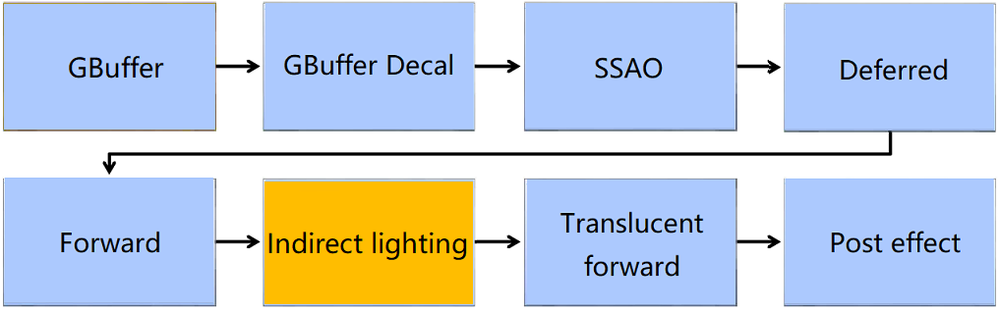


### Indirect lighting

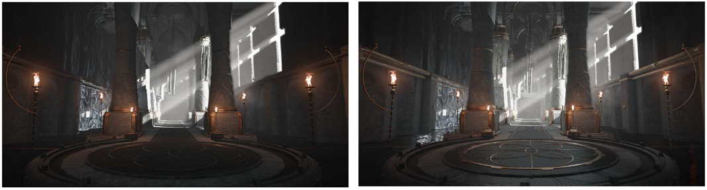

Processed at once with pixel shader

* Irradiance Volume
* Screen space reflection
* Parallax Corrected Cubemap

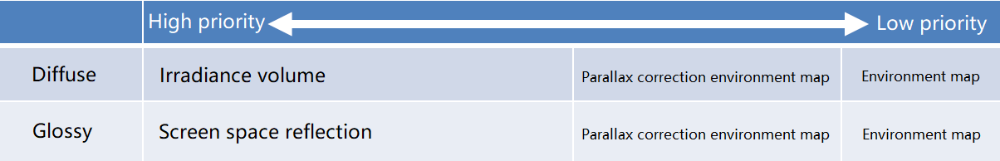


### Irradiance volume

#### Direct lighting

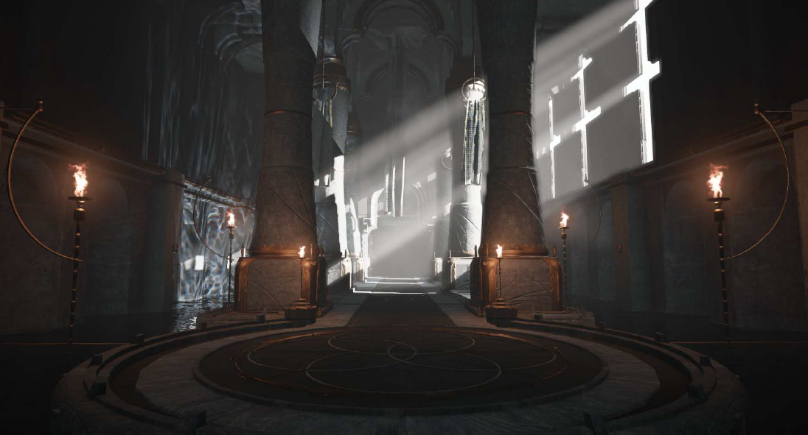

#### Direct lighting + irradiance volume

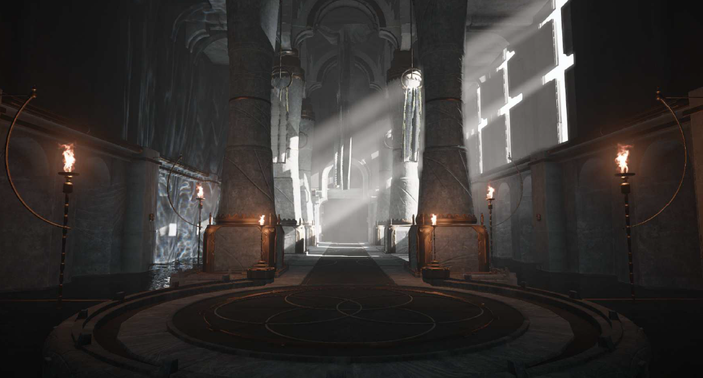

#### Irradiance volume

* Diffuse reflection of indirect lighting
* The light that hits the surface is reflected
  * You can also place fake and invisible luminescent polygons

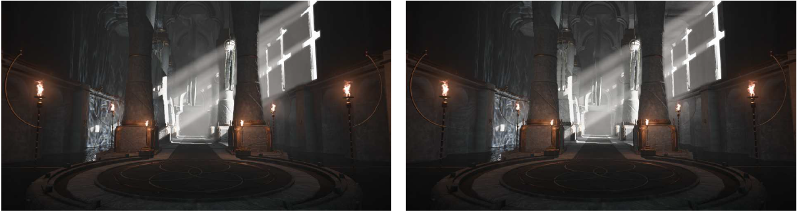

* Created while the game is loading
  * Use voxel cone tracing
* Create voxels for your scene
  * Output voxel information from PS to list for each model
    * Illuminated color information and occlusion information
  * Enter the list in voxels (256x256x256)
  * Create voxel mipmaps
* Creating the final irradiance volume
  * 128x128x128 structure that covers the entire scene
  * Cone tracing by dividing the entire spherical surface into 12 directions
    * Each cone trace result is added as 4 base colors
      * Implemented based on Farcry 3
    * Stored in 3 128x128x128 3D textures


### Screen space reflection

* Image-based ray tracing

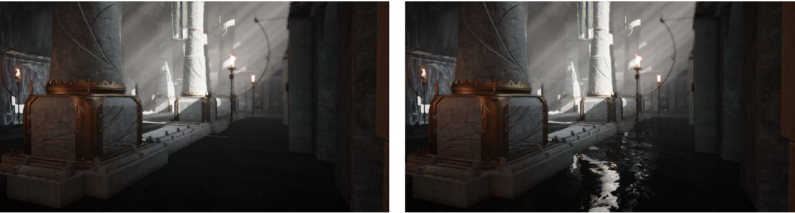

* Linear exploration and dichotomy
  * Glossy reflection is not supported


### Parallax correction environment map

* also called "Parallax Corrected Cubemaps"

#### Direct lighting


#### Direct lighting + Parallax correction environment map

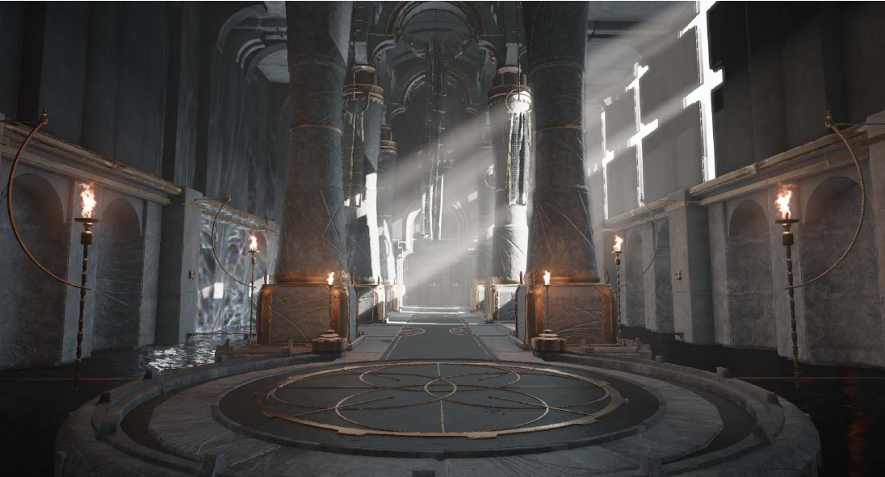

#### Parallax correction environment map

* Used for diffuse and specular reflections
* Essential for metal texture

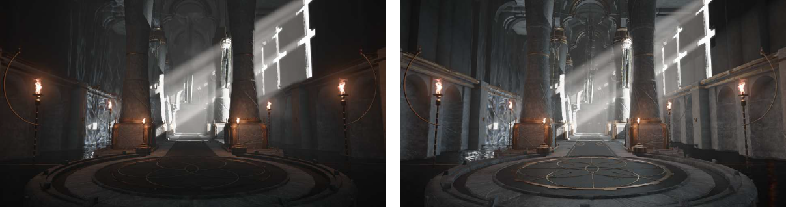

* Up to 96 in one scene with "deep down"
  * Surface roughness changes the mip level of the environment map
    * Resolution up to 128x128, mipmap up to 2x2
    * Color information is retained in RGBE format on R8G8B8A8

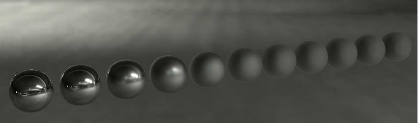

* Environmental map capture and filtering on load
  * Taken with a tetrahedron(四面体)
  * Create all mip levels at once with CS
* Parallax correction environment map exploration with stackless tree
  * AABB only BVH
  * Works well as it has almost the same branching direction


### Indirect lighting

* 效果对比

#### Direct lighting


#### Indirect lighting

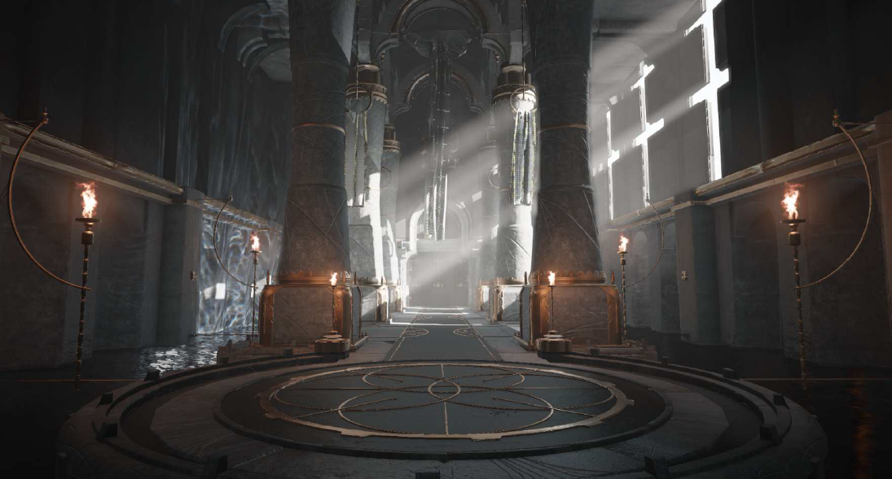


### Shadow

* Supports points, spots, and cascades
  * Shadows are output on a single texture

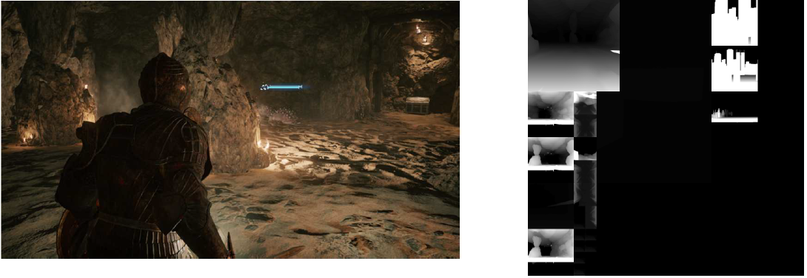

#### Accelerate shadow map creation

* Most light sources do not move or rotate
  * Variable light intensity and range
* Cache depth in a dedicated temporary buffer
  * Static light source caches static objects
    * Export only moving characters and objects
    * Omit most depth map updates
    * Memory consumption, processing time reduced

### Others

#### SSAO

* Use ScreenAmbientObscuarance
  * Change loop unrolling to processing in 4 units
    * Good parallelism and execution speed

```C++
// before
for (int i = 0; i < NUM_SAMPLES; i++)
    sum += sampleAO(ssC, C, n_C, ssDiskRadius, i, randomPatternRotationAngle);

// after
[loop]
for (int i = 0; i < NUM_SAMPLES/4; i+=4) {
    sum += sampleAO(ssC, C, n_C, ssDiskRadius, i, randomPatternRotationAngle);
    sum += sampleAO(ssC, C, n_C, ssDiskRadius, i+1, randomPatternRotationAngle);
    sum += sampleAO(ssC, C, n_C, ssDiskRadius, i+2, randomPatternRotationAngle);
    sum += sampleAO(ssC, C, n_C, ssDiskRadius, i+3, randomPatternRotationAngle);
}
```

#### Texture

* New texture compression BC7 and BC6H
  * HDR image BC6H
    * Used in environment maps, etc.
  * Color and normal BC7
    * High quality where the alpha channel is not used
* BC1 where there is not enough memory
* Roughness uses BC4


## Hair

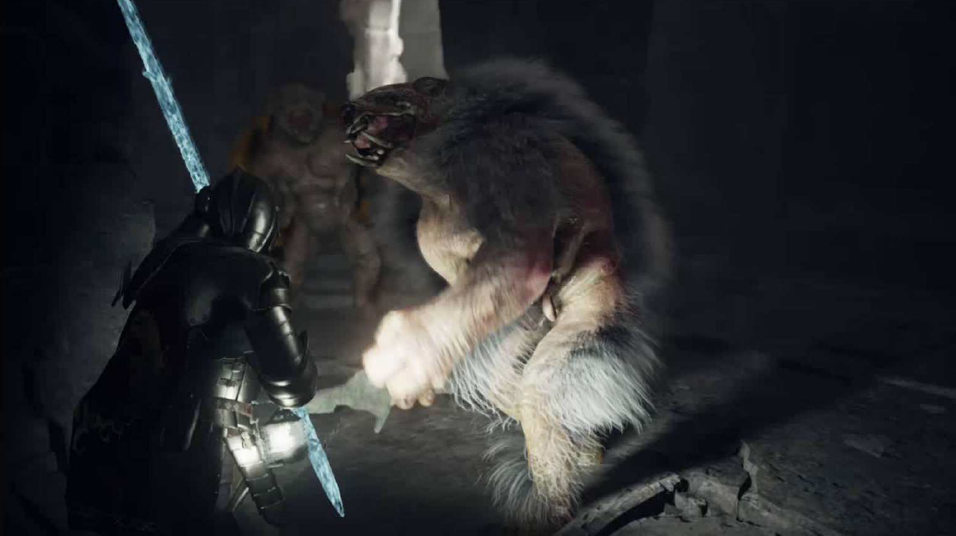


### Deep down's objective

* Express flowing hair
  * Shake it according to the motion
* Add variations
* Light processing


### Shell method

* Stacking layers in the normal direction
* Good appearance if normal and line of sight are parallel
* Stacking is visible near the contour
  * A significant number of layers are needed to make the stacking inconspicuous at high resolution
* It is difficult to express flowing hair

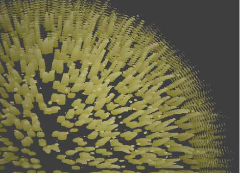


### Implanting polygons

* Implanting polygons with hair texture
  * Common methods for expressing hair
* Can express hair flow and sway
* The wider the area where hair grows, the more polygon planting work will be done.
  * It's even harder with variations


### Deep down hair expression

* Use a tessellator to grow polylines
  * No need to pre-embed in model mesh
  * The artist just adjusts the parameters
    * Easy to grow without hassle
    * Easy to add variations
  * Consider hair sway with tessellator


### Process flow - at the time of loading

* Generate a point Pn(n=1,...N) that is the source of the polyline from the vertex Pm of the standard pose of the mesh model.
  * Use Compute Shader
  * Uniform variability
* RWBuffer
  * Triangle index I(i, j, k)
  * Local coordinates p(u, v) in the triangle

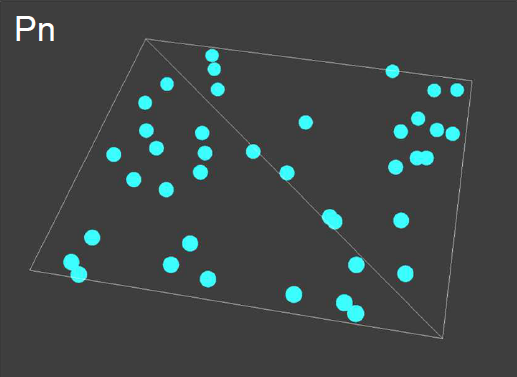


### Process flow - every frame

* Mesh model skinning Pm -> P`m
* Coordinates of polyline elements after skinning Pn -> P`n

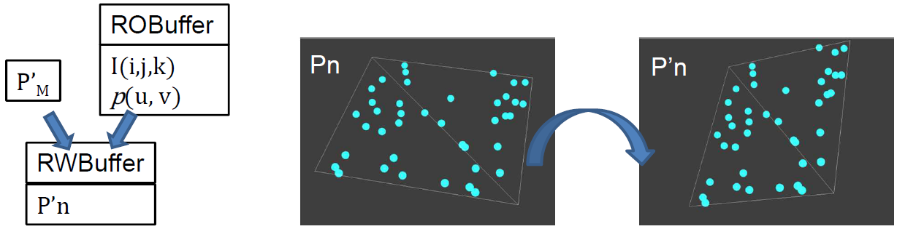

* Back-to-front sorting for translucency priority

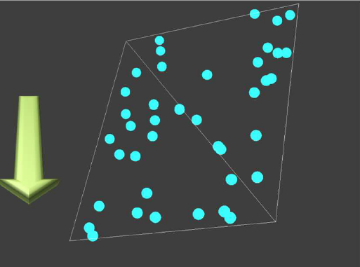

* Polyline generation with tessellator
  * Consider orientation and length


### Complete

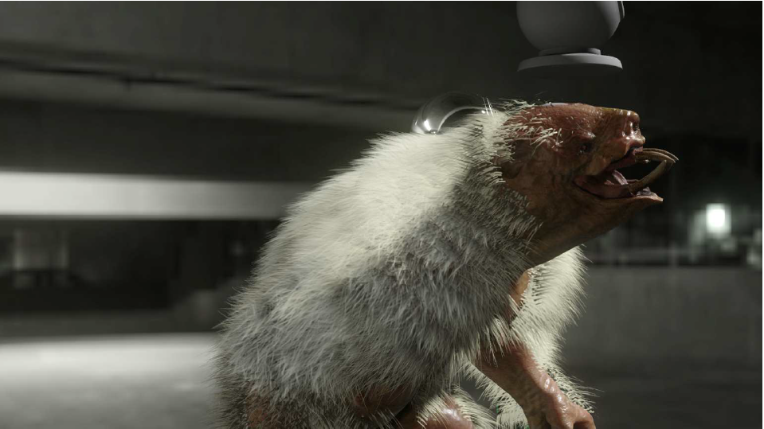


### Speed up writing

* Lighting calculations in pixel shaders are heavy
  * A large number of pixel shaders run for one pixel
* Perform lighting calculations in domain shaders
  * Pros: Writing calculation can be done in the number of times of TessFactor
  * Cons: Highlights are less likely to appear

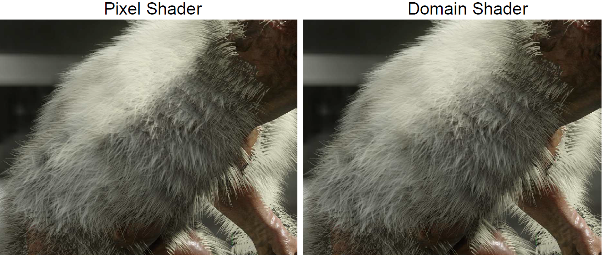


### Hair sway

* Simulation is heavy
  * No need for accurate simulation in the first place => Use speed
* Read/Write Buffer
  * The result of the previous frame remains in the buffer
  * Velocity = Result of current frame-Result of previous frame

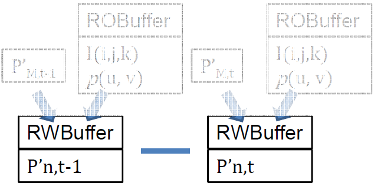

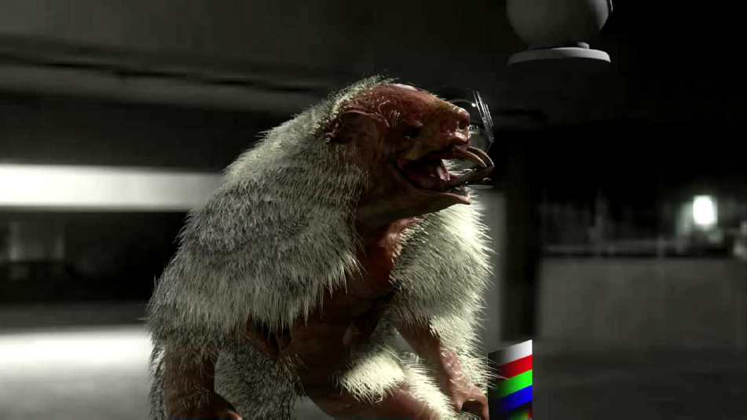


## Summary

* Change to physically based rendering
  * New texture expression
    * Skin expression
    * Use artist-made shaders
  * New lighting
    * Direct lighting - a light source with an area
    * Indirect lighting - irradiance volume, parallax correction environment map
* Use compute shaders
  * Writing
  * Hair


[1]:https://3dcoat.com/
[2]:https://www.youtube.com/watch?v=0N5oItJiIds
[3]:https://www.youtube.com/watch?v=PHEvyNiO0Tw
[4]:https://www.youtube.com/watch?v=jIRUImPWaOo
