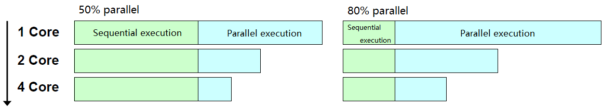
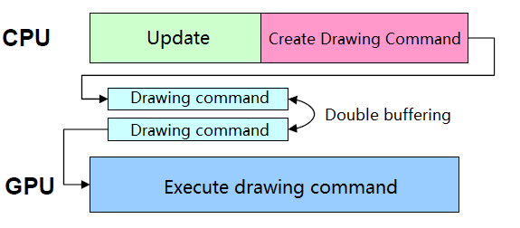
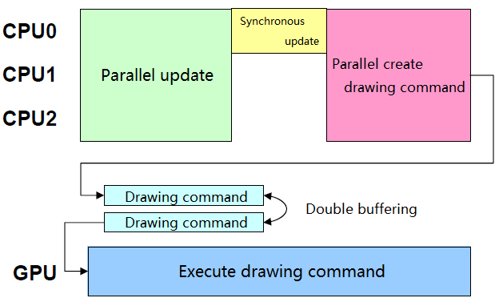

# Game Engine Design for Next Generation Consoles

* 石田智史
* 2006年 CEDEC，正好对应 MT FRAMEWORK 开始研发
  * https://en.wikipedia.org/wiki/MT_Framework
* Hardware (7th generation console)
  * PS3 - 2006.11
  * XBOX360 - 2005.11


## MT FRAMEWORK

* Game engine developed in-house
* Adopted titles for major next-generation consoles
  * Dead Rising, Lost Planet, BH5, DMC4, MH3
* Supports multiple platforms
  * XBOX360, PC (VISTA), PS3)
* Multi-core optimized design
* Tool-based architecture


## Agenda

* Utilization of multi-thread
* Rendering technique
* Tool architecture


## Utilization of multi-thread


### Next-generation CPU

* Multi-core CPU
  * CPU frequency improvement has peaked
    * TDP problem
  * CPU trends change
    * From improving frequency to increasing the number of cores
* Number of CPU cores
  * XBOX360
    * 3-Core x 2 SMT
  * PS3
    * 1-Core x 2 SMT + SPU x 7
  * PC
    * 1-Core ~ Main-Core
* **Multi-core / thread support for game programs is essential**


### Amdahl's law

* https://en.wikipedia.org/wiki/Amdahl's_law
* The overall execution time is constrained by the parts that cannot be parallelized.
  * For example, if there is a part that cannot be parallelized by 50%, no matter how much the degree of parallelism is improved, the speed cannot be increased more than twice.



* **It is important to increase the ratio of parallel execution**


### What to parallelize

* Module-based parallelization
  * Modularize rendering, sound, collision, motion, physics simulation, AI, etc. and process them in parallel
* Pros
  * High degree of parallelism can be obtained if dependencies can be minimized
* Cons
  * Module separation is difficult except for some
    * Because each module of the game program is closely dependent on each other.
  * When using SMT, cache efficiency deteriorates
    * Because completely different code works


### What to parallelize

* Parallelization in loop units
  * Distribute and process high-load, non-dependent loops in parallel
* Pros
  * Very good compatibility with SMT (Because the same code works)
* Cons
  * Not many non-dependent loops make up a few percent of game programs
  * Synchronous overhead outweighs low-volume loops


### What to parallelize

* Task-based parallelization
  * Tasks in game programming
    * Unit for updating and drawing every frame
    * Players, enemies, bullets, cameras, effect generators, etc.
  * Execute tasks with no dependencies in parallel
* Pros
  * Dependencies can be limited
    * Limited if information on other tasks is needed
  * SMT is more efficient when performing tasks with the same content
* Cons
  * Cannot be executed in parallel if there are no tasks with no dependencies

```
+-----------------------------------------------------+
| Character Task                                      |
| +---------------------+  +------------------------+ |
| | Update              |  | Rendering              | |
| +---------------------+  +------------------------+ |
| | Path finding        |  | Culling                | |
| | Motion              |  | Bone calculation       | |
| | Collision           |  | Lighting               | |
| | Posture calculation |  | Create drawing command | |
| | ...                 |  | ...                    | |
| +---------------------+  +------------------------+ |
+-----------------------------------------------------+
```


### Parallelization approach

* Module-based parallelization
  * Rendering, sound, resource loading
* Parallelization in loop units
  * Some sort processing etc.
* Task-based parallelization
  * All game objects (Players, enemies, effects, lights, cameras, etc.)
  * Divide task updates for each frame into **parallel updates** and **synchronous updates** to reduce the dependency between tasks during parallel updates.

```
Traditional task model      Parallelized task model
   +-------------+           +--------------------+
   | Update      |           | Parallel update    |
   +-------------+           +--------------------+
   | Rendering   |   ====>   | Synchronous update |
   +-------------+           +--------------------+
                             | Rendering          |
                             +--------------------+
```


### Game program flow

* Traditional game program flow
  * CPU and GPU run in parallel



* Parallelized game program flow
  * Multiple CPUs and GPUs run in parallel


