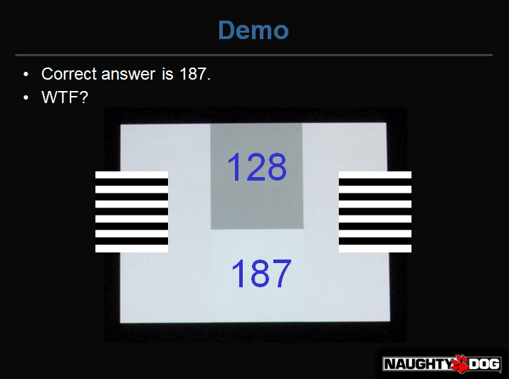
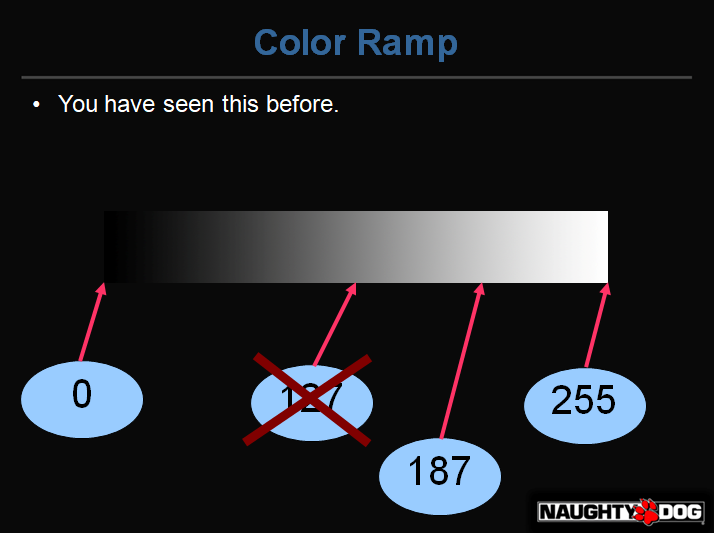
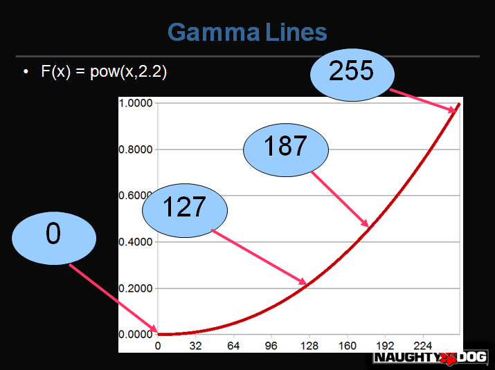
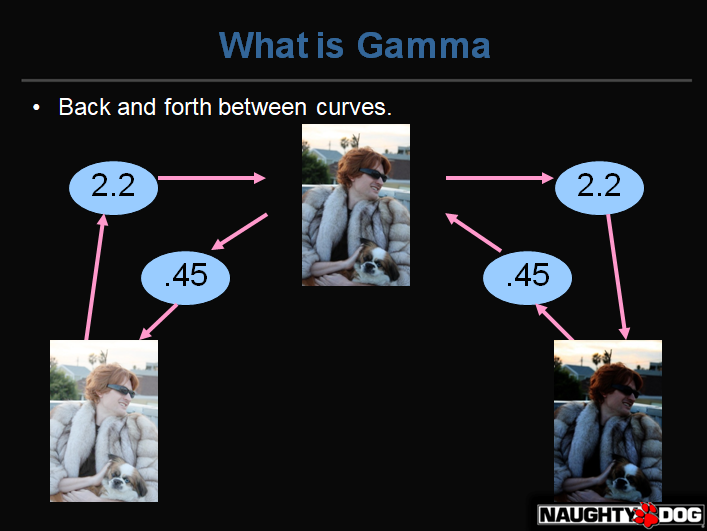
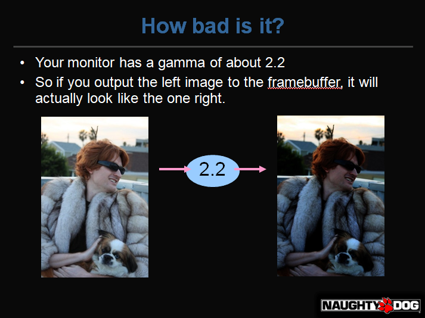
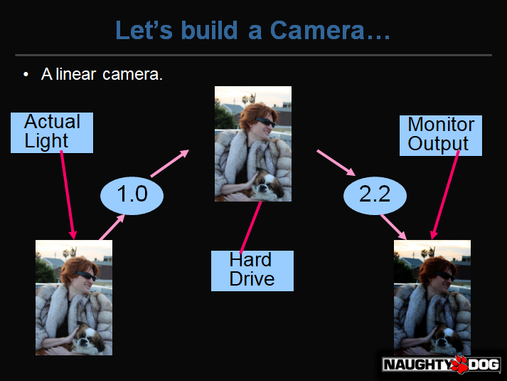
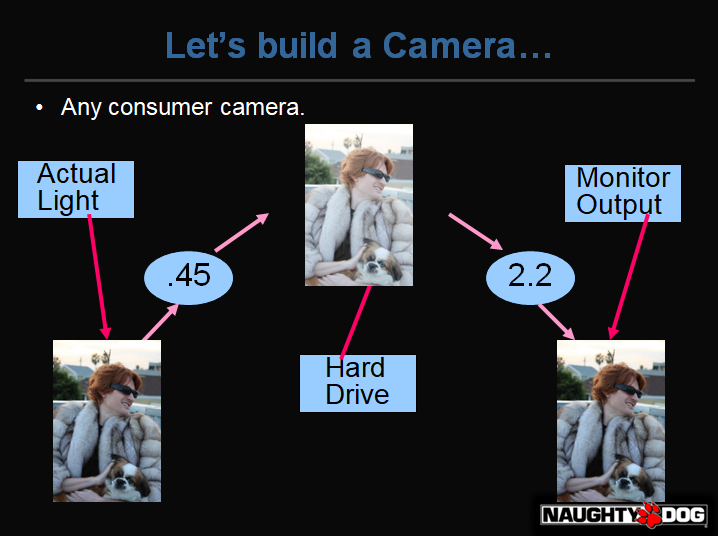

# Uncharted 2: HDR Lighting

 * [GDC Video][1]

## Gamma/Linear-Space Lighting

 * 中间白色大块区域的值是多少？187！
 * 不是128哦

 * 显示器亮度不是线性的，0.5亮度在187的位置
 * 所以需要先将其线性化，在线性空间做计算，才是正确的

 * 显示器 gamma = 2.2，函数 F(x) = pow(x, 2.2)
 * 我们通过 0.45 修正一下，0.45 ~= 1/2.2

 * 假设相机不对图片做 gamma 处理，则显示到显示器上就错了

 * 实际情况，相机都先做了 gamma 修正，硬盘中保存的是非线性数据

## Filmic Tonemaping

[1]:https://www.gdcvault.com/play/1012351/Uncharted-2-HDR