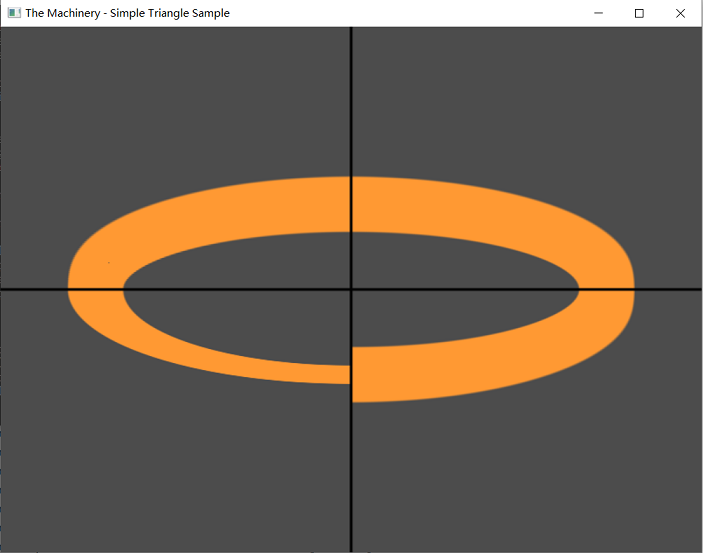

# Play with TheMachinery Shader


## Simple Color

* 参考 shadertoy 的最简案例
* [https://www.shadertoy.com/new][2]

```glsl
void mainImage( out vec4 fragColor, in vec2 fragCoord )
{
    // Normalized pixel coordinates (from 0 to 1)
    vec2 uv = fragCoord/iResolution.xy;

    // Time varying pixel color
    vec3 col = 0.5 + 0.5*cos(iTime+uv.xyx+vec3(0,2,4));

    // Output to screen
    fragColor = vec4(col,1.0);
}
```

* `position` 并不在 pixel shader 的 `exports` 中
* `position` 是 machinery shader 的 reserved keyword，表示屏幕空间的坐标，参考 [SV_Position][3]

```hlsl
common : [[
    #define screen_resolution float2(800,600)
]]

pixel_shader : {
    exports : [
        { name : "color" type: "float4" }
    ]

    code : [[
        // Normalized pixel coordinates (from 0 to 1)
        float2 uv = input.position.xy / screen_resolution;

        // Time varying pixel color
        float3 col = 0.5 + 0.5* cos(load_time() + uv.xyx + float3(0,2,4));

        // Output to screen
        output.color = float4(col, 1.0);

        return output;
    ]]
}

compile : {
    variations : [
        { systems : [ "frame_system" ] }
    ]
}
```

* frame_system.shader 包含了每帧的一些常量，需要 engine 传递给 shader
* 有了 frame_system.shader 中的声明，可以通过 `load_time()` 来访问 "time"

```
imports : [
    { name: "time" type: "float" }
    { name: "last_time" type: "float" }
    { name: "delta_time" type: "float" }
    { name: "frame_number" type: "uint" }
    { name: "settings_mask" type: "uint" }
]
```


## Ellipse

* [Ellipse - Distance Estimation][1]

```glsl
// An example on how to compute a distance estimation for an ellipse (which provides
// constant thickness to its boundary). This is achieved by dividing the implicit 
// description by the modulus of its gradient. The same process can be applied to any
// shape defined by an implicity formula (ellipses, metaballs, fractals, mandelbulbs).
//
// top    left : f(x,y)
// top    right: f(x,y) divided by analytical gradient
// bottom left : f(x,y) divided by numerical GPU gradient
// bottom right: f(x,y) divided by numerical gradient
//
// More info here:
//
// http://www.iquilezles.org/www/articles/distance/distance.htm

const float a = 1.0;
const float b = 3.0;

float r, e;

// f(x,y) (top left)
float ellipse1(vec2 p)
{
    float f = length( p*vec2(a,b) );
    return abs(f-r);
}

// f(x,y) divided by analytical gradient (top right)
float ellipse2(vec2 p)
{
    float f = length( p*vec2(a,b) );
    float g = length( p*vec2(a*a,b*b) );
    return abs(f-r)*f/g;
}

// f(x,y) divided by numerical GPU gradient (bottom left)
float ellipse3(vec2 p)
{
    float f = ellipse1(p);
    float g = length( vec2(dFdx(f),dFdy(f))/e );
    //float g = fwidth(f)/e;
	return f/g;
}

// f(x,y) divided by numerical gradient (bottom right)
float ellipse4(vec2 p)
{
    float f = ellipse1(p);
    float g = length( vec2(ellipse1(p+vec2(e,0.0))-ellipse1(p-vec2(e,0.0)),
                           ellipse1(p+vec2(0.0,e))-ellipse1(p-vec2(0.0,e))) )/(2.0*e);
    return f/g;
}


void mainImage( out vec4 fragColor, in vec2 fragCoord )
{
    r = 0.9 + 0.1*sin(3.1415927*iTime);
    e = 2.0/iResolution.y;
    
	vec2 uv = (2.0*fragCoord-iResolution.xy) / iResolution.y;
    
	float f1 = ellipse1(uv);
	float f2 = ellipse2(uv);
	float f3 = ellipse3(uv);
	float f4 = ellipse4(uv);
	
	vec3 col = vec3(0.3);

    // ellipse     
    float f = mix( mix(f1,f2,step(0.0,uv.x)), 
                   mix(f3,f4,step(0.0,uv.x)), 
                   step(uv.y,0.0) );
    
	col = mix( col, vec3(1.0,0.6,0.2), 1.0-smoothstep( 0.1, 0.11, f ) );
    
    // lines    
	col *= smoothstep( e, 2.0*e, abs(uv.x) );
	col *= smoothstep( e, 2.0*e, abs(uv.y) );
	
	fragColor = vec4( col, 1.0 );
}
```

* 依样画葫芦

```hlsl
common : [[
    #define screen_resolution float2(800,600)

    #define A 1.0
    #define B 3.0

    // f(x,y) (top left)
    float ellipse1(float2 p, float r)
    {
        float f = length( p*float2(A,B) );
        return abs(f-r);
    }

    // f(x,y) divided by analytical gradient (top right)
    float ellipse2(float2 p, float r)
    {
        float f = length( p*float2(A,B) );
        float g = length( p*float2(A*A,B*B) );
        return abs(f-r)*f/g;
    }

    // f(x,y) divided by numerical GPU gradient (bottom left)
    float ellipse3(float2 p, float r, float e)
    {
        float f = ellipse1(p, r);
        float g = length( float2(ddx(f),ddy(f))/e );
        return f/g;
    }

    // f(x,y) divided by numerical gradient (bottom right)
    float ellipse4(float2 p, float r, float e)
    {
        float f = ellipse1(p,r);
        float g = length( float2(ellipse1(p+float2(e,0.0),r)-ellipse1(p-float2(e,0.0),r),
                            ellipse1(p+float2(0.0,e),r)-ellipse1(p-float2(0.0,e),r)) )/(2.0*e);
        return f/g;
    }
]]

vertex_shader : {
    import_system_semantics : [ "vertex_id" ]
        
    code : [[                
        static float4 vertices[] = {
            { -1.0f, -1.0f, 0.f, 1.f },
            {  1.0f, -1.0f, 0.f, 1.f },
            { -1.0f,  1.0f, 0.f, 1.f },
            {  1.0f, -1.0f, 0.f, 1.f },
            {  1.0f,  1.0f, 0.f, 1.f },
            { -1.0f,  1.0f, 0.f, 1.f },
        };

        output.position = vertices[vertex_id];
        return output;
    ]]
}

pixel_shader : {
    exports : [
        { name : "color" type: "float4" }
    ]

    code : [[
        float r = 0.9 + 0.1*sin(3.1415927*load_time());
        float e = 2.0/screen_resolution.y;
        
        float2 uv = (2.0*input.position.xy - screen_resolution.xy) / screen_resolution.y;

        float f1 = ellipse1(uv, r);
        float f2 = ellipse2(uv, r);
        float f3 = ellipse3(uv, r, e);
        float f4 = ellipse4(uv, r, e);

        float3 col = float3(0.3, 0.3, 0.3);

        // ellipse
        float f = lerp( lerp(f1,f2,step(0.0,uv.x)), 
                    lerp(f3,f4,step(0.0,uv.x)), 
                    step(uv.y,0.0) );

        col = lerp( col, float3(1.0,0.6,0.2), 1.0-smoothstep( 0.1, 0.11, f ) );
        
        // lines    
        col *= smoothstep( e, 2.0*e, abs(uv.x) );
        col *= smoothstep( e, 2.0*e, abs(uv.y) );

        output.color = float4( col, 1.0 );

        return output;
    ]]
}

compile : {
    variations : [
        { systems : [ "frame_system" ] }
    ]
}
```




[1]:https://www.shadertoy.com/view/MdfGWn
[2]:https://www.shadertoy.com/new
[3]:https://docs.microsoft.com/en-us/windows/win32/direct3dhlsl/dx-graphics-hlsl-semantics#direct3d-9-vpos-and-direct3d-10-sv_position
