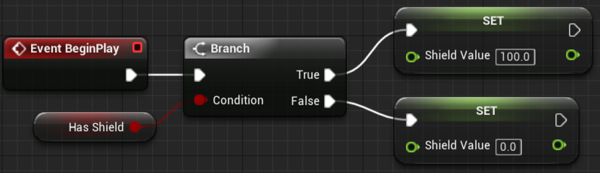

# Blueprints Visual Scripting for Unreal Engine

 * 一个 Blueprint, 就是一个 C++ 的 class
 * 包含 Functions, Macros, Variables，完整映射 C++ class 中的各种类型


## Blueprint Fundamentals

### Level Blueprint

 * 和 Level 绑定的 Blueprint，可以控制 Level 加载时干点啥


 * Level Blueprint Editor
 * 和下面的 Blueprint Editor 略有不同（没有 Components/Viewport 和 Construction Script）


### Blueprint

 * 创建 Blueprint
 * 会让选择 Blueprint 的父类，常用的包括：Actor, Pawn, Character, Player Controller, Game Mode Base 等等


 * Blueprint Editor
 * Components, 此 Blueprint 附加的各种 Component，比如：CapsuleComponent(碰撞)、Mesh（模型显示）等等 
 * My Blueprint, 类定义，包括：Graphs, Functions, Variables 等等
 * Viewport, 看 Blueprint 长啥样
 * Construction Script, 构造函数，初始化 Blueprint instance
 * Event Graph, Blueprint 执行流程
 * Details, 选中某个 Fucntions, Variables，对应的属性面板
 * 注意：**改了 Blueprint 记得 Compile**


## Events & Actions

 * Events(红色)，某个条件下触发，引擎调用 Blueprint
 * Actions，具体行为，比如：SET, Print String
 * Variables 拖出来可以 Get 或 Set，比如下图的 Bot Name
 * Execution Path(白线)，逻辑执行流，执行到某一 Action，就做某个 Action 的行为



 * 上面的图，对应 C# 代码

```C#
class MyBlueprint
{
    public string BotName { get; set; }

    public void BeginPlay()
    {
        BotName = "Archon";
        Console.DebugPrint(BotName);
    }
}
```

 * 例子02


```C#
class MyBlueprint
{
    public bool HasShield { get; set; }
    public float ShieldValue { get; set; }

    public void BeginPlay()
    {
        ShieldValue = HasShield ? 100.0 : 0.0;
    }
}
```

 * 例子03


```C#
class MyBlueprint
{
    public float Willpower { get; set; }
    public float MagicPoints { get; set; }

    public void BeginPlay()
    {
        MagicPoints = Willpower * 20.0;
    }
}
```

### Variable Types

 * 基础类型：Boolean, Byte, Integer 等等
 * Structure
 * Interface
 * Object Types
 * Enum
 * 不同颜色对应不同类型（也许美术比较喜欢）
 * 类型和 C++ 中一一对应，不详细说了
 * 红框中表示：Single Variable、Array、Set、Map(Dictionary)


### Macros & Functions & Events

 * 三者异同


### Gameplay Framework Classes

 * 所有 OOP(Object-Oriented Programing) 的核心：搞懂所有类的继承关系
 * 哪个类负责啥功能，实现一个功能应该从哪里继承
 * Actor, 可以丢到场景中 tick 的 entity
 * ActorComponent, 组装到 Actor 上的功能模块
 * Pawn, 由 Controller 控制的 Actor，一般拿来做 NPC
 * Character, 继承 Pawn，自动组合了 CapsuleComponent、ArrowComponent、Mesh、CharacterMovement 等模块，一般拿来做主角
 * Controller，控制 Pawn
 * PlayerController，控制 Character
 * AIController，控制 Pawn，做 NPC AI
 * GameModeBase, 比较特殊，下面详述


#### Game Mode

 * GameMode，控制 Level 整体行为的总控类
 * 一个 Game 有多个 Level
 * 一个 Game 有一个 Default GameMode (Edit => Project Settings ... => Maps & Modes => Default GameMode)
 * 每个 Level 可以有独立的 GameMode (Settings => World Settings => Game Mode => GameMode Override)
 * GameModeBase, 要实现自己的 GameMode，继承它


#### Game Instance

 * class Game Instance, Level 之间跳转，用来做数据的序列化和传递
 * 有需要可以继承 Game Instance，实现一些特殊逻辑
 * 设置路径：Edit => Project Settings => Maps & Modes => Game Instance


