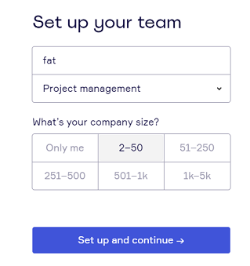
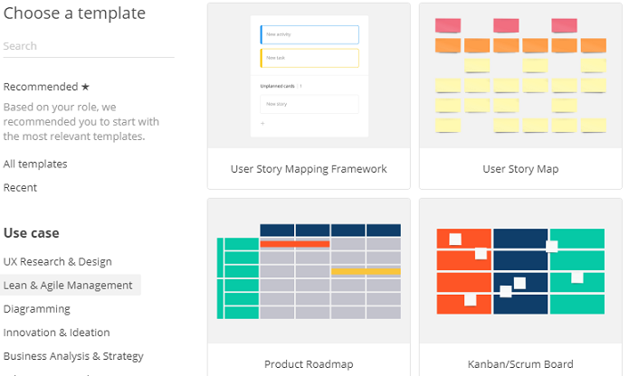
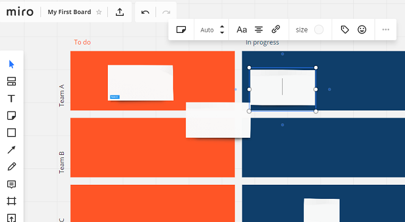

# RealtimeBoard 体验报告

 * [https://realtimeboard.com/][1]

## 账号注册

 * 体验还不错
 * 流程比较简洁

## 模板选择

 * 突然出现了很多 template 让你选
 * 一个产品，想解决所有需求
 * 很有可能，一个需求都没解决好

## 使用体验

 * 我选了 Scrum/Kanban Template
 * 体验很糟糕，It's sucks~
 * 敏捷的核心诉求，快速的信息同步、便捷的操作
 * RealtimeBoard 将整个页面做得很"真实"，"真实"意味着附带了很多无效信息
 * 很难用
 * 建立一个 Label 都很"费力"

## 后记

 * 对于设计
 * Less is More
 * trello 是标杆，[https://trello.com][2]

[1]:https://realtimeboard.com/
[2]:https://trello.com
