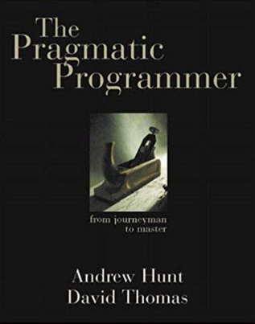

# The Pragmatic Programmer



十多年前，刚毕业，读过这本书。当时还有很多不理解的地方，如今重温一遍，顿觉句句珠玑。

## CH05 - Bend, or Break

 * Decoupling and the Law of Demeter
 * Metaprogramming
 * Temporal Coupling
 * It's Just a View
 * Blackboards


### Decoupling and the Law of Demeter

 * Decoupling，解耦
 * Demeter，希腊神话，得墨忒耳（掌农业，结婚，丰饶之女神）
 * the Law of Demeter，得墨忒耳定律，也叫做"最少知识原则"，指松耦合

#### Minimize Coupling

不好的例子

```Java
public void plotDate(Date aDate, Selection aSelection) {
    TimeZone tz = aSelection.getRecorder().getLocation().getTimeZone();
}
```

上面代码的问题

 * plotDate() 依赖于 Recorder / Location / TimeZone
 * 如果 class Location 有修改，不再具有 getTimeZone() 这个函数
 * 则上面的代码，也需要相应修改

改进之后

 * 给 class Selection 增加 getTimeZone()
 * 将细节交给 getTimeZone() 内部去实现

```Java
public void plotDate(Date aDate, TimeZone aTz) {
    ...
}
plotDate(someDate, someSelection.getTimeZone());
```

#### The Law of Demeter for Functions

#### Exercises

 * 不同语言，有不同的做法
 * 下面是 C++ 的例子

```C++
// person1.h
#include "date.h"
class Person1 {
private:
  Date myBirthdate;
public:
  Person1(Date &birthDate);
```

解构，不依赖 class Date 的实现

```C++
// person2.h
class Date;
class Person2 {
private:
  Date *myBirthdate;
public:
  Person2(Date &birthDate);
```


### Metaprogramming(元编程)

 * 


### Temporal Coupling

 * temporal，一时的、时间的
 * coupling，耦合


### It's Just a View

 * 正确分离 Model & View


### Blackboards