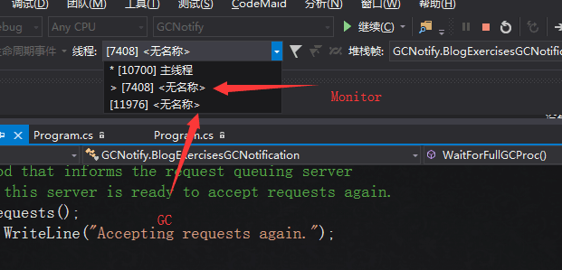

# Managed Heap＆CSharp GC Principle(上篇)

本文主要是对《CLR via C#》一书中GC的总结，分上下两篇．

## 目录
- [介绍](#介绍)
- [ManagedHeap内存分配](#ManagedHeap内存分配)
- [GCPrinciple](#GCPrinciple)
- [Generation的设计](#Generation的设计)
- [GCCondition](#GCCondition)
- [GC模式](#GC模式)
- [GCNotifications](#GCNotifications)
- [GCSettings](#GCSettings)
- [Finalize和IDisposable](#Finalize和IDisposable)
- [关于文件流的问题](#关于文件流的问题)
- [参考资料](#参考资料)

## 介绍

GC(Garbage Collection)，主要作用是 __帮助开发者自动管理应用程序内存__. GC试图去回收在程序中不再需要使用的对象占用的内存。最初是由John McCarthy在1959年在Lisp语言中提出的。

了解GC，好处诸多，其中之一就是代码规范，避免出现写出类似下面这种代码：

``` csharp
    FileStream fs = null;
    StreamWriter sw = null;

    try
    {
        fs = new FileStream(Environment.CurrentDirectory + "/Test.txt"， FileMode.OpenOrCreate);
        sw = new StreamWriter(fs);
        //TODO
        //....
    }
    catch (Exception ex)
    {
    }
    finally
    {
        if (sw != null)
            sw.Dispose();
        if (fs != null)
            fs.Dispose();
    }
```


## ManagedHeap内存分配

通常在C#中，我们使用资源需要经过以下流程:  
1．调用IL指令newobj，为代表资源的类型分配内存；  
2．设置资源的初始化状态(通过调用类型的实例构造器来完成)；  
3．在实例的生命周期内访问资源(重复)；  
4．摧毁资源的状态以进行清理(可选，目前未找到实例验证)；  
5．释放内存．


从IL上看，分配内存和初始化是一条语句，因此下面将这两个操作合并．
简化之后的流程可以概述为：__分配 & 初始化->使用->释放__

分配的详细流程又可概括为：  
1．计算类型的字段(以及从基类型继承的字段)所需的字节数；  
2．加上实例对象所需要的额外开销(类型对象指针和同步块索引)；  
3．CLR检查Managed Heap中是否有足够的空间容纳实例对象所需要的字节数，若有，则分配，反之，则触发GC进行回收．  

如下图：我们可以发现fs对象中的字占用了228个字节．


如果仔细验证分配规则，如下：
``` csharp
    public class TestA
    {
        public int id;
        public string Name;

        public TestA(int ID, string Name)
        {
            this.id = ID;
            this.Name = Name;
        }
    }
    public class GCTest_1
    {

        static void Main(string[] args)
        {
            TestA a = new TestA(1, "zh");
        }
    }
```


如上，*.cs使用的是unicode编码，所以在这里一个字母是2个字节，所以CLR为对象a分配了总共8个字节的内存空间，加上同步块索引和类型对象指针，正好16字节．
因此，验证了书中在Managed Heap中内存分配的规则．

## GCPrinciple
因Managed Heap的内存不是无限的，所以需要GC释放内存来使程序可以使用更多的资源．在GC进行释放内存时，需要确定哪些资源是需要被释放的．
由此引入引用跟踪算法．过程如下:  
1．CLR开始GC时，会挂起应用程序的所有进程，避免在CLR检查Managed Heap中的对象时，对象的状态会被改变；  
2．CLR把Managed Heap中的每个对象的同步块索引中的一位设为0．0 表示对象将被回收；  
3．CLR遍历活动根，查看哪些引用了堆中的对象．在Managed Heap中将其标记为1；  
4．遍历Managed Heap，将标记为0的进行垃圾回收；  
5．压缩Managed Heap中的对象；  
6．重新确定活动根中引用对象的地址．  

以上，是不考虑 __Generation__ 的情况下的GC回收过程.

## Generation的设计
考虑到GC对程序性能的影响，也就是不可能每一次都去遍历Managed Heap中所有的对象，而且在此过程中会Stop　the　World，所以　CLR引入了Generation来提升了
GC的效率．  
在GC中 Generation 包含三个，Gen0、Gen1、Gen2，可以理解为这是逻辑上对Managed Heap的划分，每个Generation都有自己的预算，当超过这个预算时，即会触发GC.
三者关系如下:大部分对象在Gen0 就会被回收，Gen0可以单独被回收；若Gen1被回收，则Geno、Gen1都会被回收；若Gen2被回收，则Gen0、Gen1都会被回收；
如下：  


CLR在初始化的时候，会为每一个Generation都设定一个预算大小，然而这个大小可以通过GC自己来调节．预算大小是根据每次GC之后幸存的对象的数目来确定的．
每次幸存者数目多，则扩大预算，反之，则缩小Generation的预算．

## GCCondition
- 代码显示调用System.GC的静态Collect方法
- Window 报告低内存的情况
- CLR 正在卸载Appdomain
- CLR 正在关闭

## GC模式
.NET 的GC有两种模式，在程序启动时便由CLR指定:  
- __工作站:__ 该模式针对客户端应用程序优化GC.特点是GC造成的延时很低，应用程序线程挂起时间很短，避免使用户感到焦虑，GC假定机器上运行的其他应用程序都不会消耗太多CPU资源.

- __服务器:__ 该模式针对服务端应用程序优化GC.被优化的主要是吞吐量和资源利用.GC假定机器上没有运行其他应用程序，并假定机器上的所有CPU都可以用来辅助完成GC.该模式根据
CPU的数目把Managed Heap拆分成几个区域(section)，每个CPU一个。开始GC时，每个CPU都会运行一个特殊的线程，负责回收属于自己管理的section.

应用程序默认以工作站的GC模式运行.若要以服务器的GC模式运行，可在配置文件(App.config)中设置如下:
  <runtime>
    <gcServer enabled ="true"/>
  </runtime>

  执行应用程序时可以通过System.Runtime.GCSettings.IsServerGC来确定是否执行的是服务器的GC模式.

  除此，还支持两种子模式:并发模式和非并发模式；Gen0和Gen1的回收是非并发模式的，也就是说对Gen0和Gen1进行回收时，Stop The World，但是对于Gen2的GC，也就是
  Full GC时采用的是并发模式，减少应用程序的等待时间.以下是并发模式的具体过程:
 1. 在应用程序运行时，会有一个额外的后台的线程标记对象，确定哪些对象是不可达对象，以便在GC的时候进行回收
 2. 当Gen0超出预算时，GC先挂起所有线程，判断哪些代需要回收
 3. 若仅需要回收Gen0或则Gen1，一切如常进行
 4. 若需要回收Gen2，则会增大Gen0的大小，然后恢复应用程序的运行.
 5. 新分配的对象在增大的Gen0的内存块中分配，然后并发地去回收Gen2、Gen1、Gen0

 若要关闭GC的并发模式(Console应用程序)，修改App.config如下:
```csharp 
  <runtime>
    <gcConcurrent enabled ="false" />
  </runtime>
```

## GCNotifications
当CLR 执行Full GC(指对Gen2回收)，可能对系统产生一些性能影响.比如GC发生时，当前服务器Stop The World，但是此时，有大量的客户端请求进来，这些请求就将会延迟处理.
针对这种在特殊时期发生GC，你可以将请求重定向到另外一个服务器实例，在本服务器实例上释放一些不需要再处理的请求，以便在即将发生的GC中回收这些请求.  
示例代码:[GC Notifications Code Demo](2019_01_05_managed_heap_and_gc_principle_code/BlogExercisesGCNotification.cs)  
执行这个Demo时，请关闭GC的并发模式，具体修改在上节有提到.


代码分析:  
此程序主要是监控 __Full GC__，每当发生一次__Full GC__之前，就去释放load，以便在真正GC的时候进行内存释放.  
日志如上，第一次__Full GC__的时候监控到了，之后由于线程未及时切换，没有释放load，所以load占用的内存达到进程上限(Window7 64系统中分给一个进程最大的可用内存时4G).  
内存大小 = 3509153/(1024*1024) = 3.347G，最后抛出Out of Memory异常  




## GCSettings
我们不能完全控制GC，但是我们可以在GCSettings中设置一些属性来达到对GC某种程度上的控制:
``` csharp
namespace System.Runtime
{
    //
    // 摘要:
    //     指定当前进程的垃圾回收设置。
    public static class GCSettings
    {
        //
        // 摘要:
        //     获取或设置垃圾收集的当前滞后时间模式。
        //
        // 返回结果:
        //     指定滞后时间模式的枚举值之一。
        //
        public static GCLatencyMode LatencyMode { get; set; }
        //
        // 摘要:
        //     [在 .NET Framework 4.5.1 和更高版本中受支持] 获取或设置指示完全阻止垃圾回收是否压缩大型对象堆 (LOH) 的值。
        //
        // 返回结果:
        //     指示完全阻止垃圾回收是否压缩 LOH 的枚举值之一。
        public static GCLargeObjectHeapCompactionMode LargeObjectHeapCompactionMode { get; set; }
        //
        // 摘要:
        //     获取一个值，该值指示是否启用了服务器垃圾回收。
        //
        // 返回结果:
        //     如果启用了服务器垃圾回收，则为 true；否则为 false。
        public static bool IsServerGC { get; }
    }
}
```
GCSettings.IsServerGC 是一个只读属性，用来判断使用采用了服务器的GC模式，前面我们已经用到过.GCSettings.LargeObjectHeapCompactionMode是用来控制GC是否压缩
大对象堆(LOH)，我们在后面提到.接下来，主要研究的是GCSettings.LatencyMode，
|符号名称|说明|详细|
|-------|----|----|
|Batch("服务器"GC的默认模式，完全阻塞模式)|关闭并发GC|一旦GC开始运行，所有非GC线程都会被挂起，直到垃圾回收结束|
|Interactive("工作站"GC的默认模式)|打开并发GC|多个线程并发进行GC，但是并发模式只针对Gen2对象|
|LowLatency|仅在系统遇到内存压力时才发生完全回收，而通常情况下发生 0 代和 1 代回收|GC全力避免Full GC，适用于短时间、敏感的操作，之后将其设置为Batch或则Interactive模式|
|SustainedLowLatency|作用和LowLatency基本相同，但是可以用于服务器的GC模式|无|

LowLatency和SustainedLowLatency区别:Interactive模式的专用线程在GC的过程中，不允许发起另外一个GC过程，而且只能在内存段中剩余的空间中分配内存.SustainedLowLatency模式允许在后台GC运行中启动另一次针对第0和1代的GC过程，甚至允许创建另一个新段来进行内存分配

## Finalize和IDisposable
这个问题是额外添加的。发生在与劲哥讨论时抛出来的，当时我确实未留意GC是如何处理这两个方法的.特此记录一下.    

### 终结器Finalize的引入  
__缘由:__ 包含本机资源的内容被GC时，GC会回收对象在Managed Heap中使用的内存.但是这样会造成本机资源的泄漏，由此，引入Finalize来解决此问题  
__调用时机:__ 当GC判定一个对象不可达时，首先会调用Finalize，释放本机资源，然后再释放Managed Heap中的内存.  
__语法:__ System.Object定义了虚方法的Finalize  
  
如上，这是System.Object的源码，并没有直接发现Finalize方法，这或许是微软在编译mscolib.dll是处理这个的，有以下两种方式可以验证:  
__Ａ．通过dnspy反编译mscorlib.dll__  


如上，反解出来可以发现~Object方法没有了，取而代之的是Finalize方法  

__Ｂ．查看Dll的元数据表__  
  

如上，我们在类型引用表中可以发现Object.Finalize.因此，我们确定了Object中确实存在一个虚方法的Finalize  

### 终结器Finalize做了啥?
首先，分析空的终结器，C#代码如下
``` csharp
    class TestA
    {
        ~TestA()
        {
        }
    }
```
IL指令如下:  
  

如上，我们发现 __类__ 类型若写了终结器，会去调用基类System.Object的终结器

### CLR是如何处理终结器的(内部工作原理)?
Ａ．如果一个类型显示定义了Finalize方法，当调用该类型的实例构造器之前，会将指向该对象的指针放到一个终结列表中  
  
Ｂ．当第一次GC发生时，当一个对象被标记为垃圾之后并且不再终结列表中，则会被直接回收.反之，则会在终结列表中删除该指针，并把它附加到foreachable队列中  
  
  
Ｃ．CLR会创建一个特殊的高优先级的线程将foreachable队列中的元素依次移除，并调用其Finalize方法.最后，在下一次GC的时候，已终结的对象才会被GC真正的回收  
  

综上，可以发现用Finalize来处理本机资源是由CLR自动完成的.Managed Heap中的包装对象被回收时至少是2次才能完成，但是很多时候，第一次GC之后，包装对象就被提升了一代，
可能需要更多次数的GC才能被完全回收.  

### IDisposable 的引入
如果完全将本机资源交给CLR来管理，就会出现如下的问题:  
``` csharp
        static void Main(string[] args)
        {
            Byte[] bytesToWrite = new byte[] { 1， 2， 3， 4， 5， 6， 7 };

            FileStream fs = new FileStream("Temp.dat"， FileMode.Create);

            fs.Write(bytesToWrite， 0， bytesToWrite.Length);

            File.Delete("Temp.dat");
        }
```
本机资源的释放必须是在GC之后，因此无法确定资源什么时候被清理.所以，在调用File.Delete的时候会大概率报错.
因此，引入IDisposable来手动控制本机资源的生命周期.
IDisposable定义如下:
``` csharp
public interface IDisposable {
        void Dispose();
    }
```

### Dispose具体做了哪些事?
首先，需要明确Dispose只是清理了本机资源，而在Managed Heap中的包装类对象必须在GC的时候才会被清理.

### Finalize和Dispose的比较和冲突
Finalize:  
- 清理本机资源的时间不确定
- 多个Finalize调用的顺序不明确
Dispose:  
- 可以手动控制本机资源的生命周期，在调用的时候必须保证本机资源不再使用了

案例分析:
若一个类型包装的本机资源，既实现了IDisposable接口，也添加了Finalize方法，就可能会会出现资源被二次卸载的问题.
代码如下:
``` csharp
    class TestA:IDisposable
    {
        ~TestA()
        {
            Console.WriteLine("call TestA.Finalize()");
        }

        public void Dispose()
        {
            Console.WriteLine("call TestA.Dispose()");
        }
    }
```

解决方法:确保Finalize和Disposable只有一个会被调用即可
C# 中的SafeHandle即解决以上问题:
``` csharp
    abstract class SafeHandle:CriticalFinalizerObject，IDisposable
    {
        protected IntPtr handle; 
        private bool _ownsHandle;

        protected SafeHandle(IntPtr invalidHandleValue， bool ownsHandle)
        {
            handle = invalidHandleValue;
            _ownsHandle = ownsHandle;

            if (!ownsHandle)
                GC.SuppressFinalize(this);
        }

        protected void SetHandle(IntPtr handle)
        {
            this.handle = handle;
        }

        protected abstract bool ReleaseHandle();

        public void Close()
        {
            Dispose(true);
        }

        public void Dispose()
        {
            Dispose(true);
        }

        protected virtual void Dispose(bool disposing)
        {
            //TODO
            //1.若本机资源被释放，直接返回
            //2.调用ReleaseHandle方法释放本机资源
            //3.通知GC不要调用Finalize方法 GC.SuppressFinalize(this);             
        }

        ~SafeHandle()
        {
            Dispose(false);
        }

    }
```

__ps:CriticalFinalizerObject__
被CriticalFinalizerObject标记的类型及派生类型对象有以下三个特征:
- 继承结构层次中的所有Finalize方法都会在首次构建对象的时候被JIT编译
- 非CriticalFinalizerObject的Finalize方法调用晚于CriticalFinalizerObject的Finalize方法的调用
- 若AppDomain被强行中断，CLR将会调用CriticalFinalizerObject的Finalize方法

### 特殊约定
- 从System.Object继承的Finalize，GC会默认忽略它，只有重写的，才会默认此类型及派生类型的对象是可以终结的

## 关于文件流的问题
这个是在文章一开始就抛出的一个问题，答案:调用sw.Dispose()的时候，会在内部调用fs.Dispose()，所以不需要重复写fs.Dispose().
原理:StreamWriter没有重写Finalize()方法，所以其缓区的数据不会flush到FileStream中，也因此sw持有的非托管资源必须通过Dispose进行手动释放，这也是Microsoft特意
这样设计的，目的在于提醒开发人员注意到这种数据丢失的问题.
StreamWriter.Dispose()过程具体如下:
1. 调用父类TextWriter的Dispose方法，通过GC.SuppressFinalize(this)设置GC不要调用该对象的Finalize()，手动来处理该对象管理的非托管资源
2. 将数据Flush到FileStream，再Flush到磁盘上
3. 调用Stream.Dispose()关闭流

``` csharp
        protected override void Dispose(bool disposing) {
            try {
                // We need to flush any buffered data if we are being closed/disposed.
                // Also, we never close the handles for stdout & friends.  So we can safely 
                // write any buffered data to those streams even during finalization， which 
                // is generally the right thing to do.
                if (stream != null) {
                    // Note: flush on the underlying stream can throw (ex., low disk space)
                    if (disposing || (LeaveOpen && stream is __ConsoleStream))
                    {
#if FEATURE_ASYNC_IO
                        CheckAsyncTaskInProgress();
#endif
 
                        Flush(true, true);
#if MDA_SUPPORTED
                        // Disable buffered data loss mda
                        if (mdaHelper != null)
                            GC.SuppressFinalize(mdaHelper);
#endif
                    }
                }
            }
            finally {
                // Dispose of our resources if this StreamWriter is closable. 
                // Note: Console.Out and other such non closable streamwriters should be left alone 
                if (!LeaveOpen && stream != null) {
                    try {
                        // Attempt to close the stream even if there was an IO error from Flushing.
                        // Note that Stream.Close() can potentially throw here (may or may not be
                        // due to the same Flush error). In this case, we still need to ensure 
                        // cleaning up internal resources, hence the finally block.  
                        if (disposing)
                            stream.Close();
                    }
                    finally {
                        stream = null;
                        byteBuffer = null;
                        charBuffer = null;
                        encoding = null;
                        encoder = null;
                        charLen = 0;
                        base.Dispose(disposing);
                    }
                }
            }
        }
```

## 参考资料
CLR via C# 第四版第二十一章


