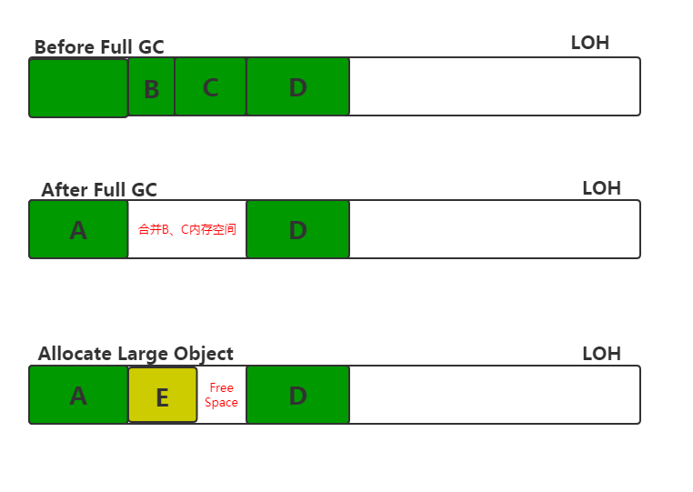

# Managed Heap＆CSharp GC Principle(下篇)

本文主要是对《CLR via C#》一书中GC的总结，分上下两篇.  
上篇主要是对GC进行宏观上的概括，下篇主要针对GC的一些细节进行研究

## 目录

- [LargeObjectHeap](#LargeObjectHeap)
- [活动根](#活动根)
- [弱引用](#弱引用)
- [应用程序资源监视](#应用程序资源监视)
- [API介绍](#API介绍)
- [从GC分析应用性能](#从GC分析应用性能)
- [内存管理与分页机制](#内存管理与分页机制)
- [参考资料](#参考资料)

## LargeObjectHeap

### LOH介绍
CLR 根据将对象分为大对象和小对象，上面所述的Managed Heap其实都是小对象堆(SOH)，而大对象，在进程地址空间的其他地方进行分配，通常称之为LOH.  
当前版本，认为大于8500字节的即为大对象，大对象有如下特征:
- 大对象不在SOH进行分配，在进程地址空间的其他地方分配
- 目前版本的GC不会去压缩大对象，因为在内存中移动他们的代价过高.但这可能在进程中的大对象之间造成地址空间的碎片化，以至于抛出OutOfMemoryException异常.
- 大对象总是在第2代，绝不可能是第0代或第1代，所以只能为需要长时间存活的资源创建大对象.短时间存活的大对象会导致第二代被频繁回收，损害性能.
从.NET Framework 4.5.1开始，可以使用GCSettings.LargeObjectHeapCompactionMode属性按需压缩大对象堆.

### GC如何处理LOH?
加载CLR时，GC分配两个初始段:一个用于小型对象(SOH)，一个用于大型对象(LOH).我们所了解的 __Generation__ 是GC heap 的一个逻辑视图，所有对象都在 __Managed Heap Segments__ 中分配.Managed Heap Segments是GC 代表托管代码通过调用 __VirtualAlloc__ function 向OS申请保留的内存块.  
托管对象就是在Managed Heap Segments上分配的.如果对象小于85000字节，则会在SOH上为其分配内存，否则，在LOH上分配内存.
- 对于SOH，GC未处理的对象会被提升到下一代.但是，Gen2上未处理的对象仍然是Gen2.
- 对于LOH，LOH未处理的对象仍是LOH对象，由GC的Gen2负责回收.

当Gen2进行GC时，会扫过LOH段，根据已经销毁的对象创建一个 __Free List__，供之后分配大对象使用，其中相邻的被清除对象将组成一个自由对象.
具体过程，如下图所示:


### 大对象何时被回收?
有以下三种情况，在触发 Gen2回收的时候去回收大对象:
- 分配超出大型对象的阀值:Gen0，Gen1，Gen2，LOH都有属于自己的阀值，一旦超过此阀值，则会触GC
- 调用SYstem.Collect()或System.Collect(2)
- OS内存不足，触发Full GC的情况

### 收集LOH的性能数据(TODO)
收集LOH的数据，可以通过以下三种方式:
- .NET CLR 内存性能计数器(perfmon.exe)
- ETW 事件
- 调试器

## 活动根(TODO)
进行垃圾回收的时候，GC会去遍历活动根，而这个活动根是JIT在调用方法的时候创建的一张表，这张表中每条记录包含两个地址，一个是变量的地址，一个是变量最后一次引用的机器码指令的地址，
当GC发生时，GC触发的位置与Managed Heap中的对象最后一次引用的机器码的指令的地址来比较，以确定对象是否是活动状态，并最终来标记对象，确定是否回收该对象

## 弱引用
强引用指对象在被引用的时候，GC是不能去回收该对象的;反之，弱引用是指引用的对象被GC认为是不可达对象，因此可被回收.  
Microsoft官方有个例子展示了WeakReference的用法: [WeakReference的用法][0]  
以下，我用一个例子简单展示WeakReference的使用以及留下的一个问题:
``` csharp
        static void Main(string[] args)
        {
            int i = 10;

            WeakReference wr = new WeakReference(i， false);
            Console.WriteLine(wr.Target == null);
            System.GC.Collect(0);
            Console.WriteLine(wr.Target == null);
        }
```
运行结果:  
False  
True  

程序解释:
1. 定义int 类型变量i
2. 创建一个弱引用，值类型i发生装箱，作为参数传入WeakRefrence的构造函数
3. 打印弱引用指向的对象是否为Null(此处为False)
4. 触发Gen0的GC，i装箱后的对象直接被回收
5. 打印弱引用指向的对象是否为Null(此处为True)

程序中存在的问题:  
若弱引用指向的是值类型装箱之后的对象，System.GC.Collect(0)之后，对象马上被回收，若指向的是class，System.GC.Collect(0)之后，并不会马上回收对象  
推测的情况:  
1. 包装之后的对象和在代码中声明的对象，System.GC.Collect(0)区别对待
2. 直接在代码中声明的对象存活到了更高的代

## 应用程序资源监视(TODO)

## API介绍(TODO)
- System.GC
- System.Runtime.InteropServices.GCHandle

## 从GC分析应用性能(TODO)

## 理解内存申请
通常而言，我们不会直接操作物理内存，而是通过GC代替我们去分配/释放虚拟内存来达到操作物理内存的目的.64位机器，在进程被创建的时候会被分配4G的虚拟内存，内存的分配其实就是虚拟内存到物理内存的一个映射过程.
虚拟内存有三个状态:MEM_RESERVE，MEM_RELEASE，MEM_COMMIT
- MEM_RESERVE: 占用一块逻辑地址空间，但未实际分配物理内存;
- MEM_COMMIT: 实际分配物理内存
- MEM_RELEASE: 清理虚拟内存和物理内存

__VirtualAlloc:__ 在虚拟地址空间中保留或提交内存页  
__VirtualProtect:__ 更改虚拟内存页的保护属性  
__VirtualFree:__ 释放或撤销提交虚拟内存  
__VirtualLock:__ 将进程的虚拟地址空间的指定区域锁定到物理内存中，确保后续对该区域的访问不会导致页面错误  
__VirtualUnlock:__ 解锁  
__VirtualQuery:__ 在虚拟地址空间中检索页的信息  

## 内存管理与分页机制(TODO)


## 参考资料
VM Operation Windows API : https://msdn.microsoft.com/en-us/library/windows/desktop/aa366898(v=vs.85).aspx

[0]:https://docs.microsoft.com/zh-cn/dotnet/api/system.weakreference?view=netframework-4.7.2