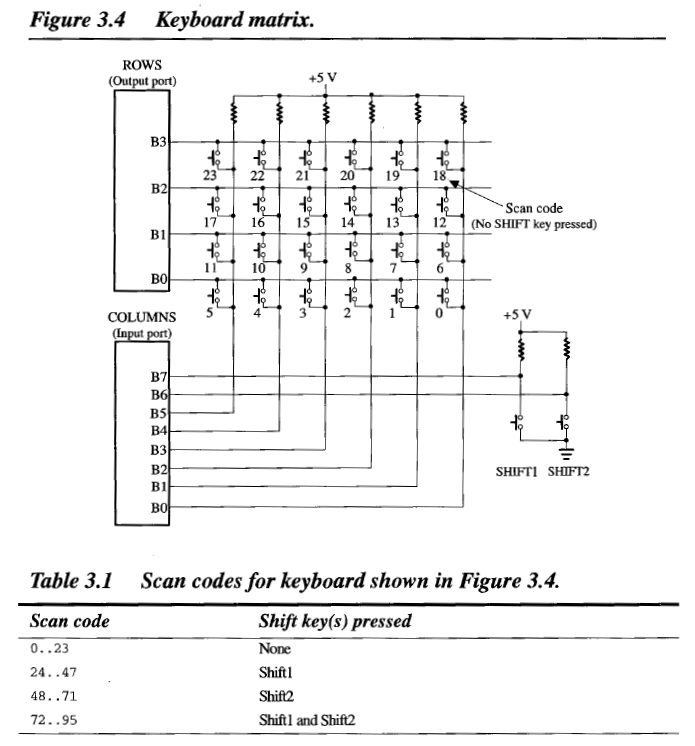
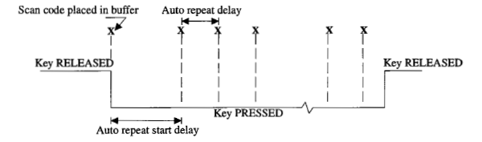
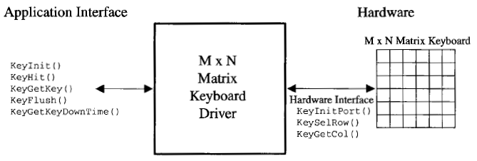
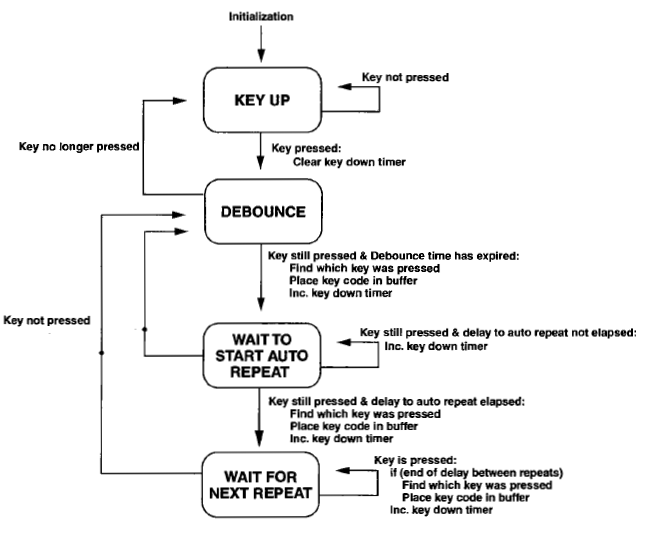

# [ESBB] Keyboards

# 硬件原理

 * 键盘按下的时候，要不就是高电压，要不就是底电压，就知道"按下"这个事情了
 * 按下前后有 edge bounce，程序读取按键信息，需要处理这种情况


为了节约线路，整个 keyboard 肯定是设计为一个 matrix 的。

 * row/col 交会点，给一个 scan code，表示一个按键


加上 Ctrl, Shift 之类

 * 线路布局大约如下
 * 带不带 Shift，就是给不同的 scan code
 * 注意，这里的键盘，对应我们在超时看到的那种 MxN 的键盘



如果一个按键一直按下，我们希望 app 收到"此按钮反复按下的消息"。需要 keyboard module 模拟一个 auto repeat 的行为。




## 代码解读

ESBB 中 keyboard module 的代码就很简单了。下面是整体的结构图：

 * 左边是 keyboard module 暴露给 app 使用的接口
 * 右边是 keyboard module 内部使用的接口



基本原理就是 KeyInit() 启动了一个 KeyScanTask()，然后不停的扫描硬件，看看有没有按键按下，并把这个信息，写入 buffer，缓存起来。

KeyScanTask() 通过状态机，用来处理上面说的 edge bounce 和 auto repeat。




### KeyFlush()

清空 keyboard module 中现有的 key state buffer cache。

```C
void Task(void *pdata)
{
    ...
    for (;;) {
        KeyFlush();     /* Clear the keyboard buffer */
        ...
    }
}
```


### KeyGetKey()

等待某个 key 按下

 * ticksToWait 填 0，无限等待
 * 如果 ticksToWait 还没按下，返回 0xFF。

```C
INT8U KeyGetKey(UINT16U ticksToWait);

```

```C
void Task(void *pdata)
{
    INT8U scancode;
    ...
    for (;;) {
        scancode = KeyGetKey(10);   /* Wait for key to be pressed */
                                    /*   up to 10 ticks           */
}
```


### KeyGetKeyDownTime()

返回"某个 key 一直被按下的持续时长"，并不关心是哪个 key。

 * 音量+/- 功能就需要这种函数

```C
void Task(void *pdata)
{
    INT16U time;
    ...
    for (;;) {
        time = KeyGetKeyDownTime();    /* See how long last key was pressed */
        ...
    }
}
```


### KeyHit()

是否按下了某个 key，不关心具体哪个 key。

```C
void Task(void *pdata)
{
    INT8U scancode;
    ...
    for (;;) {
        if (KeyHit()) {             /* See if a key has been pressed */
          scancode = KeyGetKey(0);  /* Yes, get scan code            */
        }
        ...
    }
}
```
