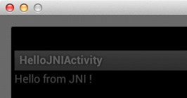

# Simple Android App & JNI

## 下载 Android SDK & NDK

[http://developer.android.com/sdk/index.html][1]

解压，放好。修改 PATH 方便以后使用。

```
~/fsengine/hello-jni> cat ~/.profile 
PATH=$HOME/fsengine/android-sdk-macosx/tools:$HOME/fsengine/android-sdk-macosx/platform-tools:$HOME/fsengine/android-ndk-r8b:$PATH
```

运行 $SDK/tools/android，启动 SDK Manager，下载对应的 Platform，我下了 Android 4.1 来玩。（下载请翻墙）

创建&启动模拟器，并启动起来。

```
android avd    (avd - Android Virtual Device Manager)
```

## 创建 Android App 项目

```shell
# android-16 就是 Android 4.1 的 target id，可以通过 android show targets 看到
android create project --target android-16 --name HelloJNI --path HelloJNI --activity HelloJNIActivity --package com.kcoder.hellojni
```

```shell
# 编译 & 安装到模拟器上
ProjectDir> ant debug
ProjectDir> adb install bin/HelloJNI-debug.apk
```

[http://developer.android.com/training/basics/firstapp/index.html][2]

## 增加 JNI 支持

JNI 放在 ProjectDir/jni 目录

```
Android.mk
hello-jni.c
```

hello-jni.c 的内容

```C
#include <string.h>
#include <jni.h>

jstring
Java_com_kcoder_hellojni_HelloJNIActivity_stringFromJNI( JNIEnv* env,
                                                  jobject thiz )
{
    return (*env)->NewStringUTF(env, "Hello from JNI !");
}
```

对应修改 ProjectDir/src/com/kcoder/hellojni/HelloJNIActivity.java

```Java
@Override
public void onCreate(Bundle savedInstanceState)
{
    super.onCreate(savedInstanceState);

    TextView tv = new TextView(this);
    tv.setText( stringFromJNI() );
    setContentView(tv);
}

public native String stringFromJNI();

static {
    System.loadLibrary("hello-jni");
}
```

编译 & 安装 apk

```
ProjectDir> ndk-build
ProjectDir> ant debug
ProjectDir> adb install -r bin/HelloJNI-debug.apk    # -r, reinstall
```

OK，可以通过 java 访问 C 函数啦。



清理

```
ProjectDir> ant clean
ProjectDir> ndk-build clean
```


[1]:http://developer.android.com/sdk/index.html
[2]:http://developer.android.com/training/basics/firstapp/index.html
