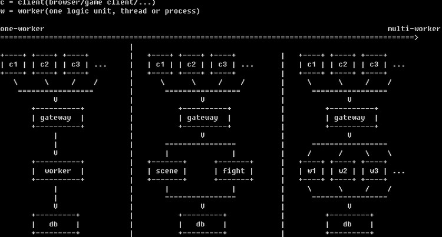

# [game-dev] web和game业务逻辑之区别

一直在思考web和game业务逻辑上的区别，今天似乎突然顿悟。

## web的业务逻辑

以 niginx 的进程结构为例：

```
                     /-- worker --\
clients <--> master ---- worker ---- dbserver
                     \-- worker --/
```

因为 web 业务多个 http request 之间基本没有上下文关系，worker 在处理业务逻辑时，都是 block 地去访问 dbserver。（就算不 block，通过 coroutine 的形式，也可以让 worker 的业务逻辑在代码层面上看起来是 block 的）

所以 web 的并发，来自于多个 worker。worker 可以是多进程，也可以是多线程。依靠操作系统的调度，来并发。

 1. http request 没有上下文关系
 2. web 业务相对比较简单，每个 worker 并发跑相同的逻辑
 3. 通过 dbserver 来保持数据一致性，worker 向 dbserver 请求的时间消耗，就算再慢，< 0.1 sec 的时间应该都可以接受


## game的业务逻辑

```
                       /-- scene server / data cache --\
clients <--> gateway ----  logic server / data cache ---- dbserver
                      \--  fight server / data cache --/
```

游戏的逻辑相对复杂得多，多个系统同时在运作，比如：好友系统、帮派、组队、...
 1. 模块间的逻辑可能会有交互，某些时候不太好拆分成独立模块，比较独立的如：战斗、场景跑路、聊天、... 比较容易拆出来。
 2. 对于同一个模块，不同的请求有上下文关系，为了保证时序，最简单的方法就是把这些请求交给同一个 worker 去做。
 3. 如果和 web 一样，都是 block 地访问 dbserver，则一个逻辑帧可能 block 的次数过多，严重导致性能下降。所以每个 worker 基本都会做一些 data cache，如此，则 data cache 之间的数据同步就成问题了。最简单的方法，就是业务逻辑拆分为每个 worker 处理不同的业务，不允许存在重叠业务（dbserver 的同一个变量，只允许一个 worker 去写）。
 4. 当然，最好的优化自然是根据具体的逻辑细分，分出哪些有上下文关系，哪些没有。但游戏需求变化过快，导致这种细分成本过大，所以粗略的划分更实用。


## web业务 / redis benchmark

测试了一下 redis，get/set 10000 次（redis-lua binding）。

```
CPU: Intel(R) Xeon(R) CPU 5130  @ 2.00GHz (1995.01-MHz 686-class CPU)
```

这台机器上，跑了 2 sec。我们逻辑帧是 0.1 sec，也就是说 0.1 sec 只能跑 500 个 dbserver request，而且还不包括跑业务逻辑的时间，所以 data cache 这样的东西必须的。

看一下 redis benchmark 的测试方法：

* The test was done with 50 simultaneous clients performing 100000 requests.

恩，不符合游戏的结构，huh~


## 总结

对于休闲、开房间的小游戏，也许不需要 data cache，访问数据直接 read/write 足够了。但对于 MMO，只能通过 data cache 的形式。

再画了个图，just for fun~



 * gateway, 任务分发, 保证时序
 * db, 修改数据, 保证时序(比如数据库, 保证时序也可能是通过row-lock来保证的, 并不代表db不可以并发)
 * worker, 把"可以独立出来的逻辑"拆分为独立的worker
 * 最左边就是不划分worker，最简单。
 * 游戏服务器结构可以在最左边，也可以在中间。
 * 最右边可以认为就是web。

**Updated - 2018.11.17**

随着游戏中越来越多的 web 玩法（比如：全服的朋友圈），游戏中也会引入很多 web 构架。game/web 之间的界限越来越模糊。
