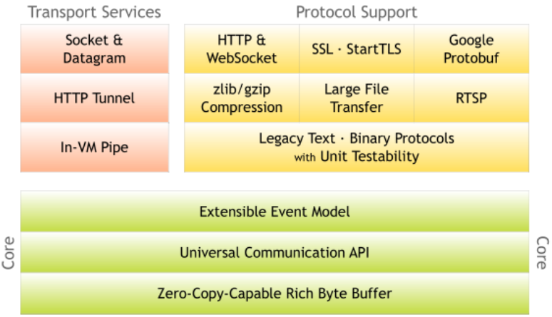

# 游戏服务端引擎程序员 - 打怪升级路线图

## 语言基础

C

 * C语言最佳入门，[https://learncodethehardway.org/c/][8]
 * 《[The C Programming Language][3]》
 * 《[Expert C Programming][4]》
 * 《[C Traps and Pitfalls][5]》
 * 《[C Interface and Implementation][6]》

C++

 * 如何学 C++，看 [这里][7]

Lua or Python

 * 搞懂一门脚本语言
 * 书只是辅助，推荐直接读代码
 * 《[Lua设计与实现][2]》
 * 《[Python源码分析][1]》

## 操作系统API + Linker & Loader

 * Steven 的 APUE: 《[Advanced Programming in the UNIX Environment][9]》
 * 《[The Linux Programming Interface: A Linux and UNIX System Programming Handbook][10]》
 * 《[程序员的自我修养--链接、装载与库][12]》
 * 《[Programming PThread][11]》

## 网络编程

 * Steven 的 UNP 两卷: 《[UNIX Network Programming Vol.1][15]》《[UNIX Network Programming Vol.2][14]》
 * Steven 的 TCP/IP 三卷：《[TCP/IP Illustrated Vol.1: The Protocols][19]》《[TCP/IP Illustrated Vol.2: The Implementation][20]》《[TCP/IP Illustrated Vol.3: TCP for Transactions, HTTP, NNTP and the Unix Domain Protocols][21]》
 * POSA Vol.2：《[Pattern-Oriented Software Architecture Volume 2 - Patterns for Concurrent and Networked Objects][16]》

UNP Vol.1，讲解 TCP / UDP socket api。配合 TCP/IP Vol.1 一起读。

UNP Vol.2，讲解 shared memory、domain socket 等等 Interprocess Communication 方法。

TCP/IP Vol.2，讲的是 [4.4BSD-Lite][22] 的 bsd socket api 的实现。

POSA Vol.2，[ACE][17] 作者 [Douglas C. Schmidt][18] 的名著，各种 network patterns，比如：reactor、proactor、acceptor/connector 等等，都是来源于这本书。

关于 [ACE][17] 的评价，早年在 douban 写过一篇评论，看[这里][28]。如今不再需要去读 [ACE][17] 来学习网络库如何封装，[libuv][23]、[zeromq][25] 都是更好的例子。

### 网络库 - 代码阅读

#### libuv

 * node.js 底层，通用的跨平台网络库，学习如何封装系统 api
 * [http://libuv.org/][23]
 * [https://nikhilm.github.io/uvbook/][24]

#### zeromq

 * 一个 message-queue，换一个角度思考网络数据传输
 * [http://zeromq.org/][25]

#### skynet

 * skynet 是 single-process multi-threading game server 的典范
 * 学习如何设计一个优秀的游戏服务器
 * [https://github.com/cloudwu/skynet][26]
 * [http://blog.codingnow.com/2012/09/the_design_of_skynet.html][27]

#### Boost.Asio

 * 非常经典的 raw socket 封装方式（虽然我不喜欢 C++ 的厚重 :-)）
 * [https://www.boost.org/doc/libs/1_70_0/doc/html/boost_asio.html][29]

#### Netty

 * netty 是 Java 生态中 No.1 的网络库，很多设计值得学习
 * [https://netty.io/][30]
 * 《[Netty权威指南][38]》
 * 《[Netty进阶之路：跟着案例学Netty][39]》

## Shell入门

 * 《[Shell命令偷偷教][13]》，一些 shell 的推荐数目，在这篇文章的附录里。

## Database

TODO，数据库是弱项，过五年来填坑。:-)

 * 《[Readings in Database Systems 5th][37]》

### 数据库 - 代码阅读

#### Redis

 * [redis][36]
 * 《[Redis 深度历险：核心原理与应用实践][35]》

#### MySQL

 * TODO

#### MongoDB

 * TODO

## Profiling

 * [DTrace][33]
 * 《[Systems Performance: Enterprise and the Cloud][32]》
 * 《[DTrace: Dynamic Tracing in Oracle Solaris, Mac OS X and FreeBSD][31]》

想做好 profiling，[Brendan D. Gregg][34] 的每一本书，都该看看。:-)

## Game Server Design

Single-Process Multi-Threading Design

 * select/epoll/kqueue/IOCP
 * timer (priority-heap / time-wheel)
 * async I/O
 * AOI
 * Python/Lua embeded
 * database, ORM

Multi-Process Multi-Threading Design

 * 自己的一个玩具项目 (on working)
 * 设计思路参考 [Akka.NET][42] 和 [ET][43]
 * [fatserver design][40]
 * [fatuv benchmark][41]

[1]:https://book.douban.com/subject/3117898/
[2]:https://book.douban.com/subject/27108476/
[3]:https://www.amazon.com/Programming-Language-2nd-Brian-Kernighan/dp/0131103628/
[4]:https://www.amazon.com/Expert-Programming-Peter-van-Linden/dp/0131774298/
[5]:https://www.amazon.com/C-Traps-Pitfalls-Andrew-Koenig/dp/0201179288/
[6]:https://www.amazon.com/Interfaces-Implementations-Techniques-Creating-Reusable/dp/0201498413/
[7]:https://github.com/kasicass/blog/blob/master/cpp/2018_11_23_farewell_cpp.md
[8]:https://learncodethehardway.org/c/
[9]:https://www.amazon.com/Advanced-Programming-UNIX-Environment-3rd/dp/0321637739/
[10]:https://www.amazon.com/Linux-Programming-Interface-System-Handbook/dp/1593272200/
[11]:https://github.com/kasicass/blog/blob/master/minibook/programming_pthread.md
[12]:https://book.douban.com/subject/3652388/
[13]:https://github.com/kasicass/blog/blob/master/shell/2016_05_12_shell_crash_course.md
[14]:https://www.amazon.com/UNIX-Network-Programming-Interprocess-Communications/dp/0130810819/
[15]:https://www.amazon.com/Unix-Network-Programming-Sockets-Networking/dp/0131411551/
[16]:https://www.amazon.com/Pattern-Oriented-Software-Architecture-Concurrent-Networked/dp/0471606952/
[17]:http://www.dre.vanderbilt.edu/~schmidt/ACE.html
[18]:http://www.dre.vanderbilt.edu/~schmidt/
[19]:https://www.amazon.com/TCP-Illustrated-Protocols-Addison-Wesley-Professional/dp/0321336313/
[20]:https://www.amazon.com/TCP-IP-Illustrated-Implementation-Vol/dp/020163354X/
[21]:https://www.amazon.com/gp/product/0201634953/
[22]:https://github.com/sergev/4.4BSD-Lite2
[23]:http://libuv.org/
[24]:https://nikhilm.github.io/uvbook/
[25]:http://zeromq.org/
[26]:https://github.com/cloudwu/skynet
[27]:http://blog.codingnow.com/2012/09/the_design_of_skynet.html
[28]:https://book.douban.com/review/3092133/
[29]:https://www.boost.org/doc/libs/1_70_0/doc/html/boost_asio.html
[30]:https://netty.io/
[31]:https://www.amazon.com/DTrace-Dynamic-Tracing-Solaris-FreeBSD/dp/0132091518/
[32]:https://www.amazon.com/Systems-Performance-Enterprise-Brendan-Gregg/dp/0133390098/
[33]:http://www.brendangregg.com/dtrace.html
[34]:http://www.brendangregg.com/
[35]:https://item.jd.com/12464009.html
[36]:https://redis.io/
[37]:http://www.redbook.io/
[38]:https://item.jd.com/11681556.html
[39]:https://item.jd.com/12458713.html
[40]:https://github.com/kasicass/blog/blob/master/fatserver/2018_11_29_fatserver_design.md
[41]:https://github.com/kasicass/blog/blob/master/fatserver/2018_11_03_fatuv_benchmark.md
[42]:https://github.com/kasicass/blog/blob/master/fatserver/2018_11_28_akka_net.md
[43]:https://github.com/egametang/ET
