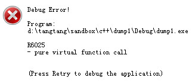

# [win32] CrashReport机制 (1) -- 制作dump文件

一直想动笔写写这个，拖了很久。还是主动把这个坑填上吧。

主要想把"创建minidump、到自动上传整个流程"所需要的的技术，总结一下。


## Win32程序如何捕获所有异常

捕捉异常的时候，下面三个函数都需要设置。
 * SetUnhandledExceptionFilter()
 * _set_purecall_handler()
 * _set_invalid_parameter_handler()

Debug 状态下，pure call、invalid parameter会出现提示框（下面一一说明）。Release 下程序直接挂掉。

* _set_purecall_handler, 如果调用了一个 pure virtual function，则触发此 handler


* _set_invalid_parameter_handler, 一个 crt 函数传参不正确出发此handler，比如：printf(NULL)
* _set_purecall_handler_m, 用于 mixed mode。mixed mode CRT，与.net库链接时所用的crt。


看一下 _set_invalid_parameter_handler/_set_purecall_handler 的具体例子。

```C++
#include <Windows.h>
#include <stdlib.h>
#include <stdio.h>
#include <crtdbg.h>

class CDerived;
class CBase
{
public:
    CBase(CDerived *derived) : pDerived_(derived) {}
    virtual ~CBase();
    virtual void function() = 0;

private:
    CDerived *pDerived_;
};

class CDerived : public CBase
{
public:
    CDerived() : CBase(this) {}
    virtual void function() {}
};

CBase::~CBase()
{
    pDerived_->function();
}

void myPurecallHandler()
{
    printf("myPurecallHandler\n");
    int *p = 0;
    *p = 1;
}

static void __cdecl myParameterHandler(const wchar_t *, const wchar_t *, const wchar_t *, unsigned int, uintptr_t)
{
    printf("myParameterHandler\n");
    int *p = 0;
    *p = 1;
}

LONG WINAPI myExceptionFilter(struct _EXCEPTION_POINTERS *ExceptionInfo)
{
    printf("myExceptionFilter\n");
    return EXCEPTION_EXECUTE_HANDLER;
}

int main()
{
    SetUnhandledExceptionFilter(myExceptionFilter);

    _set_purecall_handler(myPurecallHandler);
    CDerived   myDerived;
    //_CrtSetReportMode(_CRT_ASSERT,   0);
    //_set_invalid_parameter_handler(myParameterHandler);
    //printf(NULL);

    return 0;
}
```

要抓住所有异常，这样做既可。

```C++
static void throw_exception()
{
    int *a = 0;
    *a = 1;
}

static void __cdecl invalid_parameter_handler(const wchar_t *, const wchar_t *, const wchar_t *, unsigned int,   uintptr_t)
{
    throw_exception();
}

void RegisterExceptionFilter()
{
    SetUnhandledExceptionFilter(MyFilter);
    _set_invalid_parameter_handler(&invalid_parameter_handler);
    _set_purecall_handler(&throw_exception);
}
```

附带一个技巧。当异常发生后，捕获之，并继续运行。做windows服务器程序的同学可以用用。

```C++
#include <windows.h>
#include <stdio.h>
#include <stdlib.h>
#include <crtdbg.h>

LONG WINAPI MyUnhandledExceptionFilter(struct _EXCEPTION_POINTERS* ExceptionInfo)
{
    return EXCEPTION_EXECUTE_HANDLER;
}

void makeException()
{
    int *p = NULL;
    *p = 1;
}

static void __cdecl myParameterHandler(const wchar_t *, const wchar_t *, const wchar_t *, unsigned int, uintptr_t)
{
    makeException();
}

void mainLoop()
{
    static int step = 0;
    __try
    {
        switch (step)
        {
        case 0:
            printf("step 0\n");
            makeException();
            break;
        case 1:
            printf("step 1\n");
            printf(NULL);
            break;
        default:
            printf("default\n");
            break;
        }
    }
    __except(MyUnhandledExceptionFilter(GetExceptionInformation()))
    {
        printf("catch it! step: %d\n", step);
        step++;
    }
}

int main()
{
    _set_purecall_handler(makeException);
    
    _CrtSetReportMode(_CRT_ASSERT, 0);
    _set_invalid_parameter_handler(myParameterHandler);
    mainLoop();
    mainLoop();
    mainLoop();
   
    return 0;
}
```


## 制作一个minidump

在Filter中，通过 MiniDumpWriteDump() 很容易创建一个 .dmp 文件。

把 DumpFile.dmp 和 Program.exe, Program.pdb 放到一个目录，双击 DumpFile.dmp 直接启动 Visual Studio，点"运行"，就可以看到 call stack 了。

如果本机还有编译此exe的源代码，可以直接看到具体的代码行。

```C++
#include <Windows.h>
#include <Dbghelp.h>
 
#pragma comment(lib, "DbgHelp")
LONG WINAPI myExceptionFilter(struct _EXCEPTION_POINTERS* ExceptionInfo)
{
    HANDLE lhDumpFile = CreateFile(L"DumpFile.dmp", GENERIC_WRITE, 0, NULL, CREATE_ALWAYS,FILE_ATTRIBUTE_NORMAL ,NULL);

    MINIDUMP_EXCEPTION_INFORMATION loExceptionInfo;
    loExceptionInfo.ExceptionPointers = ExceptionInfo;
    loExceptionInfo.ThreadId = GetCurrentThreadId();
    loExceptionInfo.ClientPointers = TRUE;
    MiniDumpWriteDump(GetCurrentProcess(), GetCurrentProcessId(),lhDumpFile, MiniDumpNormal, &loExceptionInfo, NULL, NULL);

    CloseHandle(lhDumpFile);

    return EXCEPTION_EXECUTE_HANDLER;
}

int main()
{
    SetUnhandledExceptionFilter(myExceptionFilter);
    int *p = 0;
    *p = 1;
    return 0;
}
```

MSDN MiniDump API的使用
 * [http://msdn.microsoft.com/en-us/library/windows/desktop/ms679309(v=vs.85).aspx][1]

Effective MiniDumps, 详细介绍了如何使用MiniDump API
 * [http://www.debuginfo.com/articles/effminidumps.html][2]

异常处理与MiniDump详解，从C++异常到MiniDump，很详细
 * [http://blog.csdn.net/vagrxie/article/details/4317423][3]
 * [http://blog.csdn.net/vagrxie/article/details/4323962][4]
 * [http://blog.csdn.net/vagrxie/article/details/4382591][5]
 * [http://blog.csdn.net/vagrxie/article/details/4398721][6]

[1]:http://msdn.microsoft.com/en-us/library/windows/desktop/ms679309(v=vs.85).aspx
[2]:http://www.debuginfo.com/articles/effminidumps.html
[3]:http://blog.csdn.net/vagrxie/article/details/4317423
[4]:http://blog.csdn.net/vagrxie/article/details/4323962
[5]:http://blog.csdn.net/vagrxie/article/details/4382591
[6]:http://blog.csdn.net/vagrxie/article/details/4398721
