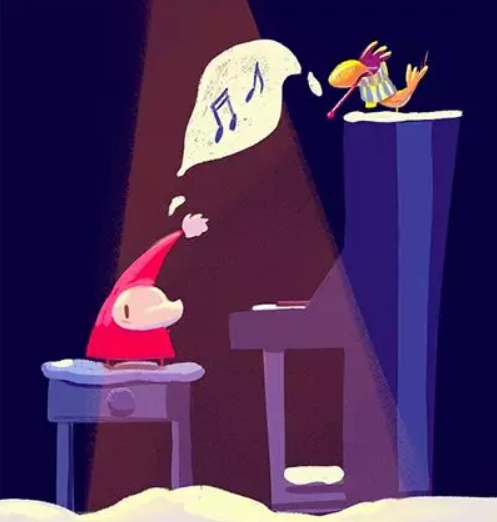
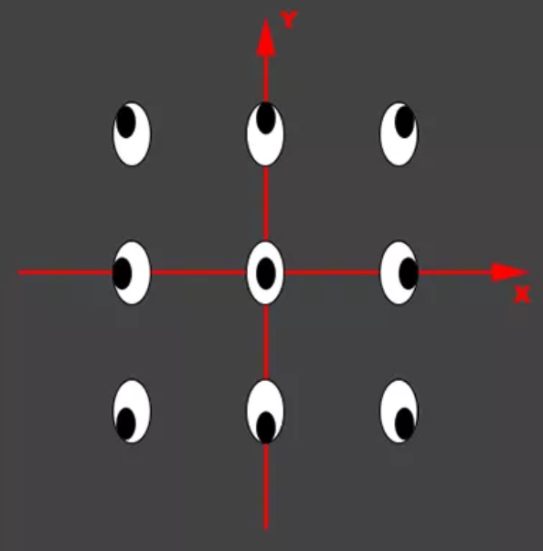
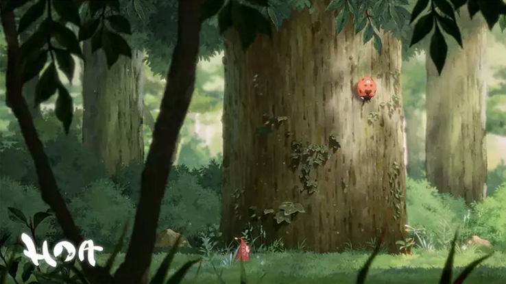
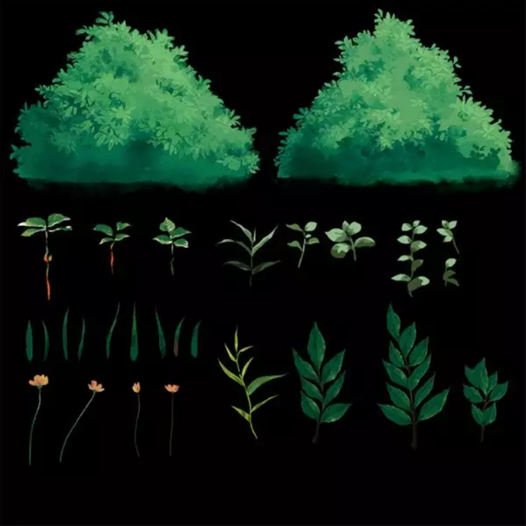

# 《Hoa》：使用Unity创作吉卜力艺术风格的冒险游戏

转自 [这里][1]。

《Hoa》的创作团队由新加坡南洋理工大学和国立大学的大学毕业生组成，共有2名美术和2名程序。由于所有团队成员都有自己的全职工作，因此这个项目都是在业余时间兼职制作。

《Hoa》的创作团队从未有过多的游戏开发经验，项目创作花费了几个月的时间，大量的时间花费在构思与美术风格的确认，而对于小型团队，实现一个理想中精美的游戏，Unity起到了至关重要的作用。

## 《Hoa》的灵感创意

当开始创作《Hoa》项目时，我们唯一的想法是尝试制作一款拥有出色画面效果的横版游戏。我们非常希望制作出类似《Trine》、《地狱边境》、《Rayman》这样拥有精美画面和美丽视觉风格的游戏。

首先我们需要为游戏准备一个故事。经过数次头脑风暴后，我们选择的创意是游戏主角的回家之路。

游戏的场景简单而优美，使我们可以让角色穿越不同的环境，展现出精美的横向滚动画面，同时游戏也有创作背景故事的大量潜力。

## 艺术风格

首次构思《Hoa》的故事之前，我们不知道游戏会是什么样子，唯一知道的是，我们希望游戏画面非常优美，使玩家进行游戏的目的只是为了身临其境全身心享受游戏。

通过利用主角背景故事和预期行为作为灵感，我们最终得到了目前的设计，下图是主角的样品概念图。

然后我们尝试把角色放入各种艺术风格。令我们惊讶的发现，主角非常适合日式动画的手绘背景，特别是吉卜力工作室的艺术风格。

这种艺术风格的其中一个优点是：画面注重描绘植物和花卉。这些元素是故事情节的重要部分，因此我们决定使用它作为游戏的美术风格。

## 对Unity的选择

我们选择Unity的一个非常重要原因是，为了使用游戏引擎创作出色的内容，学习曲线最好不要太陡峭。虽然缺乏游戏行业的经验，但我们的成员仍可以快速掌握Unity的使用。

Unity的2D工具集非常强大，而且Unity仍在每个补丁中不断添加实用的功能。Unity可以让我们添加和控制2D元素，并轻松结合2D和3D效果。

Unity的另一个强大之处是庞大的Asset Store资源商店。作为缺乏经验的小型团队，我们经常要在许多任务上寻求帮助，而Asset Store资源商店为我们提供了很大帮助。

其中一个例子是渲染3D元素。为了实现与手绘背景完美融合的卡通效果，我们使用了从Asset Store资源商店资源商店购买的卡通着色器，例如：Toony Colors Pro 2，RealToon，这些工具为我们节省了自己编写着色器的大量时间。

## 角色创作

如前所述，我们使用角色的游戏内行为和背景故事作为设计的核心，并去除了不符合这些要求的元素。例如：我们决定让《Hoa》没有任何需要手臂或手部的动作，因此在最终设计中，主角的整个身体被斗篷覆盖，无法看到她的手部，你甚至不知道她是否拥有手。

当决定好概念时，我们的3D制作流程和标准流程差不多，可能甚至比普通流程更为简单。游戏角色的多数外形非常简单独特，而且2D卡通风格效果不需要法线贴图。

游戏细节被直接绘制到反照率贴图，因此我们不需要遵循常见流程，即创建高多边形模型后，进行重拓扑处理并烘焙细节到低多边形模型。

我们使用了Photoshop制作纹理，直接制作出最终的模型，并在Maya中进行绑定和制作动画。然后我们使用fbx格式导出模型，将模型和纹理导入到Unity。

## 场景

我们的场景设置类似其它横向滚动游戏：2D精灵放置在不同深度以实现视差效果。

关于可交互对象，以用石块和角色的眼睛作为例。对于眼睛，我们制作了眼睛的9个动画剪辑，它们分别看向8个方向，即上下左右和四个角落，其中一个处于向前直视的状态。

我们在Unity制作了动画控制器，把所有动画放到Blend Tree，Blend Tree会获取2个参数：X位置和Y位置。

下图是设置方法。

通过使用附加给石块的脚本，我们得到相对于石块位置的玩家XY位置，并把它们传入到Blend Tree的参数中。因此角色眼睛总会看着角色面朝的方向。

## 纹理

当决定使用吉卜力风格时，我们知道要克服的最大困难是在数字化的环境中实现精美的手绘效果，当时我们真不太确定是否能够做到。

吉卜力工作室的艺术家男鹿和雄拥有多年的手绘经验，而我们必须实现同样的品质。如果无法实现这种效果，那么项目从一开始就会宣布失败。

我们花了大量时间观看所有吉卜力工作室的电影，研究他们的背景艺术，分解技术要求，寻找实现吉卜力风格的方法。这是一项非常艰巨的任务，但随着我们画得越来越多，我们逐渐掌握这种风格的绘画。

几个月后，经过不断的研究，练习和尝试Photoshop的不同画笔设置，作品终于达到了可以接受的水平，最终我们使用Unity中的滤镜和后期处理效果来弥补了剩余的品质差异。

在时间成本上，我们的研发阶段持续了几个月。在制作游戏时，以森林场景为例，我们花了二周时间来绘制完成场景的所有背景元素。

所有元素被划分到不同图层，根据图层和摄像机的距离，我们相应地调整了细节层级和颜色。规划过程对最大化每个精灵可使用的情景非常重要，同时会确保精灵能很好地融合在一起。

下图是游戏的示例精灵图集。

## 动画

我们都知道动画制作有12项基本原则。基础部分的完成需要大量处理。例如：跳跃和着地的“挤压拉伸”展示了主角落下的撞击效果，使她更加可爱，并让玩家感受到她的重量。

对于兜帽的较长末端，我们利用了跟随动作和摆动效果。下图是一个慢动作的Gif动图，你可以清楚地看到我们如何利用这些原则。

虽然介绍这些原则的应用很有趣，但我们制作这些动画的方法是介于明显和微妙之间。制作流畅的动画只是成功的一半，我们仍需要在Unity进行设置，使它们流畅地互相过渡。

动画的设计更多与游戏逻辑相关。角色是否在需要跳跃时进行奔跑动画？为什么会发生这种情况？如何修复这个问题？这需要大量的反复试验，以及美术和程序之间很好的团队协作。

## 开发计划

《Hoa》游戏的时长，我们的目标是和《风之旅人》游戏类似。游戏流程不会很长，大概有几个小时的紧张体验，让玩家享受其中的冒险故事。

最终的可玩性的游戏演示将在2019年中发布，此后，我们将收集来自社区和玩家对演示的反馈而制定新的开发计划。并且在明年初将游戏发布到PC和Nintendo Switch，甚至移动平台。

## 小结

《Hoa》的创作经验分享到这里，让我们期待这款小清新风格的游戏在几个月后，与我们见面吧。希望大家根据《Hoa》的项目经验来运用到自己的项目中，从而创作出更加精彩的游戏。

[1]:https://mp.weixin.qq.com/s?__biz=MzU5MjQ1NTEwOA==&mid=2247497144&idx=1&sn=cae8a34214049b416ff35195014225c6&chksm=fe1dc113c96a4805e80d10e39792df2fcdce51707a7374f185e68eb53636327c637bb2d181e3&mpshare=1&scene=1&srcid=02215GpeDgE0Hh9yxItlYs8g&key=480a3550c10d3149967d4b58b7d5000530a11e6a8fa21a01f58a1cc70e812c5084bf379bfd6300af50f8cb6143864e327f9a0ad7f7c34534be6d606202d7758e8e06a22e4ebf8f1f085809df734bc283&ascene=1&uin=MTgzNzQ3MDAw&devicetype=Windows+10&version=62060728&lang=zh_CN&pass_ticket=P7rCYqyfiz3cEOfFgbOdcqYBP72%2Fi2D2VWbj%2Bls2ZhE%3D

