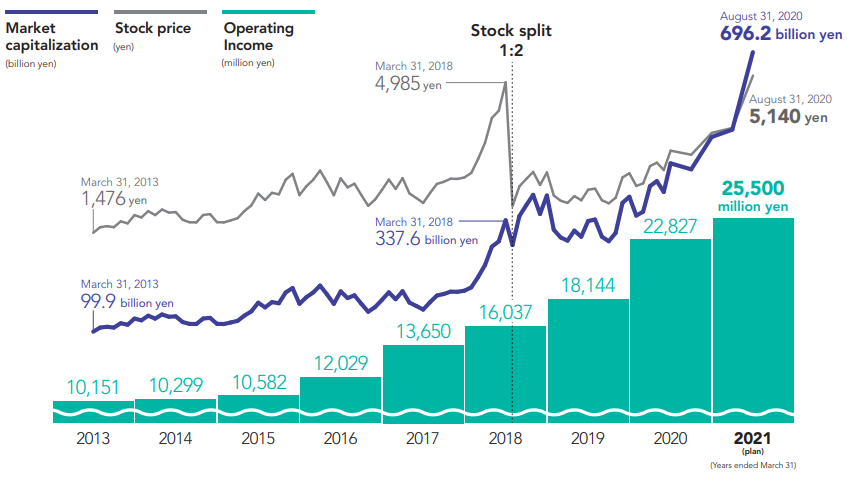
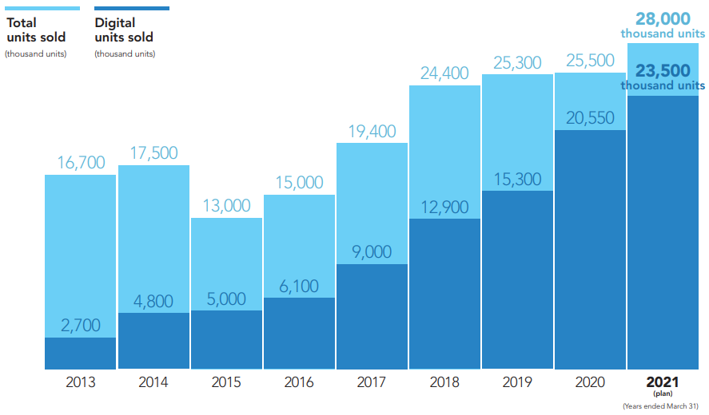
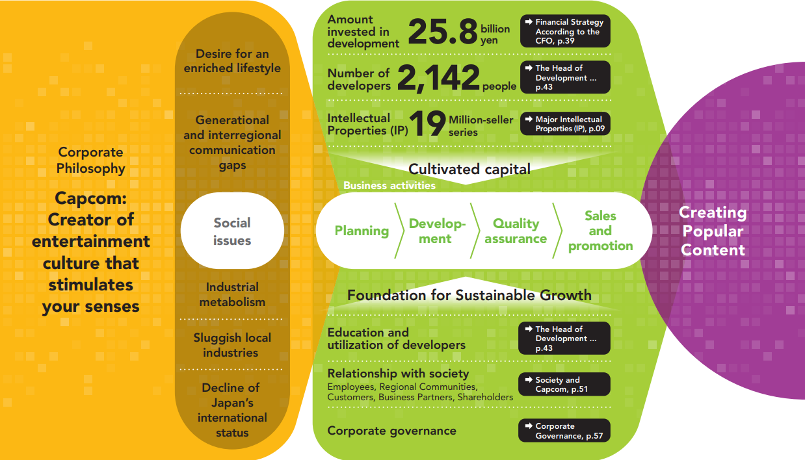
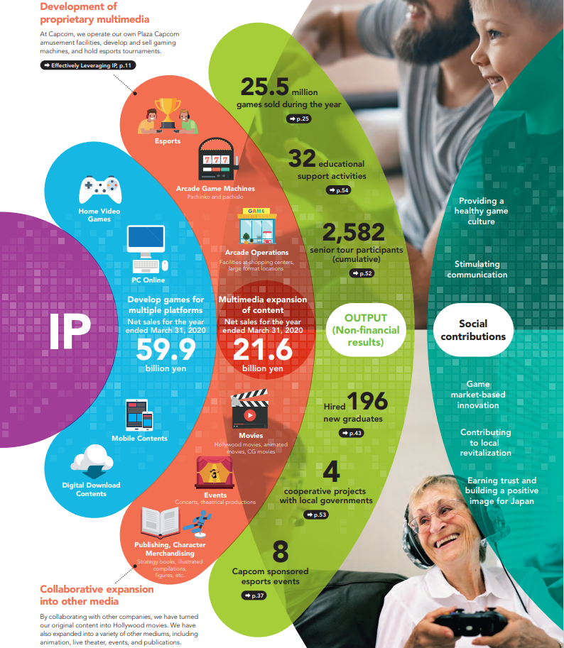
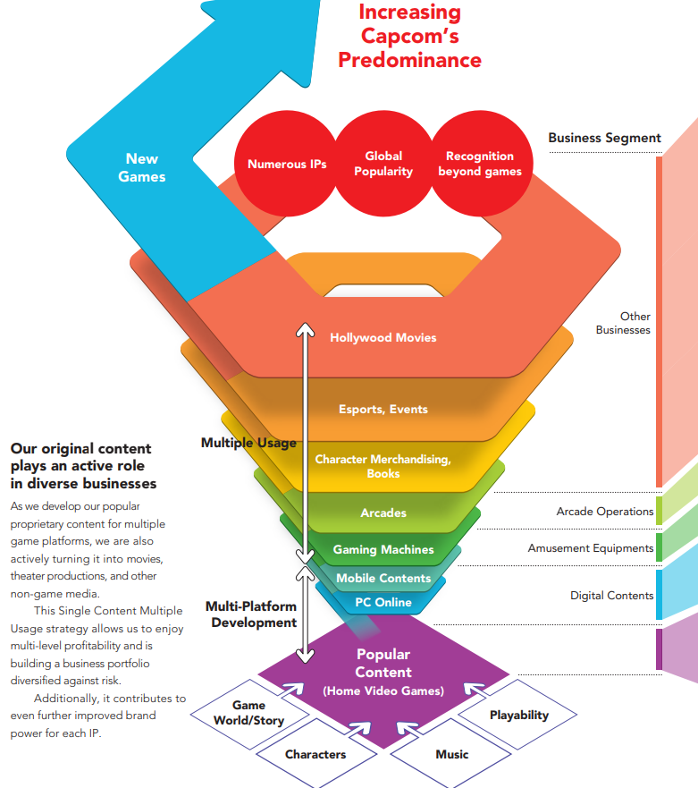
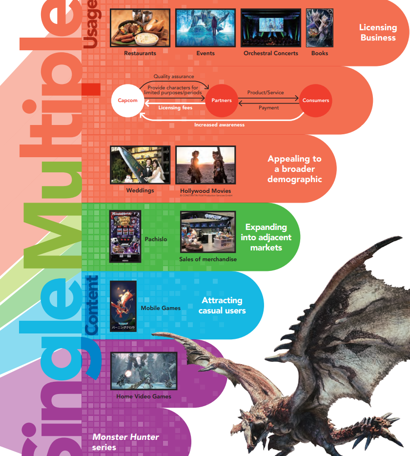

# CAPCOM Annual Report 2020

* [2020年报][1]

## 理念

* Continuing to create finacial and non-finacial value
* Providing smiles and moving hearts all across the globe

## 数据

以2021预计数据，折算为人民币

* market capitalization (股票市值): 416.4 亿
* stock price (股价): 307.43 元
* operating income (营收): 15.25 亿

* 主要销售靠数字版

## History of Value Creation

### Value Creation Model

* 核心技术
* 核心产品(打造IP)

* 持续打造百万级销量的爆款产品
* 洛克人、生化危机、街霸、怪物猎人、鬼泣、鬼武者等等

* Single Content Multiple Usage strategy
* IP运营思路

* 以怪物猎人为例

[1]:https://www.capcom.co.jp/ir/english/data/annual.html
