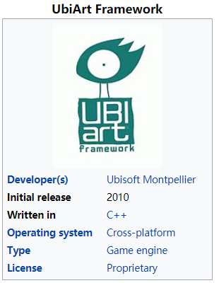
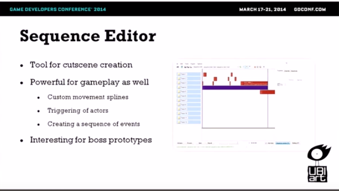
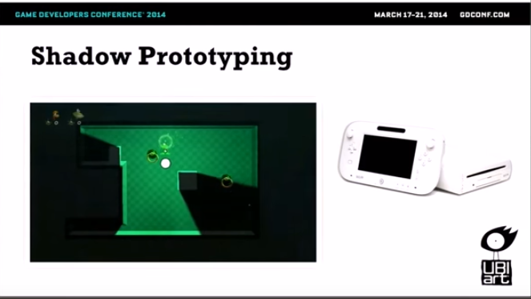
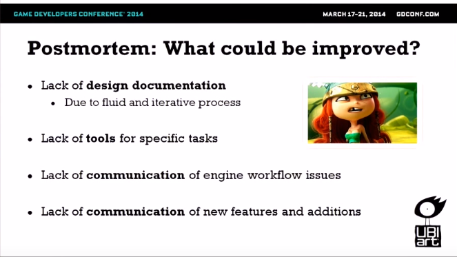
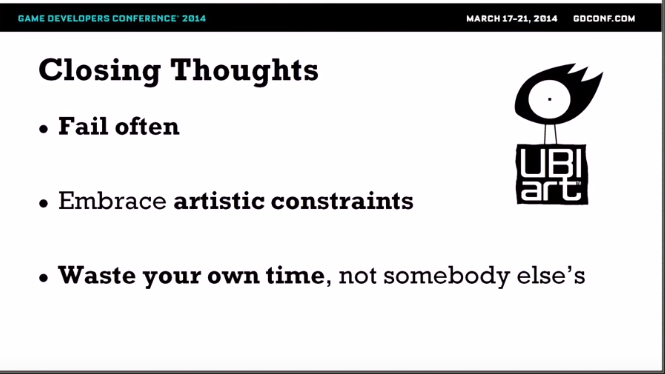

# 2D Platform Game 制作利器 -- UbiArt Framework

## UbiArt Framework

几年前，玩 ubisoft 的《[光之子][3]》，超级震撼。

随之就去研究《[光之子][3]》用的什么引擎。Ubisoft 作为传统大厂，在游戏制作的工具研发上，还是相当有实力的。《[Rayman Origins][4]》《[光之子][3]》等等一系列 2d platform 游戏，都是用同一款引擎 -- [UbiArt Framework][2]。

关于 [UbiArt Framework][2]，GDC 2014 的一个视频，有简单的介绍。

 * [https://en.wikipedia.org/wiki/UbiArt_Framework][2]
 * [https://www.youtube.com/watch?v=WFu1utKAZ18][1]
 * 其中，时间轴 10:40 那一段演示，相当震撼
 * 
 * The Art of Child of Light，[https://www.youtube.com/watch?v=st7giW3wqwM][14]

## UbiArt Framework 解构

 * 下面是通过 [GDC 2014视频][1] 中分析出来的一些内容
 * Extra 是原视频未提及，额外补充的内容
 * 实现难度：1 - 5 stars

### LUA Scripting

 * 实现难度：★★
 * 用 Lua 当脚本

### Sequence Editor

 * 实现难度：★★★
 * 基于 timeline 的过场动画编辑

 * 一堆可触发的 action/event
 * 然后丢到 timeline 上即可

### GenAnim

 * 实现难度：★★★★
 * 类似 [spine][7] 的东西，参考
 * [GDC Vault: Rayman Reinvented][8]

### GamePlay - Shadow Prototyping

 * 实现难度：？
 * Rayman 中有光影 + 碰撞，触发游戏逻辑
 * Editor 中需要，随时移动光影，立即看到效果（prototyping）
 * Editor 中，允许一位设计者控制角色，另一位设计者控制 shadow
 * 所见即所得

### GamePlay - Digging Prototyping

 * 实现难度：？
 * Separate functionality into different actors
 * Parenting system
 * Flexibility in prototyping
 * Eventually **integrate component**
 * digging 这种 gameplay，各个关卡可能需求不一样
 * 通过各种 component 组合来实现，简单说就是 hardcode

### GamePlay - Kung Foot

 * 实现难度：？
 * Rayman 踢球，会有几个连续不同的状态
 * 通过 event 组合，去实现

### Extra：Physics

 * 实现难度：★★★
 * 碰撞检测，整合 box2d
 * [https://box2d.org/][9]

### Extra：Publish to All-Platform

 * 实现难度：★★★★
 * 抽象不同平台的硬件、操作系统API
 * 实现不同的 rendering driver：dx9、dx11、OpenGL、OpenGL ES 等等

## 开发经验回顾

### Postmortem: Waht went right?

 * 快速迭代开发
 * small team，便于沟通

### Postmortem: What chould be improved?

 * 敏捷迭代，因为缺乏文档
 * 太敏捷了，所以有些功能改了，并没有知会其他人

### UbiArt Framework 制作的游戏

除了 Rayman，[UbiArt Framework][2] 还做了啥。

 * 手游，《[Rayman: Fiesta Run][10]》
 * RPG，《[Child of Light][3]》
 * 《[Valiant Hearts: The Great War][13]》

### 一些资料

两篇 Blog

 * Playing with Art，[http://blog.ubi.com/en-GB/column-chris-mcentee-on-the-level-july-2013/][11]
 * Creating a World，[http://blog.ubi.com/en-GB/on-the-level-creating-20000-lums-under-the-sea/][12]

### 反思

 * 失败 & 验证
 * 遵循美术限制（引擎限制）
 * 自己先花时间 work-out，然后输出给团队（Don't waste others' time）

## Unity3D 的野望

 * 这两年随着 pixel games 和 2d platform 的流行
 * unity3d 也一直在加强这一块的功能
 * Unity All in One 全家桶

### 2D Animation System

 * 类似 [spine][7] 的东西
 * [https://github.com/Unity-Technologies/2d-animation-samples][5]

### 2D SpriteShape

 * 类似 [UbiArt Framework][2] 中的场景编辑功能
 * [https://github.com/Unity-Technologies/2d-spriteshape-samples][6]

### 2D Pixel Perfect

 * 根据像素做对齐，减少模糊
 * [https://github.com/Unity-Technologies/2d-animation-samples][5]

[1]:https://www.youtube.com/watch?v=WFu1utKAZ18
[2]:https://en.wikipedia.org/wiki/UbiArt_Framework
[3]:https://en.wikipedia.org/wiki/Child_of_Light
[4]:https://en.wikipedia.org/wiki/Rayman_Origins
[5]:https://github.com/Unity-Technologies/2d-animation-samples
[6]:https://github.com/Unity-Technologies/2d-spriteshape-samples
[7]:http://en.esotericsoftware.com/
[8]:https://www.youtube.com/watch?v=p-8eNkUCvnw
[9]:https://box2d.org/
[10]:https://play.google.com/store/apps/details?id=com.ubisoft.rayman.fiestarun&hl=en
[11]:http://blog.ubi.com/en-GB/column-chris-mcentee-on-the-level-july-2013/
[12]:http://blog.ubi.com/en-GB/on-the-level-creating-20000-lums-under-the-sea/
[13]:https://en.wikipedia.org/wiki/Valiant_Hearts:_The_Great_War
[14]:https://www.youtube.com/watch?v=st7giW3wqwM
