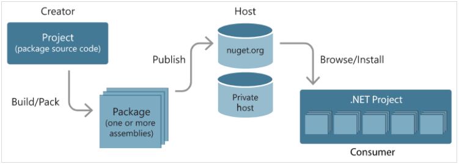

# IronPython on .NET Core

.NET Core 已经出到 2.1 了，好久没玩 .NET 了，试试看 IronPython 在 debian9 上性能如何。


## 软件安装

.NET Core 的安装，已经超级方便了。

 * [https://dotnet.microsoft.com/learn/dotnet/hello-world-tutorial][1]

安装 IronPython，参考 [这里][2]：

```
$ dotnet new console -o myApp
$ cd myApp

$ dotnet add package IronPython.Interpreter --version 2.7.4
```

装完后，死活找不到 ipy 在哪。=_=! 无法，还得好好研究下 NuGet。


## NuGet

 * [https://www.nuget.org/][4]
 * [https://docs.microsoft.com/zh-cn/nuget/what-is-nuget][3]

package 的制作/发布流程：




### 使用 package

```
$ dotnet new console -o myhello
$ cd myhello
$ dotnet add package Newtonsoft.Json
```

写个测试代码

```C#
using System;
using Newtonsoft.Json;

public class Account
{
    public string Name { get; set; }
    public string Email { get; set; }
    public DateTime DOB { get; set; }
}

namespace myhello
{
    class Program
    {   
        static void Main(string[] args)
        {   
            Account account = new Account
            {   
                Name  = "John",
                Email = "john@nuget.org",
                DOB   = new DateTime(1980, 2, 20, 0, 0, 0, DateTimeKind.Utc),
            };  

            string json = JsonConvert.SerializeObject(account, Formatting.Indented);
            Console.WriteLine(json);
        }   
    }   
}
```

运行结果

```
$ dotnet run
{
  "Name": "John",
  "Email": "john@nuget.org",
  "DOB": "1980-02-20T00:00:00Z"
}
```

## IronPython build from source

好像研究错方向了，改研究 IronPython 的[文档][5]。

```
$ wget https://github.com/PowerShell/PowerShell/releases/download/v6.1.1/powershell_6.1.1-1.debian.9_amd64.deb
# dpkg -i powershell_6.1.1-1.debian.9_amd64.deb

$ git clone --recursive https://github.com/IronLanguages/ironpython2
$ cd ironpython2
$ pwsh
> ./make.ps1
blab... blab...
```

还是各种出错。放弃。再换个方向。


## Using IronPython.dll

既然 add package 已经成功，那直接写个程序，运行 python 脚本吧。

```
$ dotnet new console -o myhello
$ cd myhello
$ dotnet add package IronPython --version 2.7.9
```

修改 Program.cs

```C#
using System;
using Microsoft.Scripting;         // SourceCodeKind
using Microsoft.Scripting.Hosting; // ScriptEngine
using IronPython.Hosting;

namespace myhello
{
    class Program
    {
        static void Main(string[] args)
        {
            ScriptEngine engine = Python.CreateEngine();

            ScriptSource source;
            source = engine.CreateScriptSourceFromString("print 'Hello! IronPython!'", SourceCodeKind.Statements);
            ScriptScope scope = engine.CreateScope();
            source.Execute(scope);
        }
    }
}
```

运行结果

```
$ dotnet build
$ dotnet run
Hello! IronPython!
```

再改改 Program.cs，让其读取一个 .py 文件，并运行。

```C#
using System;
using Microsoft.Scripting;
using Microsoft.Scripting.Hosting;
using IronPython.Hosting;

namespace myhello
{
    class Program
    {
        static void Main(string[] args)
        {
            ScriptEngine engine = Python.CreateEngine();

            ScriptSource source;
            source = engine.CreateScriptSourceFromFile(args[0]);
            ScriptScope scope = engine.CreateScope();
            source.Execute(scope);
        }
    }
}
```

这下可以跑 pystone.py 了

```
$ dotnet build
$ dotnet run pystone.py
```

## IronPython vs pypy vs python2.7

```
$ time dotnet run pystone.py 
real    0m2.969s
user    0m3.396s
sys     0m0.420s

$ time pypy pystone.py
real    0m0.083s
user    0m0.056s
sys     0m0.024s

$ time python pystone.py
real    0m0.332s
user    0m0.320s
sys     0m0.004s
```

What's the fucking slow of IronPython. 和我之前在 win32 上测试结果一样。

## 后记

用 locate 很方便知道 NuGet 把包放在哪里了。

```
$ locate IronPython.dll
/home/kasicass/.nuget/packages/ironpython.interpreter/2.7.4/tools/IronPython.dll
...
```

将 IronPython.dll、Microsoft.Scripting.dll 用 [ILSpy][6] 打开，可以直接读代码。

[1]:https://dotnet.microsoft.com/learn/dotnet/hello-world-tutorial
[2]:https://www.nuget.org/packages/IronPython/
[3]:https://docs.microsoft.com/zh-cn/nuget/what-is-nuget
[4]:https://www.nuget.org/
[5]:https://github.com/IronLanguages/ironpython2/blob/master/Documentation/building.md
[6]:https://github.com/icsharpcode/ILSpy
