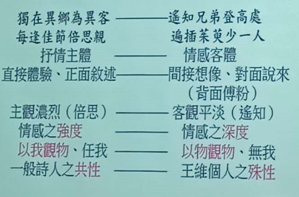
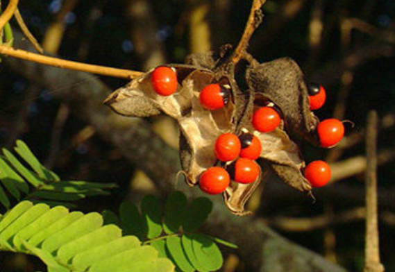

# 唐诗 -- 万花筒与望远镜

## 老师

 * 5.11 - 5.12，深圳
 * 台大中文系
 * 欧丽娟教授

## 初唐的宇宙视野

 * 宇宙，两个维度
 * 宇，空间的永恒
 * 宙，时间的永恒


### 学者的历观

 * 当代新诗已发展百年，也该出李白、杜甫？
 * 盛唐之所以是五言、七言的鼎盛时代，是有历史传承的，不是简单的百年发展

无规矩不成方圆

 * 初唐，开始讲究"平平仄仄，格律"
 * 有格律，可以训练；在规矩之中，才能表达出最佳的美感
 * 艺术(art)，都是人设计出来的东西，形式呈现(格律)，形式很重要
 * 当代新诗，无形式要求，无千锤百炼之美

艺术的发展与传承

 * 隋炀帝
 * 一位被安放在帝王位置的诗人（有点像陈后主 :-)）

```
夜露含花气．
春潭漾明月。
汉水逢游女，
湘川值两妃。
```

 * 《天净沙·秋思》中枯藤、老树、昏鸦
 * 来源于隋炀帝

```
枯藤老树昏鸦，
小桥流水人家，
古道西风瘦马。

夕阳西下，
断肠人在天涯。
```

### 唐·张若虚<春江花月夜>

 * 明·王世懋《唐诗解》卷十一："句句以春江花月状成一篇好文字。"
 * 明·锺惺《唐诗归》卷六："将春、江、花、月、夜五字炼成一片奇光，分合不得，真化工手。"
 * 清·徐增《而庵说唐诗》卷四："此诗如连环锁子骨，节节相生，绵绵不断。"、"春、江、花、月、夜五个字，各各照顾有情。诗真艳诗，才真绝才也。"

总纲

 * 每一段都是七言
 * 1 - 2: 生，月光，广阔
 * 3 - 4: 过去、未来（宙，时间）
 * 5: 游子
 * 6 - 9: 思妇

细解

 * "海上明月共潮**生**"
 * 生，生发，生机勃勃；而不是"升"，升，只有升起之意
 * 
 * "月照花林皆似霰" / "汀上白沙看不见"
 * 月光，广袤、皎洁、明净

```
春江潮水连海平，海上明月共潮生。
滟滟随波千万里，何处春江无月明！
江流宛转绕芳甸，月照花林皆似霰；
空里流霜不觉飞，汀上白沙看不见。
```

 * 开始引入"人"，人与月、与月光的邂逅
 * 有人，就有了各种情绪

```
江天一色无纤尘，皎皎空中孤月轮。
江畔何人初见月？江月何年初照人？
人生代代无穷已，江月年年望相似。
不知江月待何人，但见长江送流水。
```

 * 谁"夜扁舟子"？游子
 * 游子思乡之情

```
白云一片去悠悠，青枫浦上不胜愁。
谁家今夜扁舟子？何处相思明月楼？
```

 * 思妇

```
可怜楼上月徘徊，应照离人妆镜台。
玉户帘中卷不去，捣衣砧上拂还来。
此时相望不相闻，愿逐月华流照君。
鸿雁长飞光不度，鱼龙潜跃水成文。
昨夜闲潭梦落花，可怜春半不还家。
江水流春去欲尽，江潭落月复西斜。
斜月沉沉藏海雾，碣石潇湘无限路。
不知乘月几人归，落月摇情满江树。
```

### "生"字的延续

 * 王湾《次北固山下》："海上**生**残夜，江春人旧年。"
 * 张九龄《望月怀远》："海上**生**明月，天涯共此时。"
 * 陈子昂《感遇三十八首》之一："微月**生**西海。"
 * 崔融《关山月》："月**生**西海上。"


## 盛唐的恢弘

### 历史维度

 * 唐：290年
 * 初唐：100年
 * 盛唐：50年
 * 中唐：70年
 * 晚唐：50年

安史之乱

 * 天宝14年，开始安史之乱，打了七年多
 * 天宝13年，人口普查：5000万
 * 十年之后，人口普查：1700万
 * 死亡率：60%
 * 目前世界上人口死亡率最高的一场战争
 * 对当时人心的影响：空前绝后
 * 
 * 安史之乱，盛唐 => 中唐(没落的帝国) => 晚唐(苟延残喘的末世)


### 王维：水穷云起的智慧

 * 王维，字右丞
 * 
 * 长安的明星：盛唐诗坛的桂冠
 * 全方位的天才（诗、画、音乐）
 * 哲学家诗人：只有四百多首诗
 * 王昌龄评："人间出世心"
 * 
 * 水穷云起："行到水穷处，坐看云起时"
 * 入世与出世之间，随时切换，灵动自如
 * 
 * 400余首，多作于盛唐时期
 * 晚年很少写诗
 * 
 * 欧老师是王维铁杆粉

#### 《九月九日忆山东兄弟》（时年十七）

 * 1-2句，写自己，有我
 * 3-4句，写家人，无我

```
独在异乡为异客，
每逢佳节倍思亲。
遥知兄弟登高处，
遍插茱萸少一人。
```



#### 《桃源行》（时年十九）

 * 陶渊明《桃花源记》
 * 桃花源，东方名族内心的乌托邦
 * 
 * 王维的《桃源行》
 * 十九岁时的出世之心

```
渔舟逐水爱山春，两岸桃花夹古津。
坐看红树不知远，行尽青溪不见人。
山口潜行始隈隩，山开旷望旋平陆。
遥看一处攒云树，近入千家散花竹。
樵客初传汉姓名，居人未改秦衣服。
居人共住武陵源，还从物外起田园。
月明松下房栊静，日出云中鸡犬喧。
惊闻俗客争来集，竞引还家问都邑。
平明闾巷扫花开，薄暮渔樵乘水入。
初因避地去人间，及至成仙遂不还。
峡里谁知有人事，世中遥望空云山。
不疑灵境难闻见，尘心未尽思乡县。
出洞无论隔山水，辞家终拟长游衍。
自谓经过旧不迷，安知峰壑今来变。
当时只记入山深，青溪几度到云林。
春来遍是桃花水，不辨仙源何处寻。
```

#### 《终南别业》

 * "兴"，兴致，兴起则行
 * "行"无路则"坐"，看看"云起"，又是一片天空
 * 
 * 偶然碰到林叟，笑谈忘了时间。
 * 写意、自然，随心所欲不逾矩。
 * 
 * 偶然碰到的一位老头，如何能谈笑忘记了时间？
 * 上课时立即想到 Steve Jobs 的 "stay hungry, stay foolish" 

```
中岁颇好道，晚家南山陲。
兴来每独往，胜事空自知。
行到水穷处，坐看云起时。
偶然值林叟，谈笑无还期。
```

与苏轼对比

 * 《定风波》："莫听穿林打叶声，何妨吟啸且徐行。"
 * 自云："上可以陪玉皇大帝，下可以陪悲田院乞儿。"
 * 
 * "莫听"，不听，说明心意已经动，不想听，怕被扰动
 * 而王维的诗句中看不到被扰动的意思

嫁娶观

 * 《唐诗》王维："妻亡不再娶，三十年孤居一室，屏绝尘染。"
 * 在当时的时代，一夫多妻是很正常的，妻亡不娶，实属异类。

#### 《相思》

 * [红豆][2]，红豆树上的果实，又名相思子
 * 不是我们经常吃的红豆 :-)
 * 
 * 全唐诗，王维第一人，用红豆代表相思
 * 晚唐温庭筠(812-870)："玲珑骰子安红豆，入骨相思知不知？"

```
红豆生南国，
春来发几枝。
愿君多采撷，
此物最相思。
```




#### 《辋川集》

 * 王维隐居辋(wang3)川时的山水诗集合，二十首，二十景
 * 每一首都透出"清素淡雅、出尘脱俗"的意境

##### 辋川集·鹿柴

 * 柴(zhai4)
 * 鹿柴，围鹿的栅栏
 * 
 * "不见人" 却 "但闻人语"
 * 空寂，又生机勃勃，以动衬静
 * 
 * 景(ying3)，日光
 * "深林"，树，枝叶繁复、茂密，阳光好不容易
 * 从多层的树叶间，找到一缕空隙，照到青苔之上
 * 
 * "复照"，"复"，非第一次
 * 这一缕阳光，让"青苔"可以刚刚好存活
 * 对"青苔"而言，"多一分太多，少一分不可"
 * 
 * 树叶，交错，光的瞬间，斑光
 * 画家的画面感

```
空山不见人，但闻人语响。
返景入深林，复照青苔上。
```

##### 辋川集·竹里馆

 * 歌曲《[竹里馆][3]》

```
独坐幽篁里，弹琴复长啸。
深林人不知，明月来相照。
```

##### 辋川集·辛夷坞

```
木末芙蓉花，山中发红萼。
涧户寂无人，纷纷开且落。
```

#### 《酌酒与裴迪》

 * 裴迪没考上进士，王维为了劝慰他写的一首诗
 * 
 * 关于人性的洞察
 * "人情翻覆似波澜" / "白首相知犹按剑"

```
酌酒与君君自宽，人情翻覆似波澜。
白首相知犹按剑，朱门先达笑弹冠。
草色全经细雨湿，花枝欲动春风寒。
世事浮云何足问，不如高卧且加餐。
```

#### 《杂诗三首》之二

 * 好不容易有了知道故乡消息的人，为何只问"寒梅著花未？"
 * 答案在《[孤独的多棱镜][1]》

```
君自故乡来，应知故乡事。
来日绮窗前，寒梅著花未？
```

#### 兼谈儒释道

庄子

 * "人心险于山川，难于知天" / "相刃相靡(mi3)"
 * 
 * 《齐物论》，癞之人（TODO）
 * 受经年累月之苦，怀悲天悯人之心
 * 
 * 看得起儒家，天天评儒家
 * 对儒家的评价："明乎礼仪而陋于知人心"
 * 
 * 入而能出：庄子
 * 往而不返：屈原

#### 空间与时间的艺术表现形式

 * 《拉奥孔》，朱光潜
 * 
 * 空间艺术：绘画
 * 时间艺术：音乐、文学
 * 接受信息的方式不同
 * 
 * 景物是空间的艺术，用文字这种时间表现形式，则
 * 文字要短，以突出整体性
 * 反例：《奥德赛》中描写盾牌的精细，用了两页纸，完全无感，丢失了整体性
 * 
 * 如果非要用绘画表达时间的叙事
 * 画最精彩的一瞬间，让人用联想，去补充整个事件的其他内容


### 李白：美的超越

#### 生平

 * 早年在藩国
 * 5岁回到中原，开始饱读诗书
 * 25岁游历名川大山
 * 
 * 郁郁不得志，寄情山水中

#### 《将进酒》

 * "三百杯" / "万古愁"，数量的夸张，才能表达自己的情感
 * "君不见" / "与尔"，称谓变，人已醉

```
君不见，黄河之水天上来，奔流到海不复回。
君不见，高堂明镜悲白发，朝如青丝暮成雪。
人生得意须尽欢，莫使金樽空对月。
天生我材必有用，千金散尽还复来。
烹羊宰牛且为乐，会须一饮三百杯。
岑夫子，丹丘生，将进酒，杯莫停。
与君歌一曲，请君为我倾耳听。
钟鼓馔玉不足贵，但愿长醉不复醒。
古来圣贤皆寂寞，惟有饮者留其名。
陈王昔时宴平乐，斗酒十千恣欢谑。
主人何为言少钱，径须沽取对君酌。
五花马，千金裘，呼儿将出换美酒，与尔同销万古愁。
```

#### 《望庐山瀑布》

 * 不喝酒的时候，如何消愁？
 * 寄情山水间

```
日照香炉生紫烟，
遥看瀑布挂前川。
飞流直下三千尺，
疑是银河落九天。
```

#### 《与史郎中钦听黄鹤楼上吹笛》

 * 安史之乱后，流放夜郎
 * 贬滴之人，再也无法归长安，但内心依旧能看到五月的梅花

```
一为迁客去长沙，
西望长安不见家。
黄鹤楼中吹玉笛，
江城五月落梅花。
```

#### 现实世界中的诗仙

 * 李白的诗，看不到缺钱，满满的挥金如土的豪气
 * 满满的"财务自由小王子"气息
 * 
 * 现实呢？
 * 人间无所安顿之心
 * 
 * 杜甫和李白是好朋友
 * 从杜甫的诗中，才能看到真实世界的李白

杜甫《不见（原注：近无李白消息）》

 * "世人皆欲杀" / "飘零酒一杯"，诗仙现实之写照

```
不见李生久，佯狂真可哀。
世人皆欲杀，吾意独怜才。
敏捷诗千首，飘零酒一杯。
匡山读书处，头白好归来。
```

杜甫《赠李白》

```
秋来相顾尚飘蓬，未就丹砂愧葛洪。
痛饮狂歌空度日，飞扬跋扈为谁雄。
```

#### 耀眼如流星的一生

 * 流星之美，外人看着都心生向往
 * 但流星的本质，不过是外太空的漂泊之石，与大气层激烈摩擦的光与亮
 * 最后落地，成为陨石
 * 
 * 李白是盛唐时代的流星
 * 每一首诗，都是与现实世界激烈摩擦后的自我绽放
 * 内心"千古恨"，唯有酒来消


### 杜甫：超过的幽默、悲悯

#### 生平

 * 一生穷困潦倒，又遇"安史之乱"
 * "安史之乱"之后，作品越发纯粹
 * 无所不在的"悲天悯人之心"
 * 
 * 死于回乡的路上，卒后40多年，孙子才将遗体送回故乡
 * 杜甫的诗中，一个"苦"字，贯穿始终。也许这就是"安史之乱"的写照

#### 《茅屋为秋风所破歌》

 * "安得广厦千万间，大庇天下寒士俱欢颜！风雨不动安如山。"
 * "呜呼！何时眼前突兀见此屋，吾庐独破受冻死亦足！"
 * 
 * "我不入地狱谁入地狱"，佛家的慈悲，尽藏于诗中。

```
八月秋高风怒号，
卷我屋上三重茅。
茅飞渡江洒江郊，
高者挂罥长林梢，
下者飘转沉塘坳。

南村群童欺我老无力，
忍能对面为盗贼。
公然抱茅入竹去，
唇焦口燥呼不得，
归来倚杖自叹息。

俄顷风定云墨色，
秋天漠漠向昏黑。
布衾多年冷似铁，
娇儿恶卧踏里裂。
床头屋漏无干处，
雨脚如麻未断绝。
自经丧乱少睡眠，
长夜沾湿何由彻！

安得广厦千万间，
大庇天下寒士俱欢颜！
风雨不动安如山。
呜呼！
何时眼前突兀见此屋，
吾庐独破受冻死亦足！
```

#### 《自京赴奉先县咏怀五百字》

 * 个人之悲伤 => 大我的悲悯


```
...

朱门酒肉臭，路有冻死骨。

...

默思失业徒，因念远戍卒。
忧端齐终南，澒洞不可掇。
```

#### "同情"此词

 * 米兰.昆德拉《生命中无法承受之轻》
 * 同情 => 共情 => 同理心
 * 
 * "同情"的意思不仅仅能与苦难的人生活在一起，还要去体会他的任何情感：欢乐、焦急、幸福、痛楚。
 * 于是乎这种同情表明乐一种最强烈的感情想象力和心灵感应力，在感情的等级上，它至高无上。

#### 《解忧》、《秋野五首》之一

 * 《解忧》言 "减米散同舟，路难思共济。"
 * 杜甫很穷了，但依旧"减米"与同路之人
 * 
 * 《秋野五首》言 "盘餐老夫食，分减及溪鱼。"
 * 回乡路上，坐在河边，难得有一顿饭，看到溪鱼游过来，依旧"分减"喂鱼
 * 
 * 无差别之博爱

#### 《北征》节选

 * 有一段对景物的描写，透过景物之平静，向往世外桃源的美好
 * 让每一个生命，获得上天的滋养
 * 万物等价、公平
 * 
 * "上天无偏颇，蒲稗各自长"
 * 蒲，茂盛；稗，衰败
 * 
 * "一物自荷皇天慈"
 * 
 * 杜工部的价值观：
 * 尊重每一位生命，万物生发，都有价值
 * 只要有能力，帮助每一份生命，安顿每一份生命（造物主之心）
 * 平等、无私、宏大

```
山果多琐细，罗生杂橡栗。
或红如丹砂，或黑如点漆。
雨露之所濡，甘苦齐结实。
缅思桃源内，益叹身世拙。
```

#### 《空囊》

 * 囊，钱袋子；空囊，袋中无钱
 * 
 * 前两句，"道教就自己，吾道艰难"
 * 《[The Road Not Taken][4]》
 * 
 * 爨(cuan2)，生火做饭
 * 看(kan1)
 * "留的一钱看"，囊中羞涩的幽默，"你看，这不是还有一块钱么"

```
翠柏苦犹食，晨霞高可餐。
世人共卤莽，吾道属艰难。
不爨井晨冻，无衣床夜寒。
囊空恐羞涩，留得一钱看。
```

#### 《赠蜀僧闾丘师兄》节选

 * "漂然薄游倦，始与道侣敦"
 * 大悲如杜甫，与世间抗争，也会倦了
 * 
 * 摩尼珠，佛教
 * 只有佛家，才能解救如今浊水一般的世界

```
...

漂然薄游倦，始与道侣敦。
景晏步修廊，而无车马喧。
夜阑接软语，落月如金盆。
漠漠世界黑，驱车争夺繁。
惟有摩尼珠，可照浊水源。
```

### 三人诗性之我见

 * 李白和杜甫在两个极端
 * 王维佛性，在中间

```
美丽内心世界 --> 李白
    ^
    |
    |
    +---------> 王维
    |
    |
    V
悲怆现实世界 --> 杜甫
```

```
杜公悲世事，
太白醉人间。
摩诘独安乐，
水穷云起时。
```


## 中唐的病态偏锋

 * "安史之乱"，中央借外族力量，取胜
 * 分藩外族，节度使世袭
 * 唐中道衰落

### 兼谈《枕中记》《南柯太守梦》

 * 《枕中记》
 * 作于盛唐，做梦内容："娶五姓女，拜山东大员"
 * 
 * 《南柯太守梦》
 * 作于中唐，实权已归属地方
 * 做梦才能做太守，世袭之严苛
 * 愿望是：当太守，取金枝公主（世家大族已衰落）
 * 
 * 梦：时代的价值观
 * 不在大文化之下，读别人的文学作品，易断章取义

### 李贺：幽冥的抚慰

#### 生平

 * 中唐时代的鬼才
 * "李"姓，皇室远房亲戚，已沦为平民，需要重新科举
 * 
 * 才华横溢，20岁准备考进士
 * 所有其他考生妒其才华，联名上书
 * 以‘李贺父亲名字"李晋肃"中"晋"与"进士"之"进"有避讳’为由，不让李贺参加考试
 * 
 * 当时的泰斗韩愈，为此事写了《讳辩》，但未能改变"众口铄金"
 * 《讳辩》收录于《古文观止》
 * 
 * 李贺依旧参加了当年的进士考试，但考官受众人影响，没让他过关
 * 李贺落榜，"二十心已朽"，从此一蹶不振，自我放逐
 * 所有哀怨之气，化为诗文，郁结而亡，时年27岁
 * 
 * 唐代的考试，不胡名（考官能看到考生名字），道德要求很高
 * 
 * "安史之乱"之后出生的新生代，内心的刚强、生发之气，显然不如杜甫。
 * 从盛唐过来的诗人，会有更多的"希望"，因为当年在"希望"的环境中长大
 * 内心强大，带着"希望之光"
 * 
 * "爱听秋坟鬼唱诗"，找鬼寻求安慰

## 《秋来》

 * 肠，情感最内在的居所，比如：愁肠百结、述衷肠。
 * 吊，古语为"diao(TODO)"，慰问
 * 碧，源于《庄子.外物篇》，碧血
 * 
 * "呕心沥血"来自于李贺。"心与血"化为文
 * 
 * 鬼是什么？人因生前冤屈太深，怨念不散，死而成鬼
 * 鬼是人心不甘而幻化出来的一种想象
 * 
 * "雨冷香魂吊书客"
 * 香魂，鬼；鬼都美好，人世之人心，有多可怕
 * 
 * "恨血千年土中碧"，恨之碧，恒古不灭


```
桐风惊心壮士苦，衰灯络纬啼寒素。
谁看青简一编书，不遣花虫粉空蠹。
思牵今夜肠应直，雨冷香魂吊书客。
秋坟鬼唱鲍家诗，恨血千年土中碧。
```

## 晚唐的世纪末华丽

### 李商隐：一往不返的陷溺

TODO

### 翻案的新诠释

TODO


## 推荐阅读

 * 〔日〕入谷仙介著，盧燕平譯：《王維研究（節譯本）》，北京：中華書局，2005。
 * 荊立民：〈尋找另一個「理想王國」——論王維的人生追求〉，師長泰主編：《王維研究》第一輯，北京：中國工人出版社，1992。
 * 林繼中：〈王維情感結構論析〉，《文史哲》1999年第1期。
 * 趙永源：〈試論王維詩歌的"空"字〉，《北方論叢》1999年第2期。


## 后记

 * 机缘巧合，能听到欧老师的唐诗史观，幸甚。
 * 个人，不过是历史洪流的一瞬间
 * 个人的渺小，只有在历史的大潮中才能体悟
 * 
 * 也许，我们又一次处于大唐盛世的前夜，感谢、感激时代给予个人的馈赠。
 * 感谢小鹿，有了这次听课的机会 :-)

[1]:https://www.iqiyi.com/v_19rr6miz5s.html
[2]:https://baike.baidu.com/item/%E7%BA%A2%E8%B1%86/7038
[3]:https://y.qq.com/n/yqq/song/001RHLFh2NrARr.html
[4]:https://music.163.com/#/song?id=21671644
