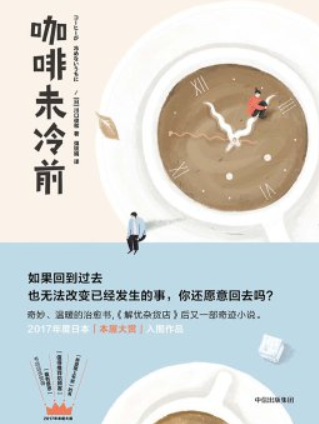
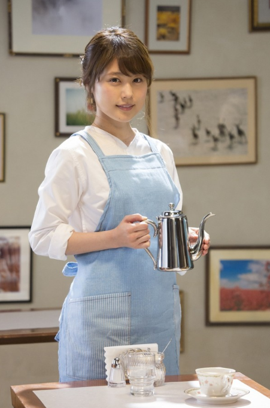

# 电影解构 - 咖啡未冷前

## 期望传达的内涵

 * 既往不恋，纵情向前
 * 你期望未来是怎样，它就是怎样

## 基本规则设定

 * 咖啡店，坐在某个座位上，女主E 给倒咖啡，可以回到过去/未来某个时刻
 * 咖啡未冷前，喝下咖啡，可以回来
 * 否则，将被锁在时间里面
 * 无论如何，并不会改变已经发生的事情

## 叙事

### 故事一：年轻人的爱情

 * 男主A 和 女主B 青梅竹马，互相喜欢
 * 但一直都没敢说出内心想法
 * 男主A 去美帝工作，离开前和 女主B 喝咖啡聊天，但双方都腼腆，未敢说出内心想法
 * 最终 女主B 回到过去，重现了一次当天的情形
 * 回到现在，女主B 勇敢表白，飞去美帝和 男主A 团聚

### 故事二：老年人的爱情

 * 男主C 和 女主D 已经到老年，女主D 得了老年痴呆，慢慢忘记了 男主C
 * 男主C 是护士，慢慢把 女主D 当病人看
 * 男主C 无意间回到过去，在 女主D 还未痴呆前，拿到了一封 女主D 本来想给 男主C 但没给的信
 * 原来是 女主D 期望 男主C 离开她，寻找更好生活的期望的信
 * 最终 男主C 回到现在，重新开始将 女主D 视为妻子，生活重新开启

### 故事三：自我设限

 * 咖啡店 女主E 的妈妈，因为早年想回到过去，看一看离世的丈夫，一直没能回到现在，被困在了时间当中
 * 女主E 因为帮妈妈倒咖啡，一直对这件事耿耿于怀，但因为除了她自己，没有别人能给她倒咖啡，所以她自己没法回到过去
 * 男主F 喜欢 女主E，和她生了一个女儿，同时在墙上贴了"某年某月早上8:00，请回到这个时间"
 * 女儿回到现在，然后给 女主E(妈妈) 倒咖啡，让 女主E 回到过去，看看当年自己妈妈为何没有回来
 * 知道前因后果之后，释怀。放下过去，迎接未来。

## 总结

 * 故事设定和《解忧杂货店》比较像，通过时空的错接，去带入反思
 * 利用时空(时间和空间)的变换，能做出更优质的设定
 * 人性，是所有设计的原点

## 女主E

 * 一定要找漂亮妹子出演

