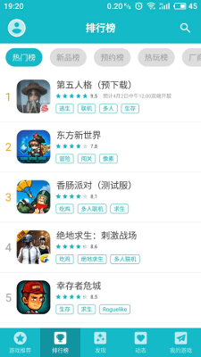

# 阿杜与他的TEN10

谨以此文，献给所有为游戏梦想而奋斗着的开发者们。

--------------

无意间点开了[TapTap的推送][1]。《东方新世界》的图片，那么熟悉，阿杜心血之作。

我截了一张图，贴到我们内部的小群。笑称：“阿杜，你的游戏比吃鸡还火。”

--------------

2008年，阿杜大学毕业，进入WY，加入我的团队。那年，我第一次带技术团队，那年，阿杜是团队的第三位成员。

阿杜初进SG团队的时候，腼腆、内向，还有点木讷，自称"细齿红唇宇宙第一战士"。刚毕业，新人的毛躁还没褪去。代码会写得比较随意，偶尔会将不符合规范的文件提交到SVN。

2011年，页游风头正劲，4399如日中天。同年，SG项目失败，阿杜带着不甘，离开WY，去了4399。4399的日子，是阿杜成长最快的日子。从最开始的一名技术小兵，到一个工作室的技术负责人。在4399待了几年后，阿杜心中独立游戏的那点梦想，开始慢慢发芽。

在4399，作为一个工作室的技术负责人，有盈利项目，个人收益也不错。在我看来，这就是稳定的生活。离开4399之前的一段日子，阿杜经常找我聊天，述说着做传统网游的无耐，述说着对独立游戏的向往。我虽然一再劝他不要冲动，独立游戏的日子必定一路荆棘，没有那么美好。但心中的那点梦，怎会轻易磨灭。

--------------

2015年初，带着一点梦想，带着几位有共同梦想的好兄弟，离开4399，阿杜成立TEN10（[http://www.ten10.cn/][2]）。

作为游戏开发者，每人都有自己十分喜欢的游戏类型，能按自己的思路，做一款自己喜欢的游戏，那就是一次朝圣之旅。在成立TEN10之前，阿杜已经研究了好几款游戏，从中选了一两款，作为主要的学习、参考对象。技术选型上，阿杜选择了2D游戏，因为3D游戏的开发，无论从美术还是程序角度，复杂度都会高很多。

《异动：影之战》是阿杜的第一款独立游戏。作为磨合团队的第一款产品，《影之战》参考了一款国外的同类产品（名字我忘了）。《影之战》上线，数据并不理想，早期想通过只卖copy的思路，在国内Android的生态环境下，盗版横行，原版的量还没到盗版数量的1/10。

做完《影之战》，阿杜一直在构思下一款产品的方向。那段时间，阿杜比较沉迷《哥布林之剑》，几番比较，最终决定做一款和《哥布林之剑》类似的产品。于是，有了《东方新世界》。

广州天河区，天河公园西边，坐落着一座小区，叫 东方新世界。《东方》这个名字，便来源于此。我问过阿杜，怎么会想到这个名字。这款游戏最早就是定位发海外的，希望名字有一点点东方的神秘感。阿杜觉得这个小区的名字正好符合游戏的定位，就用了。

我们几位玩得好的朋友，每隔几月会聚聚，阿杜总会给我们展示《东方》最新的游戏进展。从最基本的操作，到越来越复杂的关卡设计，看着《东方》一点点成型。每次我们和他吐槽难度太高时，他会得意的笑言"手残党请绕道"。

《东方》上线，在没做任何推广的情况下，iOS/Android上的下载量还不错，无奈Android的盗版还是比较严重，游戏收入基本无法覆盖成本。

阿杜带着《东方》，去北京参加独立游戏比赛，最终获得了不错的名次。TEN10也开始被国内的一些渠道商所知道。当年《微微一笑》电视剧开播，火便全国。在开播前，拿了《微微一笑》IP的合作方，开始在国内物色游戏产品开发团队，准备同档期上线。IP做了两款游戏，分别是两个开发商制作。一个做的是网游，而另一个单机版，交给了阿杜的TEN10。要求就是按《东方》的思路，做一次换皮。

是团队就要生存，接下《微微一笑》单机版制作任务，本身不过是公司发展的需要。对于TapTap论坛中说《东方》和《微微一笑》抄袭的问题，本来就是换皮之作，同为TEN10出品。但《微微一笑》版权归别人，TEN10官网上是没有的。

--------------

喜欢独立游戏的朋友，估计都看过独立游戏的电影《[Indie Game: The Movie][3]》。故事中 The Meat Boy、Braid 等几款神作的作者，呵护着那份喜爱，坚持着那份执着，最终换来了成功。而更多的独立游戏作者，坚守着那份孤独，只为内心的那一点点梦想。

良心的制作，《东方》的那一点点情怀，变成了TapTap免费的版号，变成了TapTap的推荐。感谢TapTap，阿杜也没想到TapTap会给《东方》申请版号，让《东方》可以在国内正式上线，收费。

如今，阿杜已不是年轻的"细齿红唇宇宙第一战士"。

如今，阿杜的女儿已经上幼儿园。

如今，TEN10从最多时期的10人团队，到现在阿杜1人。

但TEN10还在继续，阿杜的梦还在继续。

--------------

感谢阿杜，感谢所有还在为自己梦想而奋斗的独立游戏开发者。

[1]:http://mp.weixin.qq.com/s/yDa52AHbbeN7NZ4tkhuEHA
[2]:http://www.ten10.cn/
[3]:https://www.bilibili.com/video/av2915301/
