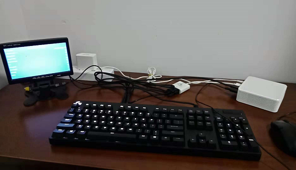
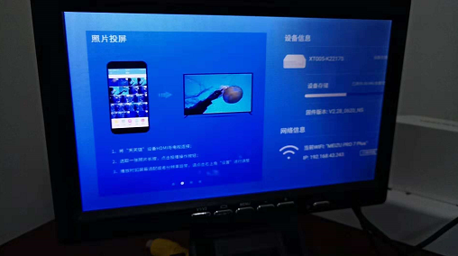
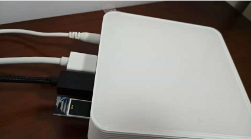
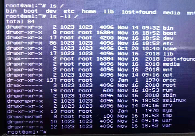

# Armbian on My N1 Box

按[顾QQ的教程][1]，成功刷上 armbian。他文章中内容比较多，总结一下我的刷机过程。

准备刷机。




## 降级 bootloader

使用方法二。

1. 没有网线，打开手机热点，点击右下角图标，配置 wifi（看下图）
2. N1在主界面使用鼠标点击四次固件版本号打开adb
3. 下载一键降级包：[https://share.weiyun.com/5klmuxd][2]，密码：yaefa9
4. 根据提示操作




## 刷 armbian

准备好带有 armbian 系统的U盘

输入下面指令，通过PC控制 N1盒子 重启。重启黑屏过程中，插入U盘。（如果在原生android系统下插入U盘，会导致"权限紊乱问题"）

```
adb connect <your ip address>
adb shell reboot update
```



启动进入U盘的 armbian，用账号/密码：root:1234 登陆。


通过

```
./install.sh
```

正常安装到 eMMC 上。


## 权限紊乱问题

装好 armbian，拔出U盘，重启盒子。

```
# ls -ll /
```

可能会看到一堆 1023 用户。



会影响 apt。重做U盘，再装一次系统。

再次装系统时，碰到了个小问题。

之前用 [Win32 Disk Imager][6] 做好的系统U盘，会有两个分区。


这时，要

 1. 对 F:, E: 格式化
 2. 用 [HDDLowLevelFormatTool][3] 给U盘做低格
 3. 这样得到只有一个 F:，对 F: 格式化
 4. 最后再用 [Win32 Disk Imager][6] 去写入 armbian image

我不按这个步骤去做，写入 armbian image 就会失败。


## wifi配置

TODO

[1]:https://github.com/kasicass/blog/blob/master/debian/2018_11_19_armbian_on_n1_box.md
[2]:https://share.weiyun.com/5klmuxd
[3]:http://hddguru.com/software/HDD-LLF-Low-Level-Format-Tool/
