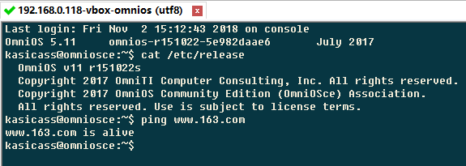

# OmniOSce r151022 Crash Course

## 安装系统

[官网][2] 下载 ISO，图形化安装，很简单。

* [https://downloads.omniosce.org/media/lts/omniosce-r151022s.iso][1]

选完 time zone，系统安装完后，选择 "Configure the installed OmniOS system"

* 设置网络
* 设置 root 密码
* 创建新用户 
* 启用 SSH Server

See Solaris Runs~



没有 OpenIndiana 的 DNS 问题，赞。


## 软件安装

相比 OpenIndiana，OmniOS 的 package 少了很多。不过少一些更好，找起来更方便。

OmniOS 将 package 总体上分为 core 和 extra 两部分。core 只放编译整个OS所需要的内容。

 * package 介绍，[https://omniosce.org/info/ipsrepos.html][3]
 * core，[https://pkg.omniosce.org/r151022/core/en/catalog.shtml][4]
 * extra，[https://pkg.omniosce.org/r151022/extra/en/catalog.shtml][5]

看看默认安装的 package

```
# pkg list
NAME (PUBLISHER)                                  VERSION                    IFO
SUNWcs                                            0.5.11-0.151022            i--
SUNWcsd                                           0.5.11-0.151022            i--
compatibility/ucb                                 0.5.11-0.151022            i--
compress/bzip2                                    1.0.6-0.151022             i--
...
```

基本操作，search & install

```
# pkg search tmux
INDEX      ACTION VALUE                         PACKAGE
basename   file   usr/gnu/share/terminfo/t/tmux pkg:/library/ncurses@6.0.20170722-0.151022
basename   file   usr/gnu/share/terminfo/t/tmux pkg:/library/ncurses@6.1.20180428-0.151022
basename   file   usr/bin/tmux                  pkg:/terminal/tmux@2.3-0.151022
pkg.fmri   set    omnios/terminal/tmux          pkg:/terminal/tmux@2.3-0.151022

# pkg install /terminal/tmux
bla ... bla ...
```


## 常用软件

/developer/sunstudio12.1

* gcc 找不到的 stdio.h, sys/socket.h 都在这里

```
$ /opt/sunstudio12.1/bin/CC test.c
$ ./a.out
```

/developer/illumos-tools 用来 build illumos kernel 的。

* Summary: Single meta-package containing required tools to build illumos

```
# pkg install /developer/illumos-tools
```

```
# pkg install /terminal/tmux
# pkg install /developer/gcc51
# pkg install /developer/build/autoconf
# pkg install /developer/build/automake
# pkg install /developer/build/libtool
# pkg install /developer/versioning/git

# pkg install /library/libffi
```


## vim & tmux 的基本配置

```
$ cat ~/.vimrc
" basic
syn on
set tabstop=4
set nobackup
set background=dark
colorscheme desert
set number

$ cat ~/.tmux.conf
# hjkl pane traversal
bind h select-pan -L
bind j select-pan -D
bind k select-pan -U
bind l select-pan -R

# reload me
bind r source ~/.tmux.conf\; display "/.tmux.conf sourced!"
```


[1]:https://downloads.omniosce.org/media/lts/omniosce-r151022s.iso
[2]:https://omniosce.org/
[3]:https://omniosce.org/info/ipsrepos.html
[4]:https://pkg.omniosce.org/r151022/core/en/catalog.shtml
[5]:https://pkg.omniosce.org/r151022/extra/en/catalog.shtml
