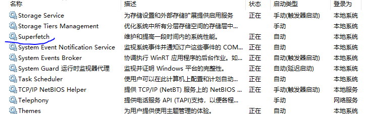

# [win10] 关闭无用的服务

windows 过于庞大，经常会给你在后台启动一些服务，搞得 CPU 占用率过高，同时磁盘I/O狂闪。

## CompatTelRunner.exe

加了用户体验机会，这货就会收集你的信息，并上报。参考 [这里][1]。

 * [Win] + R => taskschd.msc
 * 找到 Microsoft – Windows – Application Experience
 * 禁用 Microsoft Compatibility Appraiser

## SuperFetch - svchost.exe

表现是，刚开机不久，svchost.exe 占用 CPU 过高，硬盘狂转。

这货是做application预读的，猜你的用户行为，然后预热一下磁盘。没啥用，关掉。

* [Win] + R，运行 Services.msc.
* 找到 Superfetch，禁用（新版本改名叫 SysMain 了）

## tsvncache.exe

小乌龟的 Icon Cache 程序，没啥用，关掉。

资源管理器/右键 => TortoiseSVN => Settings

[1]:https://superuser.com/questions/944067/windows-disk-i-o-100-at-boot-for-20-minutes
[2]:https://superuser.com/questions/645650/what-is-superfetch-and-its-relation-to-svchost-exe-localsystemnetworkrestricte

## 后记

世界清净了。
