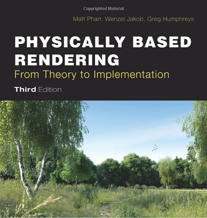

# PBR(Physics-Based Rendering) 学习资料

## Physically Based Shading in Theory and Practice

《Physically Based Shading in Theory and Practice》总目录在[这里][1]。

 * SIGGRAPH 2017: [Physically Based Shading in Theory and Practice][8]
 * SIGGRAPH 2016: [Physically Based Shading in Theory and Practice][7]
 * SIGGRAPH 2015: [Physically Based Shading in Theory and Practice][6]
 * SIGGRAPH 2014: [Physically Based Shading in Theory and Practice][5]
 * SIGGRAPH 2013: [Physically Based Shading in Theory and Practice][4]
 * SIGGRAPH 2012: [Practical Physically Based Shading in Film and Game Production][3]
 * SIGGRAPH 2010: [Physically-Based Shading Models in Film and Game Production][2]

## Algorithmic PBR Guide

 * [https://academy.allegorithmic.com/][9]
 * [THE PBR GUIDE - PART 1][10]
 * [THE PBR GUIDE - PART 2][11]

## Unity

 * [Introduction to Lighting and Rendering][12]

## 读书

[1]:https://blog.selfshadow.com/publications/
[2]:http://renderwonk.com/publications/s2010-shading-course/
[3]:https://blog.selfshadow.com/publications/s2012-shading-course/
[4]:https://blog.selfshadow.com/publications/s2013-shading-course/
[5]:https://blog.selfshadow.com/publications/s2014-shading-course/
[6]:https://blog.selfshadow.com/publications/s2015-shading-course/
[7]:https://blog.selfshadow.com/publications/s2016-shading-course/
[8]:https://blog.selfshadow.com/publications/s2017-shading-course/
[9]:https://academy.allegorithmic.com/
[10]:https://academy.allegorithmic.com/courses/the-pbr-guide-part-1
[11]:https://academy.allegorithmic.com/courses/the-pbr-guide-part-2
[12]:https://unity3d.com/cn/learn/tutorials/topics/graphics/introduction-lighting-and-rendering
