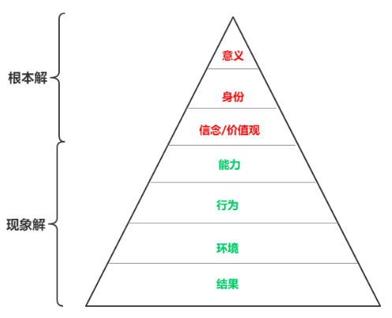

# 系统构建论

## Actor Model & System Architecture

[Actor Model][1] 是一种程序抽象模型，来源于人类社会。

Actor Model 基本原理

 * actor - primitive unit
 * message passing - asynchronous communication

System Architecture

 * 通过组合搭配 Actor (Team)
 * 来完成某个特定的功能 (Feature)

## 组织系统构建推演

### 一个人

 * 心智模式 (人脑中的软件代码)
 * 行为背后必有动机

心智模式的来源

 * 从小到大的所有过往经历 (环境产生的 input)
 * 最大影响源：原生家庭

管理方法

 * 修身、修心
 * 哲学、应用心理学
 * 运动、健身

### 2~3个人(家庭)

 * 刚结婚容易吵架：住在一起之后，互相的 input 变多，系统产生负反馈
 * 生了娃容易吵架：增加了一个 actor，系统原有平衡被打破，系统需要重新寻找平衡 (比如：教育理念不同)
 * 夫妻相：常年互相沟通之后，系统达到的一个平衡
 * 再带上双方父母，那又是一个平衡问题

管理方法

 * 幼儿心理学
 * 家庭系统排列

### 7~10个人 (Team/创业公司)

 * 创业公司
 * 一个大企业中的某个部门

管理方法

 * 团队领导力
 * Scrum [day1][3] / [day2][4]

### 公司 (100 ~ 1000 人)

 * 组织结构慢慢演化
 * 一点一点加人，各种职能部门慢慢分化

管理方法

 * [贝尔宾团队理论(belbin)][2]
 * LeSS [day1][5] / [day2][6] / [day3][7]

### 公司 (1000+ ~ 10000+ 人)

 * 组织非常庞大
 * 事业群结构

管理方法

 * 杨三角

### 结论

人的生产率

 * Output = CPU(脑力) x Time(时间)
 * 学习：提升 CPU 速度
 * 自驱力：提升自主做事情的 Time

组织的生产率

 * CPU or Time 不够用了，考虑加人，增加系统总效率
 * 加法、减法都要做，因地制宜

原则

 * 70% 精力，放在招募合适的人 (自驱力)
 * 30% 精力，构建其他内容

## 系统构建方法

 * 尝百草，然后看悟性（如果还没被毒死的话）
 * 经验越多，构建越准

[1]:https://github.com/kasicass/blog/blob/master/design-principle/2018_11_28_actor_model.md
[2]:https://github.com/kasicass/blog/blob/master/team-leadership/2019_03_22_belbin.md
[3]:https://github.com/kasicass/blog/blob/master/scrum/2018_04_13_scrum_master_day_1.md
[4]:https://github.com/kasicass/blog/blob/master/scrum/2018_04_14_scrum_master_day_2.md
[5]:https://github.com/kasicass/blog/blob/master/scrum/2019_04_25_clp_day_1.md
[6]:https://github.com/kasicass/blog/blob/master/scrum/2019_04_26_clp_day_2.md
[7]:https://github.com/kasicass/blog/blob/master/scrum/2019_04_27_clp_day_3.md
