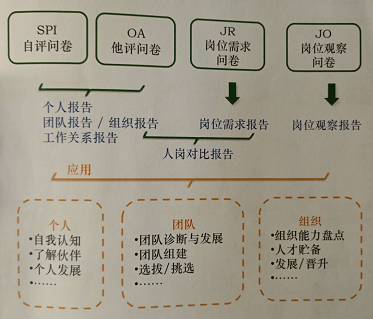
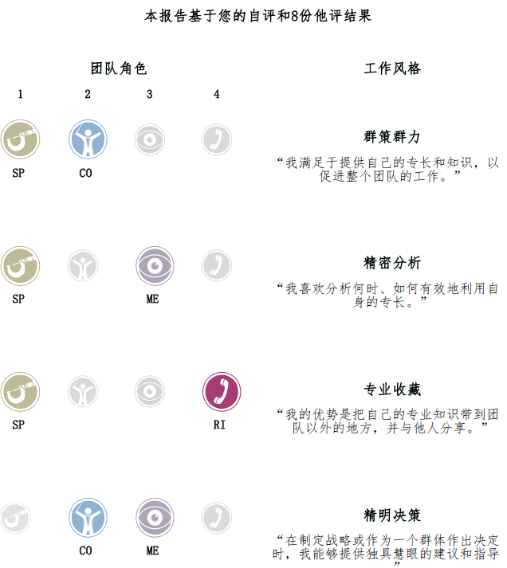
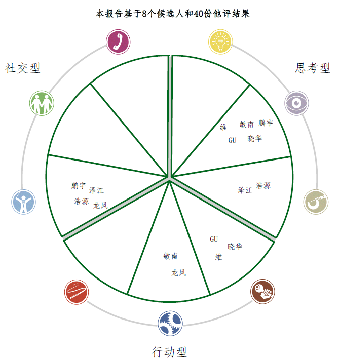

# 贝尔宾团队理论(Belbin)

## 来源

 * 一种团队管理的模型
 * [R Meredith Belbin][3]，剑桥一个管理学老头创立

## 基本概念

### 团队角色特性划分

9种角色特性，一个人可以具有多种特性

 * PL（Plant、智多星）
 * SP（Specialist、专业师）
 * TW（Team Worker、凝聚者）
 * CF（Completer Finisher、完成者）
 * RI（Resource Investigator、外交家）
 * SH（Shaper、鞭策者）
 * IMP（Implementer、执行者）
 * CO（Coordinator、协调者）
 * ME（Monitor Evaluator、审议员）

### 角色特性再分类

 * SH / IMP / CF，Action-oriented Roles
 * CO / TW / RI，Social-oriented Roles
 * PL / SP / ME，Thinking Roles

## 实践方式

 * 个人能力表 => 团队能力轮
 * 根据能力轮，选择合适的人、干合适的事情

 * 岗位需求报告问卷？上级填写，然后得到需求报告表
 * 入职的人，做评测，得到个人报告，然后出"人岗对比报告"

### 个人能力表

 * 自评(candidates) + 他评(observations) x 8
 * 自评问卷一份
 * 他评问卷八份，找一起工作的同事填
 * 最后得到一份能力表，挺客观

 * 表里面有很多数据
 * 这里截取两张图，作为示例

### 团队能力轮

 * 所有个人报告合并，得到团队能力轮
 * 缺啥补啥（招聘对应的人 or 寻找团队中分值相对最高的人担任）

## 书籍

 * 《[管理团队：成败启示录 - 第三版][2]》，理论
 * 《[团队角色：在工作中的应用 - 第二版][1]》，实践
 * 《[Management Teams: Why they succeed or fail][5]》，理论，英文版
 * 《[Team Roles at Work - 2nd][4]》，实践，英文版

## 国内 Belbin 服务

 * [http://www.learnsuccess.cn/][6]
 * 广州市天河区黄埔大道西126号云来斯堡写字楼702室
 * Tel: 020-22062477、18521052947

## 思考

 * 如何给团队做 belbin 测试？（TODO）
 * 如何给进入团队的人，做一次评测？
 * 自己做一个 belbin 微信小程序，低成本测试 :-)

## 附录1 - 角色特性详解

### SH（Shaper、鞭策者）

行为特征

 * 自驱、精力充沛
 * 进取心、性格外向
 * 积极寻找解决办法
 * 人际不敏感、好争辩

团队中的表现

 * 有着复杂政治斗争而行动缓慢的团队中发挥极大的作用
 * 义无反顾地带领团队前进、非常适应改革

### IMP（Implementer、执行者）

行为特征

 * 自控力好 & 纪律意识
 * 好好干活，不抱怨

团队中的表现

 * 执行者，稳、扎实
 * 优秀的执行者 + 良好的组织能力 = 高层管理者

### CF（Completer Finisher、完成者）

行为特征

 * 完美主义者、细节控
 * 把活干到极致

团队中的表现

 * 适合高度专注和高度精准的工作
 * 作为管理者，以"高标准的期望、对细节的严格要求"见长

### RI（Resource Investigator、外交家）

行为特征

 * 社交、谈判高手

团队中的表现

 * 争取外部资源
 * 给团队带来信息

### CO（Coordinator、协调者）

行为特征

 * 洞察力、识别别人的长处
 * 拥有远见

团队中的表现

 * 擅长统领"不同专业技能的人"组成的团队
 * 冷静，注重解决问题

### TW（Team Worker、凝聚者）

行为特征

 * 倾听者
 * 关心他人

团队中的表现

 * 团建、搞活气氛
 * 防止团队产生摩擦

### PL（Plant、智多星）

行为特征

 * 创造力
 * idea 多

团队中的表现

 * 提出新的提案、解决复杂问题
 * 价值体现于团队初期 or 停滞期
 * 企业创建者 or 一项新产品发起人

### ME（Monitor Evaluator、审议员）

行为特征

 * 严肃、谨慎、理性
 * 三思而后行
 * 全盘考虑

团队中的表现

 * 分析问题、评估想法和提出建议
 * 适合做关键决策

### SP（Specialist、专业师）

行为特征

 * 某一领域的业务专家
 * 钻研精神

团队中的表现

 * 业务专精，问题解决者
 * 作为领导者，通过经验来做决定

## 附录2 - 他评问卷设计

 * 给一堆词，正/负向都有，比如："乐于分享"、"英明决断"、"小题大做" 等等
 * 特别切合的，打双勾（记2分）
 * 切合的，打单勾（记1分）
 * 不切合的，不打勾
 * 最后这些词 + 打分，映射成被评分人的"角色特性"

[1]:https://item.jd.com/27028819250.html
[2]:https://item.jd.com/12176280.html
[3]:https://en.wikipedia.org/wiki/Meredith_Belbin
[4]:https://www.amazon.com/Team-Roles-Work-Meredith-Belbin/dp/1856178005/
[5]:https://www.amazon.com/Management-Teams-they-succeed-fail/dp/1856178072/
[6]:http://www.learnsuccess.cn/
