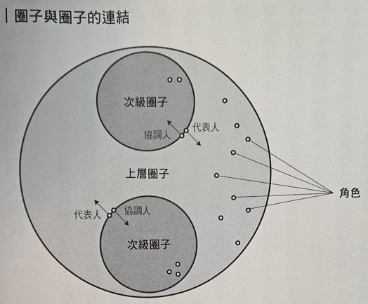

# 《无主管公司》读书笔记

 * [HOLACRACY - The New Management System for a Rapidly Changing World][1]
 * [https://www.holacracy.org/][2]

## CH03 - 组织扁平化

### 角色定义

 * 目的
 * 领域
 * 职责

### 圈子，协调人与代表人

#### 协调人

目的

 * 掌握整体圈子的目标

领域

 * 在圈子内进行角色分配

责任

 * 构建圈子的治理，以达成圈子的目标，并且制定出圈子的责任
 * 分派合作伙伴成为圈子的角色；检测圈子的适合度；提供反馈，以提高圈子的适合度；若可以有效提高适合度时，重新分配角色给其他合作伙伴
 * 横跨各种专案或角色，分配圈子的资源
 * 建立圈子优先顺序和策略
 * 定义圈子的衡量指标

#### 代表人

[1]:https://www.amazon.com/Holacracy-Management-System-Rapidly-Changing/dp/162779428X/
[2]:https://www.holacracy.org/
