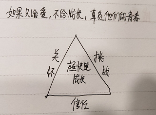

# 心智模式突破 - 二阶段 - 团队领导力

## 团队领导力 - 道

### 卓越的团队

 * 招聘优秀的人
 * 不用呵护他们的自尊心

### 卓越和一般的差别

 * Why / How / What 黄金圆环
 * 思考维度，由内向外
 * 
 * 灰度 (more or less)
 * 生存：90%物质、10%意义
 * 高层：10%物质、90%意义
 * 物质 + 精神层面，两手抓

### 卓越领导力的本质

 * 自己想清楚 why 是啥
 * 找到一群 why 一致的人
 * 大家一起做共同相信的事情（而你，只不过是大家的代言人）
 * 
 * 团队跟着你奋斗，本质上不是为你，而是为了他们的使命
 * 所以不用呵护他们的自尊心
 * 
 * 关心自己的能力
 * 内驱力不足，借外力："钱和权"
 * 驱动人，自己先做到

### 领导者的价值观

信任

 * 信任的本质
 * 信任和别人无关，信任你能接受的结果么？
 * 源自于相信自己
 * 
 * 授权不是分权，信任不是放任
 * 授权，并构建反馈机制
 * 指导与成长

感恩

 * 不仅仅是自己的价值观
 * 也是给到他人成就感
 * 心怀感激
 * 老人，关注过去
 * 信任，关注当下

付出

 * 不求回报
 * 领导力源于付出、开放的心态
 * 无我，为人

欣赏

 * 学会欣赏下属
 * 本质是欣赏自己
 * 自责 => 感恩 => 接纳 => 自省

### 领导力

 * 对下属：信任、感恩、付出、欣赏
 * 对同事（其他合作伙伴）：共赢、实力、专注
 * 对上级：尊重（权责、能力、身份）

## 团队领导力 - 术

### 一对一辅导

#### CGROW

 * 建立链接（Connection）
 * 厘清目标（Goal）
 * 反映真相（Reality）
 * 回心转念（Option）
 * 行动承诺（Will）

核心

 * 引导：外因 => 内因
 * 向内看、提升自己

#### 建立链接（Connection）

 * 同理心

#### 厘清目标（Goal）

 * 你想要什么结果？
 * 做这件事对你意味着什么？给你带来什么？
 * 不做会怎样？

#### 反映真相（Reality）

 * 你具体做了哪些努力，现在情况如何？
 * 你的角色是什么，反观自己，你发现自己有哪些需要提升的地方？

回应术（因地制宜）

 * 发问
 * 直接指出
 * 比喻

#### 回心转念（Option）

 * 限制性信念 => 帮助性信念

提问

 * 为了更好的达到目标，你还有什么可能的做法？
 * 还有呢？还有呢？还有呢？

#### 行动承诺（Will）

 * 你具体会如何做？遇到障碍如何克服？
 * 你需要我和团队什么支持

### 一对多辅导

 * 知识、技能、心智成长
 * 企业成长的速度，团队成员成长的速度
 * 
 * 团队一切问题都是管理者的问题
 * 沟通讲真话
 * 说到做到
 * 
 * 陈维"照镜子"文化
 * 团队有问题，直接提出来，往死里拍。对外合作，往死里顶
 * 
 * 一个团队如果保持 peace & love 的状态，会很平庸
 * 只有开放接纳，相爱相杀，往死里拍、死里顶
 * 
 * 如果只给爱，不给成长，负责他们的青春

### 如何应用？

 * 行为 + 环境 = 结果
 * 因地制宜，看懂趋势

## 推荐书籍

 * 《活出生命的意义》弗兰克
 * 工作（做有意义的事情）
 * 爱（关爱他人）
 * 克服困难的勇气
 * 
 * 《一念之转》拜伦.凯蒂
