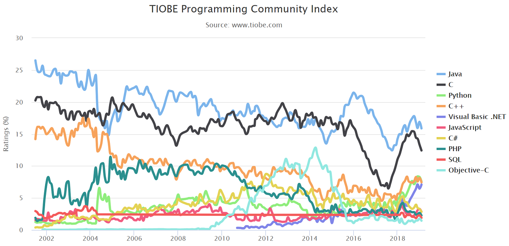
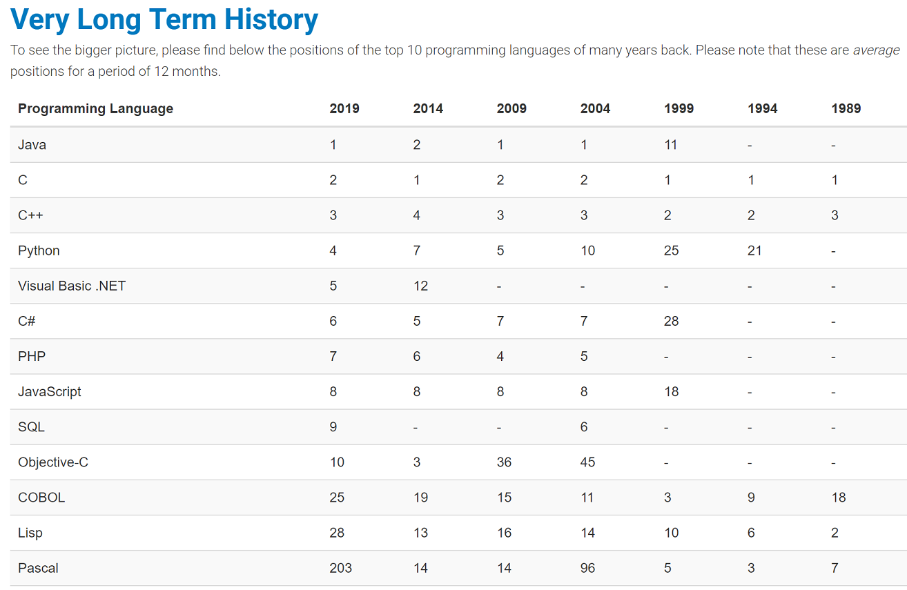

# The Future of Modern Programming Language

TODO，初稿。

## TIOBE Index

编程语言界有个很有意思的东西，叫 [TIOBE Index][1] (TIOBE指数)。每月发布一次，通过 "Google, Google Blogs, MSN, Yahoo!, Baidu, Wikipedia and YouTube" 的搜索内容，去统计编程语言的流行度。

下图是最新的 [TIOBE Index][1]

[TIOBE Index][1] 页面上还有一张图很有意思，展示了"几十年时间跨度上，一些流行语言的排名"。

看着图，抛开个人的喜好偏见，单从流行度上，分析一下各个语言的未来。

### Java

[Java][2]，1995年面世，1999年排名11位，然后就霸榜20年，一直在 No.1 or No.2 的位置徘徊。当之无愧的编程语言的王者，Java 啥都能干，从[桌面前端][5]到[web后端][6]，从[嵌入式][7]到[大型企业应用][8]，适用范围极广。

作为 Android 平台上的主力语言，Java 过去20年的地位，无比稳固。

### C

近20年，虽然趋势在慢慢下降，但作为操作系统专属语言，C肯定是一如既往稳坐 top 3 的宝座。

2016 - 2017年，C / Java 占有率断崖式下跌，不知道理由为何，感觉是 [TIOBE Index][1] 的统计问题。到 2019 年初，这个占有率有回升的正常位置。关键是这段时间内，并没有新的语言快速崛起。（对比看了一下 [Go 的趋势图][4]，2016 - 2017 有一波快速成长，算是挤压了一点 C / Java 的份额）

### Python

大蟒蛇 Python 的易用性、库的丰富度都很不错。除了慢，啥都好。

2004 - 2011

 * web时代，各种后端框架层出不穷，什么 Django、Flask、TurboGears 等等等等，没见过哪个语言有这么多后端框架的（哦，Java有）

2012 - 2017

 * 不愠不火，地位略微下降

2017 - now

 * 大数据、AI大火，作为AI的主力语言
 * Python 的 TensorFlow、Pandas、Numpy 这些库也广为人知

### C++

20多年前，在 Java 未诞生的上古时代。作为 C 的继承者，C++ 一直是主流的开发语言，那个时代的 Java。特别是在 DOS、Windows 统治地球的时代，C++ 的重要程度，毋庸置疑。

看看 Microsoft 搞出了多少 C++ 相关的技术：

 * 解决ABI问题的：OLE / COM / COM+
 * 网络编程：DCOM
 * 界面开发：MFC / ATL / WTL

但随着计算机越来越快，Java / C# 问世，C++ 注定要让出很多领域，和 C 一起，退居底层开发的业务场景。

C++ 是一门伟大的语言，按我老大的原话"C++不容易，为了性能高，为了多功能，也为了兼容你们的旧代码，它已经很拼了"，深以为然。但 C++ 毕竟老了，[想说爱你不容易][9]。

### Visual Basic .NET

VB.NET 这几年的趋势，确实出乎我的意料，但作为 C# 在 .NET Framework 上的孪生兄弟，它更易用倒是真的。

每次 Microsoft 新生代技术出炉，都是靠它先铺路（吸引开发者），然后再慢慢把这些开发者挪到 C# 上。2018 - now 它的大火，也许就是 dotnet core 准备起飞的先兆。

### JavaScript

JS 作为 web前端 最重要的语言、浏览器上的 Assembly，这20年来，排名一直是一个恒定值。（居然一直是8，好吉利）

说明 web前端 市场规模基本没啥变化。

### C#

Microsoft 主打语言之一，为了对抗 Java 而生。随着 Microsoft 桌面市场的式微，

2002 - 2010

 * 在 Windows 桌面市场上，慢慢替代 C++ 成为桌面应用开发的主流
 * 以及 Windows 下 Web 开发的主流，WebForms、ASP.NET、ASP.NET MVC

2010 - 2015

 * Microsoft 主推 Windows Phone，与 Android / iOS 背水一战
 * C# 作为主力语言之一，2012年达到市场占有率高峰

2015 - now

 * Microsoft 放弃 Windows Phone，提出 "mobile first, cloud first" 战略，主推 Azure 云平台
 * C# 作为 dotnet core 的重点语言，艰难保持排名不掉下去
 * 反倒是 Visual Basic.NET 这两年一路高歌猛进，超出我的预期

### PHP

"世界上最好的语言，PHP"，随着互联网时代的来临，因为写起来简单，2002 - 2010 一度处于 3 / 4 名的位置，但随着 web 开发越来越复杂、app 开发上并未有一席之地，PHP 注定用户会越来越少。

### Objective-C

2002 - 2009

 * Apple 早年的 Mac 台式机，销量一般
 * obj-c 也就没啥出头之日

2009 - 2014

 * iPhone / iPad 横空出世
 * 作为 iOS 上的主流开发语言，obj-c 一朝升天
 * 一时间，不懂 obj-c 都不好意思出去跟人打招呼

2014 - now

 * 随着 iOS 上各大开发方案越来越成熟
 * Qt(C++)、React Native(js)、Xamarin(C#/VB.NET)
 * obj-c 自然陨落
 * 就算 apple 再搞了一个 swift 出来，但毕竟是非主流

https://en.wikipedia.org/wiki/Windows_Phone

TODO

浏览器统计，被墙了。

[http://www.w3schools.com/browsers/browsers_stats.asp][3]

------------------------

编程语言未来考

TODO

 * 少林，Microsoft，C++正统，C#
 * 武当，Google，C++正统，Go
 * 五岳剑派，Apple，Object-C/Swift
 * 散兵游勇，Mozzilla 基金会，Rust
 * Sun/Oracle，Java 未来暗淡

应用程序开发，服务端 Java / C# / Go 三分天下。

app 前端

 * Xamarin，少林正宗，Microsoft 的选择
 * React Native
 * Qt，C++ 异教徒
 * 

脚本语言大爆炸(The Big Bang)

 * Java Script，程序员满地走，都是JS狗
 * Python
 * Lua
 * Anti-Lua
 * Shell
 * Perl
 * PHP，世界上最好的语言
 * tcl
 * pike(lpc)，mudos

## 我所用过的编程语言

 * C
 * C++
 * LPC
 * Lua
 * Python

## 即将学习的编程语言

 * C#
 * JavaScript / TypeScript

[1]:https://www.tiobe.com/tiobe-index/
[2]:https://en.wikipedia.org/wiki/Java_(programming_language)
[3]:http://www.w3schools.com/browsers/browsers_stats.asp
[4]:https://www.tiobe.com/tiobe-index/go/
[5]:https://en.wikipedia.org/wiki/Swing_(Java)
[6]:https://en.wikipedia.org/wiki/JavaServer_Pages
[7]:https://en.wikipedia.org/wiki/Java_Card
[8]:https://en.wikipedia.org/wiki/Java_Platform,_Enterprise_Edition
[9]:https://github.com/kasicass/blog/blob/master/cpp/2018_11_23_farewell_cpp.md
